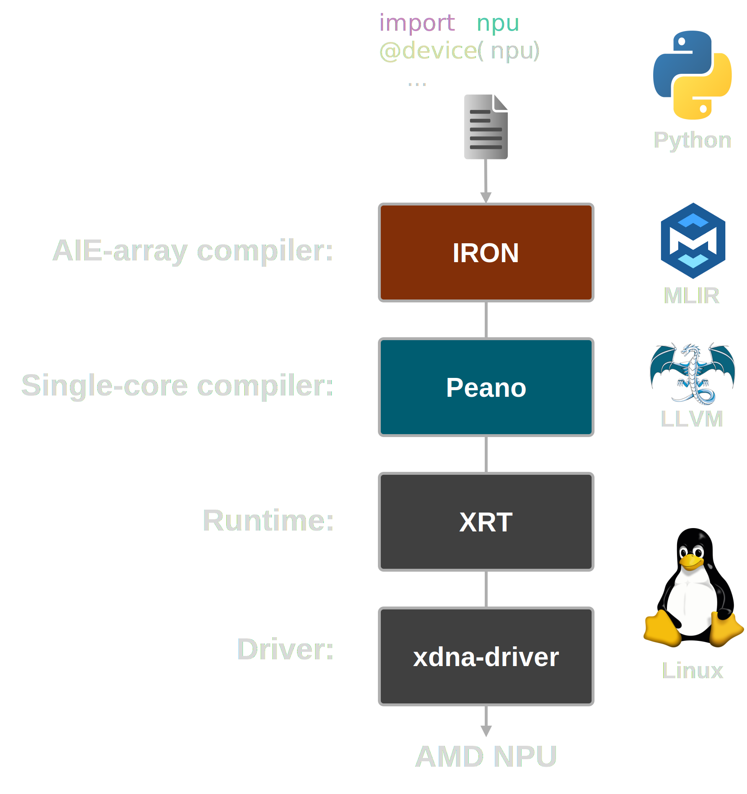

<!-- Copyright (C) 2024-2026 Advanced Micro Devices, Inc. -->
<!-- SPDX-License-Identifier: Apache-2.0 WITH LLVM-exception -->

# IRON / MLIR-AIE

**Close-to-metal Python programming for AMD Ryzen™ AI NPUs.**

IRON is an open-source toolkit that lets performance engineers write Python code
that compiles directly to the AI Engine array inside AMD Ryzen™ AI processors —
with full control over tile placement, data movement, and vectorized compute.

<div class="iron-cards" markdown>

<a class="iron-card" href="README/" markdown>
<span class="iron-card-icon">🚀</span>
<span class="iron-card-title">Get Started</span>
<span class="iron-card-desc">Install IRON on Ubuntu, build and run your first NPU design.</span>
</a>

<a class="iron-card" href="programming_guide/README/" markdown>
<span class="iron-card-icon">📖</span>
<span class="iron-card-title">Programming Guide</span>
<span class="iron-card-desc">Tiles, ObjectFifos, data movement, vectorization, and ML examples.</span>
</a>

<a class="iron-card" href="api/iron/" markdown>
<span class="iron-card-icon">🐍</span>
<span class="iron-card-title">Python API</span>
<span class="iron-card-desc">Full reference for iron, taplib, and the kernel library.</span>
</a>

<a class="iron-card" href="programming_guide/mini_tutorial/README/" markdown>
<span class="iron-card-icon">⚡</span>
<span class="iron-card-title">Mini Tutorial</span>
<span class="iron-card-desc">Five short exercises — a working NPU design in minutes.</span>
</a>

</div>

---

## What is IRON?

The NPU inside Ryzen™ AI is a 2D array of **AI Engine tiles** — small, fast,
vector-capable cores connected by programmable stream switches and DMA engines.
IRON exposes that architecture directly in Python:

```python
import aie.iron as iron
from aie.iron import In, Out, ObjectFifo, Program, Runtime, Worker
from aie.iron.controlflow import range_
import numpy as np

@iron.jit
def vector_add_one(a_in: In, b_out: Out):
    # Stream data from host → compute tile → host
    of_in  = ObjectFifo(np.ndarray[(1024,), np.dtype[np.int32]], name="in")
    of_out = ObjectFifo(np.ndarray[(1024,), np.dtype[np.int32]], name="out")

    def core_fn(of_in, of_out):
        ai = of_in.acquire(1)
        bo = of_out.acquire(1)
        for i in range_(1024):
            bo[i] = ai[i] + 1
        of_in.release(1)
        of_out.release(1)

    w = Worker(core_fn, [of_in.cons(), of_out.prod()])

    rt = Runtime()
    with rt.sequence(np.ndarray[(1024,), np.dtype[np.int32]],
                     np.ndarray[(1024,), np.dtype[np.int32]]) as (a, b):
        rt.start(w)
        rt.fill(of_in.prod(), a)
        rt.drain(of_out.cons(), b, wait=True)

    return Program(iron.get_current_device(), rt).resolve_program()

a = iron.arange(1024, dtype=np.int32, device="npu")
b = iron.zeros(1024,  dtype=np.int32, device="npu")
vector_add_one(a, b)   # JIT-compiles on first call, cached after
```

`@iron.jit` compiles your design to an `xclbin` + instruction stream using the
LLVM/MLIR-based [Peano](https://github.com/Xilinx/llvm-aie) compiler and runs it
on the attached NPU. Subsequent calls hit a cache.

---

## Architecture

<figure markdown>
  { width=540 }
  <figcaption>IRON sits between your Python code and the NPU hardware, built on open LLVM/MLIR infrastructure.</figcaption>
</figure>

---

## Key concepts

| Concept | What it is |
|---------|-----------|
| **Worker** | Code running on one AIE compute tile |
| **ObjectFifo** | Streaming data channel: host↔tile or tile↔tile |
| **Runtime** | Host-side sequence — fill inputs, drain outputs |
| **TensorAccessPattern** | Multi-dimensional DMA tiling descriptor |
| **Peano** | LLVM-based compiler for the AIE core ISA |

---

## Install

```bash
git clone https://github.com/Xilinx/mlir-aie.git && cd mlir-aie
source utils/env_install.sh   # one time
source utils/env_setup.sh     # every new shell
```

Supports Python **3.11 – 3.14** on **Ubuntu 24.04+** and **Windows**.
Wheels available on PyPI-compatible index — see [Getting Started](README/) for the full guide.

---

## Citation

> E. Hunhoff, J. Melber, K. Denolf, A. Bisca, S. Bayliss, S. Neuendorffer, J. Fifield,
> J. Lo, P. Vasireddy, P. James-Roxby, E. Keller.
> "[Efficiency, Expressivity, and Extensibility in a Close-to-Metal NPU Programming Interface](https://arxiv.org/abs/2504.18430)".
> In 33rd IEEE International Symposium On Field-Programmable Custom Computing Machines, May 2025.

---

<p style="font-size:0.8rem; opacity:0.6;">
Copyright © 2019–2021 Xilinx, Inc. &nbsp;|&nbsp; Copyright © 2022–2026 Advanced Micro Devices, Inc.<br>
Licensed under Apache 2.0 with LLVM exception.
</p>
