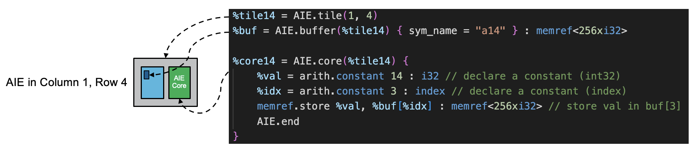
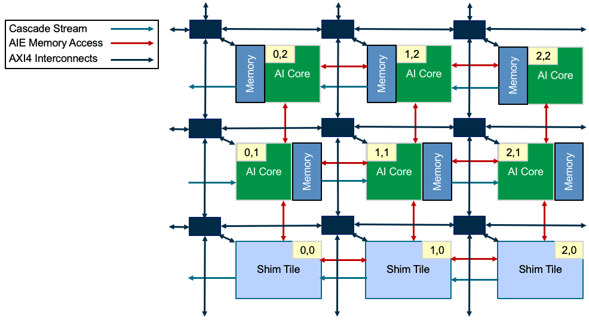

<!---//===- README.md --------------------------*- Markdown -*-===//
//
// This file is licensed under the Apache License v2.0 with LLVM Exceptions.
// See https://llvm.org/LICENSE.txt for license information.
// SPDX-License-Identifier: Apache-2.0 WITH LLVM-exception
//
// Copyright (C) 2022, Advanced Micro Devices, Inc.
//
//===----------------------------------------------------------------------===//-->

# <ins>Tutorial 1 - Modules, tile, buffer, core, lock</ins>
In the MLIR-based AI Engine representation, every physical component of the AI Engine array including connections are declared within the top level block called a `module`. All parameters and customizations of these components are then elaborated within the `module`. We generally write the MLIR code in a file with the .mlir file extension as it integrates well with the lit based auto-test of LLVM, such as those found in `test` sub-folder. A module declaration is shown below:

```
module @module_name {
    ...
    AI Engine array components and connections
    ...
}
```

## <ins>Tile Components</ins>
AI Engine tiles are the basic building blocks of AIE designs and can be declared as `AIE.tile(col,row)`. Examples include:
```
%tile14 = AIE.tile(1,4)
%tile24 = AIE.tile(2,4)
%tile34 = AIE.tile(3,4)
```
The two major components of an AI Engine tile are

* VLIW processor core declared as `AIE.core(tileName) { body }`
* Local memory buffer declared as `AIE.buffer(tileName) : memref<depth x data_type> { body }`.

Example declarations include:
```
AIE.core(%tile14) {
    ...
    core body
    ...
}

%buff0 = AIE.buffer(%tile14) : memref<256xi32>
%buff1 = AIE.buffer(%tile14) : memref<256xi32>
```
The association between these declarations and the physical AI Engine tile components can be seen here. For more details on mlir-aie dialect syntax, you can refer to the online reference document [here](https://xilinx.github.io/mlir-aie/AIEDialect.html).


A third key component of a tile is the `lock` which is critical for synchronizing data between tiles and one another, and between tiles and the host controller. While not a physically large component, it plays a critical role in facilitating efficient and correct data communication.

### <ins>Tile</ins>

For the tile, we simply declare its coordinates by column and row
>**NOTE:** index values start at 0, with row 0 belonging to the shim which is not a regular row. The first regular row for first generation AI engines is row index 1.
Tile declaration is mainly needed so other sub components can be associated to the tile by name. Some higher level logical components may also automatically declare tiles so they are enabled (e.g. logical flows require the intermediate tiles along the path to be enabled to support stream switch routing).

>**ADF Graph NOTE:** ADF graph descriptions treat the first full row of AI Engines as row 0 and does not count the shim tiles. As such, be sure to add one to the row value when moving from ADF designs to MLIR-AIE descriptions.

The type of tiles and orientation of its associated local memory is architecture dependent. In the case of the first generation of AI Engines, each tile has an associated local memory physically to its left or right depending on the row.
* odd row (1, 3, ...) - memory on right
* even row (2, 4, ...) - memory on left

<p><p>

### <ins>Buffer</ins>

When declaring a buffer, we pass in the associated AIE tile and declare the buffer parameters. Those parameters are the depth and data type width (though the local memory itself is not physically organized in this way).
> One important note about buffers is that one buffer is not strictly mapped to the entire local memory. You can declare multiple buffers that are associated with the local memory of a tile and they would, by default, be allocated sequentially in that tile's local memory.

Operators such as buffers (and some other components such as locks) also can have a symbolic name defined in the body to make it easier to refer to the component in generated host access functions. The syntax for this looks like:
```
%buf = AIE.buffer(%tile14) { sym_name = "a14" } : memref<256xi32>
```

### <ins>Core</ins>

The AIE core functionality is defined within the core body. This functionality is a combination of AIE dialect specific operations as well as other dialects that are supported by the MLIR compiler. This includes a large set of dialects such as [arith](https://mlir.llvm.org/docs/Dialects/ArithOps/) and [memref](https://mlir.llvm.org/docs/Dialects/MemRef/) but can also include many others. Custom functions that are not inherently supported on AI Engines can be translated into scalar operations that are (e.g. arctan). Keep in mind that MLIR is not a programming language but a intermediate representation so the syntax of doing simple operations may seem cumbersome at first glance but is designed to capture a robust set of operations.

In addition to the integrated core functionality definitions, `mlir-aie` also supports linking with externally compiled kernel code, which you can explore in more detail in [tutorial 9](../tutorial-9). This process allows custom kernels to be included directly in `mlir-aie` defined designs.

### <ins>Lock</ins>

Locks are components used by other components to arbitrate access to a shared resource. They are not tied to any particular resource and thus do not physically prevent the resource that they are associated with from being accessed. Instead, they facilitate a contractual agreement among users of a resource that a lock must be successfully acquired before the resource can be used. More details about how locks can be used will be presented in subsequent tutorials. A common resource they are associated with are buffers where two users of that buffer (e.g. core and DMA) may wish to access the buffer at the same time.

The `lock` operation is actually a physical sub component of the `AIE.tile`, but is declared within the `module` block. The syntax for declaring a lock is `AIE.lock(tileName, lockID)`. An example would be:
```
%lockName = AIE.lock(%tileName, %lockID) { body }
```
Examples:
```
%lock13_4 = AIE.lock(%tile13, 4)
%lock13_11 = AIE.lock(%tile13, 11) { sym_name = "lock13_11" }
```
Each tile has 16 locks and each lock is in one of two states (acquired, released) and one of two values (0, 1).
> By default, we tend to assume (value=0 is a "write", value=1 is "read"). But there is no real definition of these values. The only key thing to remember is that the lock value starts at `val=0`, and is reset into the release `val=0` state. This means an `acquire=0` will always succeed first, while an `acquire=1` needs the lock state to be `release=1` to succeed. Once acquired, a lock can be released to the 0 or 1 state.

The 16 locks in a tile are accessible by its same 3 cardinal neighbors that can access the tile's local memory. This is to ensure all neighbors that can access the local memory can also access the locks.

To use the lock, we call the `use_lock` operation either inside a `core` operation or `mem`/`shim_dma` operation.
```
AIE.use_lock(%lockName, "Acquire|Release", 0|1)
```
That code would look something like:
```
%core14 = AIE.core(%tile14) {
    AIE.use_lock(%lock14_7, "Acquire", 0)
    ... core ops ...
    AIE.use_lock(%lock14_7, "Release", 1)
}
```
Notice the familiar design pattern of:
* acquire lock in some value
* a set of operations
* release lock in some value (usually the other value)

The acquire value must match the current lock state in order for the acquire to succeed. The release value can be either 0 or 1.

We will be introducing more components and the ways these components are customized in subsequent tutorials. Additional syntax for these MLIR-based AI Engine components can be found in the github<area>.io docs [here](https://xilinx.github.io/mlir-aie/AIEDialect.html).

## <ins>Tutorial 1 Lab</ins>

> Hovering over the  buttons will reveal the answers in a tooltip.

1. Take a close look at the source file [aie.mlir](aie.mlir) and read through the code comments which walks through the syntax of this simple design. What is the variable name of the module? 

2. After building and installing `mlir-aie`, run make to compile the first tutorial.
    ```
    > make
    ```

### <ins>MLIR-AIE Transformations</ins>
Under the hood, `make` calls `aiecc.py` which itself calls a number of utilities that are built as part of the `mlir-aie` project (`aie-translate`, `aie-opt`). More details on these utilities can be found in [tutorial-10](../tutorial-10). These utilities are built as part of the `mlir-aie` to perform IR transformations and lowerings. In this example, since we are already describing our design at a low physical level, we will perform the final transformation and produce an AI Engine program (core_1_4.elf).

The MLIR operations inside the core are then converted to an LLVM representation which the AMD internal compiler (currently `xchesscc`) takes to build the executable that will run on each individual AIE tile.

3. In [aie.mlir](aie.mlir), what is the variable name for tile(1,4)? 

    What about the variable name and size of the buffer that is associated with the local memory of tile(1,4)? 

### <ins>AI Engine Data Memory</ins>
In first generation AI Engines, each tile has 32 kB of local data memory assigned to it. In addition, it can access the local memory in the other 3 cardinal directions giving a total accessible memory of 128 kB.

4. What percentage of the local memory (32 kB) does this design currently use?


5. Change the size of the buffer to the size of our local memory (8192 x i32) and run `make` again. What do you expect to happen and what happens instead? 

### <ins>AI Engine Program Memory</ins>
While we have a separate 16 kB of program memory which stores the AIE program code, the 32 kB of data memory is also used for the program stack. By default, the tool reserves 1024 bytes for the stack so all buffers are then allocated immediately after that.

6. Declare a horizontally adjacent tile (pay attention to which row we're in) so that tile (1,4) can access the neighbor tile's local memory. Declare a buffer in this tile that uses the entire local memory (8192 x i32) and replace the reference %buf in line 34 with the new buffer, then run `make ` again. What happens? 

In the [tutorial-2](../tutorial-2), we we take a look at host code configuration, simulation, and hardware performance.
