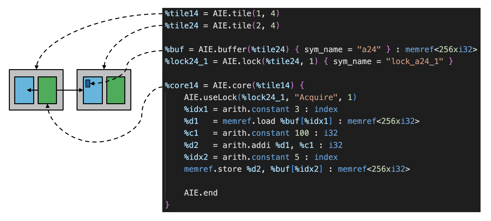

<!---//===- README.md --------------------------*- Markdown -*-===//
//
// This file is licensed under the Apache License v2.0 with LLVM Exceptions.
// See https://llvm.org/LICENSE.txt for license information.
// SPDX-License-Identifier: Apache-2.0 WITH LLVM-exception
//
// Copyright (C) 2022, Advanced Micro Devices, Inc.
// 
//===----------------------------------------------------------------------===//-->

# <ins>Tutorial 3 - Communication (local memory)</ins>

In [tutorial-1](../tutorial-1), we have explored the `core` and `buffer` dialect operations (which map to the core and local memory respectively), added the `lock` operation (which is key to synchronizing use of shared resources), and defined the functionality within cores with integrated dialect operations (`arith`, `memref`). Then, in [tutorial-2](../tutorial-2), we expanded on the host code configuration, simulation, hardware execution, and performance measurement. 

We now come back to the `mlir-aie` dialect to talk about the next major component of for AIE system design - communication. As summarized briefly in the [Basic AI Engine Architecure](../README.md#basic-ai-engine-architecture) section, communication via local memory is one of the most efficient ways to share data and can be done among up to 4 tiles adjacent to a local memory. In `mlir-aie`, all tiles have an associated local memory but adjacent tiles are able to read and write to that memory as well. 

In the diagram below, we see that the local memory for tile(2,4) is physically adjacent to the core in tile(1,4). If we were to expand the diagram further, we would see that tile(2,3) and tile(2,5) can also access that buffer. In general, each processor can access the memory in its own tile, the memory of the tile to the north and south, and the memory of the tile either to the east (in even rows) or the west (in odd rows).  As a result, communicating through shared memory is less constrained to the north and south: A processor can communicate in either of these directions using a buffer in two different tiles.  Communicating east and west is more constrained: the communication buffer can be in only one tile, and it might not be in the same tile as the source of the data.  These constraints are verified in MLIR, so it's easy to know whether we've created a valid design. Below is a table to illustrate for a given row, whether the local memory for a tile to the west or east is sharable with tile(col,row).

|   | tile(col-1, row) _West_ | tile(col, row) | tile(col+1, row) _East_ |
|---|---|---|---|
| Even Row | $$\color{red}{inaccessible}$$ | Local Memory | Shared - East   |
| Odd Row | Shared - West | Local Memory  | $$\color{red}{inaccessible}$$  |

<p><p>


In the AIEngine architecture, read and write requests from different tiles are automatically arbitrated, so shared memory accesses are always well-ordered.  However, since the architecture includes hardware locks, polling on memory is not the preferred way to synchronize the operations of different processors.  We typically use these operations to transfer ownership of blocks of memory from one processor to another, by acquiring a lock before reading or writing memory and then releasing it with a different value to allow the buffer to be used by another processor.  Bear in mind, however, that locks are not explicitly tied to particular memory buffers and can be used for any purpose.


## <ins>Using Locks to share local memory</ins>

As a reminder, the use of locks can have the following familiar design pattern:
* acquire lock in some value
* a set of operations
* release lock in some value (usually the other value)

The acquire value must match the current lock state in order for the acquire to succeed. The release value can be either 0 or 1. Below is another example of lock usage including a common state diagram of lock state transitions. Note that we can actually release to the same value if we choose.

<p><p>

## <ins>Tutorial 3 Lab </ins>

1. Read through the [aie.mlir](aie.mlir) design. Which tile's local memory is being shared between the two tiles? 

2. Can we share tile(1,4)'s local memory instead? Why or why not? 

3. What about in the vertical direction, say between tile(1,3) and tile(1,4). Which tiles' local memory can be shared between these two tiles? 

4. Change back the tiles to (1,4) and (2,4). Change the lock from belonging to tile(2,4) to tile(1,4). Does this change the behavior of our design? What does that say about the total number of locks available between two adjacent tiles? 

5. What about in the vertical direction, say again between tile(1,3) and tile(1,4). Does this change the behavior of our design? What does that say about the total number of locks available between two adjacent tiles in the vertical direction? 

6. Change back the tiles to (1,4) and (2,4). Based on what you know about locks, which tile will execute its kernel code first (inside the lock calls) in this design? 

7. Run `make` and `make -C aie.mlir.prj/sim` to compile the design with `aiecc.py` and then simulate that design with aiesimulator.

8. Change the design so that tile(2,4) runs first. What do you expect the value of buf[5] will be with this change? 

9. Change [test.cpp](test.cpp) so the testbench expects the correct result and passes again in simulation/ hardware. 

## <ins>Object FIFO Abstraction </ins>

In this tutorial the `objectFifo` abstraction is also introduced, see below. This is a higher-level abstraction which is used to establish communication across the AI Engine array without explicit configuration of the involved `mlir-aie` components. The following tutorials will use this abstraction to introduce the `mlir-aie` dialect further.

[Link to higher level objectFifo write-up](./objectFifo_ver)

## <ins>Advanced Topics -  Performance measurement in hardware</ins>

In expanding how to measure performance in hardware, we are often interested in system level performance rather than just a single kernel's program cycle count. Here, locks that arbitrate communication can be used as event triggers to measure performance between tiles. 

The previous `EventMonitor` function can be reused with different event triggers, this time tied to lock acquire and release. The `EventMonitor` struct sets triggers for the hardware performance counters in the AI Engine tile.
```
EventMonitor pc0(_xaie, 2, 4, 0, XAIE_EVENT_LOCK_1_ACQ_MEM, XAIE_EVENT_LOCK_2_REL_MEM,
                 XAIE_EVENT_NONE_MEM, XAIE_MEM_MOD);
```
> **Reminder Note**: For each tile, we have 4 performance counters in the core and 2 performance counters in the local memory. 

In [tutorial-2c](../tutorial-2/tutorial-2c/answers/test_perf.cpp), we declared an event monitor connected to 1 of 4 core performance counters. Here, we will use 1 of 2 memory performance counters (id 0) because our lock event triggers are associated with the local memory. Our start trigger will be `XAIE_EVENT_LOCK_1_ACQ_MEM` (acquire on lock id 1), and our stop trigger will be `XAIE_EVENT_LOCK_2_REL_MEM` (release on lock id 2). 

> **Note**: These lock acquire and release triggers do not check specific lock values. This means we start our counter when the 2nd tile begins (which starts at the beginning of the entire multi-tile design) and stops when the 2nd tile is done.

9. Modify `test.cpp` to add the new lock triggered  `EventMonitor`. See [test_perf.cpp](./answers/test_perf.cpp) for reference but be sure to modify the top level test.cpp so the simulator has the right reference. Run the simulator. What is the cycle count for the two tile sequential operation? 
    > Solution: `make tutorial-3_perf1.exe; make -C sim host=../answers/test_perf.cpp`

10. Copy this design on the board and run the program with `sudo ./tutorial-3.exe`. What cycle count do you see? 

The reason the cycle count is much higher here is because the time it takes for tiles to be enabled is the overhead of function calls on the host processor (ARM). This means the fist tile is enabled for some time (and done) before the second tile is enabled so we are essentially measuring the timing between core enable function calls from the host. This is really an artifact of measuring performance of hardware components that are controlled by a software host processor.

11. Change your [aie.mlir](./aie.mlir) design to swap the functionality of the two tiles, compile and simulate your design to confirm correct functionality. What cycle count do you get in simulation? 
    > Solution: `make tutorial-3_perf2.exe; make -C sim host=../answers/test_perf.cpp`
    
    Run this new design on the board. What cycle count do you get now?  What is the reason for this difference? 

The reason this occurs is an artifact of the tools since the tiles are enabled in numerical order. You can see this in the `mlir_aie_start_cores` defined in `aie.mlir.prj/aie_inc.cpp`. Changing tile declaration order is not a preferred way to change the behavior of designs but is shown here to give more understanding into the timing between software control of hardware components. Designs should be operating at steady state and would therefore be measured differently with our event triggered performance counters. We will cover this in more detail in future tutorials.

We now will look at communication with objectFifo (tileDMA, logical routing) in [tutorial-4](../tutorial-4).
