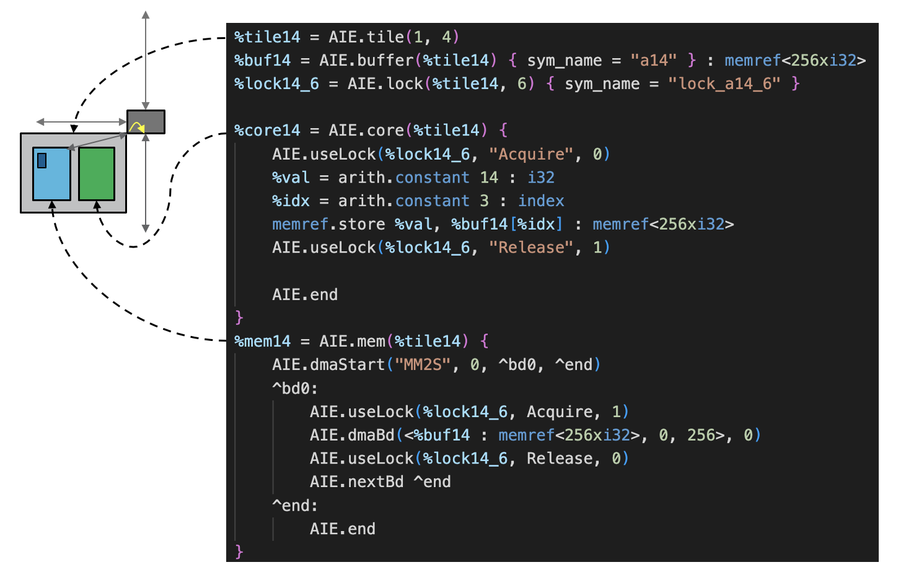

<!---//===- README.md --------------------------*- Markdown -*-===//
//
// This file is licensed under the Apache License v2.0 with LLVM Exceptions.
// See https://llvm.org/LICENSE.txt for license information.
// SPDX-License-Identifier: Apache-2.0 WITH LLVM-exception
//
// Copyright (C) 2022, Advanced Micro Devices, Inc.
// 
//===----------------------------------------------------------------------===//-->

# <ins>Tutorial 4 - Communication (tile DMA, logical routing)</ins>

Where `objectFifos` in [tutorial-4](..) provided automated connections between non-adjacent tiles, understanding the mechanism by which these connections are made is important to be able to improve on existing routing algorithms. In this tutorial, we will examine configuration of switchboxes and the DMAs (tileDMA) that moves data across those switchboxes in more detail.

## <ins>Streams</ins>
Streams are 32-bits wide and runs at the system clock rate (e.g. 1 GHz). There are 4 streams running horizontally and vertically both into and out of the switchbox (except in the vertical output direction going north and the vertical input direction coming from south, where there are 6 streams). The AIE core does have 2 input and 2 output stream ports that connect to its local switchbox but the more common way of pushing large blocks of data into and out of the stream network is with the tile DMAs. Rather than having the core read and write streams directly, the core accesses local memory and the tile DMA moves the data from local memory to the switchbox.

## <ins>Logical routing (aka flows)</ins>
The AIE switchboxes are very powerful configurable blocks for steering data between AI Engine tiles. Having 18 inputs and 18 outputs, the switchbox has connections to its neighbor, the tileDMA, the core, and an internal fifo. Each connection from input to output within the switchbox can operate in one of two modes: 
* circuit switch mode
* packet switch mode

We will discuss the circuit switch mode first and take a look at the packet switch mode in [tutorial-6](../../tutorial-6). Circuit switch mode is where a given route between ports of the switchbox are fixed, allowing data to be passed from one input port to one or more output ports. The path is fixed after configuration and the data movers (DMAs) can push data as frequently as it wishes along that fixed route.

A set of circuit switched routes from a source port in one switchbox to a destination port in another switchbox (potentially far way) is called a `flow ` and can be automatically determined and configured using the `AIE.flow` operation. 
```
AIE.flow ($source, $sourceBundle : $sourceChannel, $dest, $destBundle : $destChannel)
```
An example of a flow is shown below:
```
AIE.flow(%tile71, "South" : 3, %tile73, "DMA"   : 0)
AIE.flow(%tile73, "DMA"   : 1, %tile71, "South" : 2)
```
Notice that the route from tile(7,1) to tile(7,3) will most likely involve tile(7,2) who's inclusion in the route is not explicitly stated. Instead, we just declare the end points and allow the logical routing algorithm (aka pathfinder) to determine the optimized path for data to flow and configures the switchboxes to enable that flow.
> You can explore the lowering of logical `flows` to physical switchbox configurations in switchbox focused tutorial [here](../switchbox)

In regular AIE tiles, valid bundle names and channels are listed below: 
| Bundle | Channels (In) | Channels (Out) |
|-------|---|---|
| DMA   | 2 | 2 |
| Core  | 2 | 2 |
| West  | 4 | 4 |
| East  | 4 | 4 |
| North | 4 | 6 |
| South | 6 | 4 |
| FIFO  | 2 | 2 |
| Trace | 1 | 0 |
>All channels function identically in behavior but the key is that the chosen dma channel needs to match the declared dma channel in the tile DMA definition that will be explained next

## <ins>Tile DMAs</ins>
There are 2 tile DMAs connected to the local switchbox, each with a read and write port, giving us 4 independent dma+channel data movers. Among all 4 data movers, we have 16 buffer descriptors (bd) describing the rules of the data movement. The definition of these bds are declared within an `AIE.mem` operation as shown below:
```
%mem14 = AIE.mem(%tile14) {
    %dma1 = AIE.dma_start("MM2S", 0, ^bd0, ^end)
    ^bd0:
        AIE.use_lock(%lock14_6, "Acquire", 1)
        AIE.dma_bd(%buf14: memref<256xi32>, 0, 256)
        AIE.use_lock(%lock14_6, "Release", 0)
        AIE.next_bd ^end
    ^end:
        AIE.end
}
```
> Note that bds can be associated with any DMA (both input and output). They can also be flexibly chained together.

The definition of the body of the `AIE.mem` op is generally composed of labels which we use to chain DMA declarations and bd definitions together. These label names are arbitrary and do not necessarily correspond to a defined bd. In our example, the `^bd0` label does define a bd definition but the `^end` label does not.  

### <ins>DMA declaration (dma_start)</ins>
In defining bds within the local memory (`AIE.mem`), we start with defining the DMA used (`AIE.dma_start`) which is defined as:
```
AIE.dma_start($channelDir, $channelIndex, $dest, $chain)
```
| Argument | Description |
|----------|-------------|
|`$channelDir`| DMA based on direction (MM2S, S2MM) |
|`$channelIndex` | DMA channel (0, 1). First generation tile DMA has 2 channels in each direction. |
|`$dest` | label of 1st bd in chain |
|`$chain` | label of next definition in our declaration chain. Generally point to the label where `AIE.end` is defined but can point to the label for another `AIE.dma_start` if we are declaring more than one DMA. |

### <ins>Buffer descriptors (dma_bd) </ins>
Within a memory module, we can define up to 16 buffer descriptors, each which references the buffer in local memory that it will be accessing (either read from or write to).
The `AIE.dma_bd` syntax is:
```
AIE.dma_bd(<$buffer : type($buffer), $offset, $len>, $AB)
```
| Argument | Description |
|----------|-------------|
| `$buffer : type($buffer)`| buffer that the DMA reads or writes to, like the one used in `memref` (e.g. %buf14: memref<256xi32>). |
| `%offset`|  offset in bytes in the buffer that the DMA accesses |
| `%length`| length of the DMA operation in bytes |
| `%AB`| unique configuration where the bd is set to use either the A or B buffer. For now, just leave this as a 0. |

Each bd operation can also optionally be gated by locks meaning a lock must be acquired before the bd operation starts and released after the bd operation is complete. These lock acquires and releases can be used to time when bd transfers are done.
> The lock operations are optional and the lock ID used in acquire and release do not have to match each other though they usually do.

Below is a diagram that maps the components introduced with the physical block on the AI Engine tile.
<p><p>

### <ins>Putting it all together </ins>
In a common scenario where we may declare 2x DMAs (1x MM2S, 1x S2MM), each with 2x bds to execute a ping-pong buffer, the declaration could look like:
```
%mem14 = AIE.mem(%tile14) {
    %dma1 = AIE.dma_start("MM2S", 0, ^bd0, ^dma2)
    ^dma2:
        %dma2 = AIE.dma_start("S2MM", 0, ^bd3, ^end)
    ^bd0:
        AIE.use_lock(%lock14_6, "Acquire", 0)
        AIE.dma_bd(%buf14_1: memref<256xi32>, 0, 256)
        AIE.use_lock(%lock14_6, "Release", 1)
        AIE.next_bd ^bd1
    ^bd1:
        AIE.use_lock(%lock14_7, "Acquire", 0)
        AIE.dma_bd(%buf14_2: memref<256xi32>, 0, 256)
        AIE.use_lock(%lock14_7, "Release", 1)
        AIE.next_bd ^bd0
    ^bd3:
        AIE.use_lock(%lock14_10, "Acquire", 0)
        AIE.dma_bd(%buf14_3: memref<256xi32>, 0, 256)
        AIE.use_lock(%lock14_10, "Release", 1)
        AIE.next_bd ^bd4
    ^bd4:
        AIE.use_lock(%lock14_11, "Acquire", 0)
        AIE.dma_bd(%buf14_4: memref<256xi32>, 0, 256)
        AIE.use_lock(%lock14_11, "Release", 1)
        AIE.next_bd ^bd3
    ^end:
        AIE.end
}
```
## <ins>Tutorial 4 Lab </ins>

1. Read through the [aie.mlir](aie.mlir) design. Which DMA direction and channel is used on tile(1,4) to send data to tile(3,4)? 

2. What is the shared lock ID used in tile(1,4) to arbitrate access to its local memory? 

3. What is the DMA direction/ channel and lock ID for the tile DMA used in tile(3,4) to receive data? 

4. Based on the lock status, who will successfully acquire a lock when the core are first enabled? 

5. To explore and understand bd behavior further, make changes to [aie.mlir](aie.mlir) so the bd will keep executing over and over again indefinitely. Then change the testbench [test.cpp](test.cpp) so we force the two tileDMAs to run again. 
    >HINT: Acquire and release the locks for the tileDMAs in the right states. 

    What do you expect to happen to the output? 

## <ins>Advanced Topics -  Performance measurement in hardware</ins>

We're already touched upon using performance counters to measure things like program cycle count ([tutorial-2c](../../tutorial-2/tutorial-2c/)) and compute and communication cycles between  lock acquire/ release events ([tutorial-3](../../tutorial-3)). We now expand that definition to include measuring events that occur in non-adjacent tiles. A tile can only trigger off events that occur within the tile so core events can trigger core performance counters while memory events trigger memory performance counters. But if we want to trigger off events from non-adjacent tiles, we can use event broadcast to aggregate event signals into a single tile. Event broadcasts are where we configure triggered events to broadcast to all tiles along event broadcast channels. This means a lock acquire event in tile(1,4) can be broadcasted to tile(3,4) on these event broadcast channels. The event does incur additional latency (2 cycles for each "hop" along from source to destination). In our example design, we can broadcast the start trigger event of acquiring lock id #6 from tile(1,4) as shown below:
```
XAie_EventBroadcast(&(_xaie->DevInst), XAie_TileLoc(1,4),
                    XAIE_MEM_MOD, 2, XAIE_EVENT_LOCK_6_ACQ_MEM);
```
Here, we are using event broadcast channel #2. No additional routing is needed since it's a broadcast. Then, at a destination tile, we can specify the broadcast event trigger:
```
EventMonitor pc0(_xaie, 3, 4, 0, XAIE_EVENT_BROADCAST_2_MEM,
                XAIE_EVENT_LOCK_8_REL_MEM, XAIE_EVENT_NONE_MEM,
                XAIE_MEM_MOD);
```
The reported performance counter value then gives the difference between the two triggers. You would have to account for the 2 cycles per hop difference based on distance but for larger designs, that delta would be small.

6. Add the performance timers to the tutorial-4 design and measure the difference between the lock id #6 acquire for tile(1,4) and lock id #8 release for tile(3,4). Run the design in simulation to measure the result. How many cycles did you measure? 
    > Solution: `make -C aie.mlir.prj/sim host=../answers/test_perf.cpp`

7. Compare this number with the design in tutorial-3. Why is there such a large difference? 

8. Run `gtkwave` on the vcd file and view the relevant lock signals to see how long each operation is taking. You can see a preconfigured gtkwave by calling:
    ```
    gtkwave ./answers/tutorial-4_perf.gtkw
    ```
    which would look something like the link here: <a href="../../images/wave1.jpg"></a>