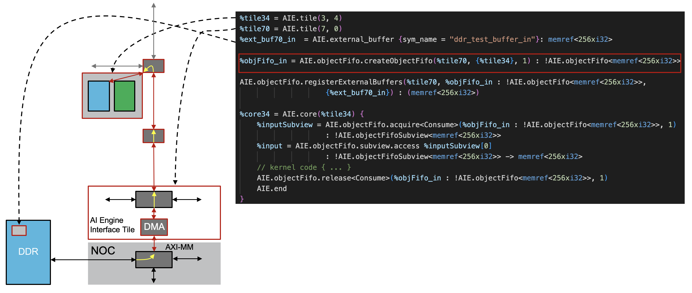

<!---//===- README.md --------------------------*- Markdown -*-===//
//
// This file is licensed under the Apache License v2.0 with LLVM Exceptions.
// See https://llvm.org/LICENSE.txt for license information.
// SPDX-License-Identifier: Apache-2.0 WITH LLVM-exception
//
// Copyright (C) 2022, Advanced Micro Devices, Inc.
// 
//===----------------------------------------------------------------------===//-->

# <ins>Tutorial 5 - Communication via objectFifo (shim DMA, external memory aka DDR)</ins>

In thinking about data communication, it's often helpful to use the memory hierarchy model of CPU architectures where we have different levels of memory with level 1 (L1) being closest to the processing unit (AI Engine local memory) and level 3 (L3) being further away (e.g. DDR). Up to this point, we've focused on communication between AI Engines or L1 to L1 communication. Supporting the communication of data between L3 (DDR) to L1 (local memory) uses the same tileDMA and stream switch components as when communicating data between L1 and L1, but requires 3 additional blocks in the AI engine array and Versal device.

* Shim DMA and External Buffers
* NOC configuration
* Host code for buffer allocation and virtual address mapping

A diagram featuring the 3 blocks needed to connect L1 to L3 can be seen in the following diagram.
<p><p>

Here, we see the different components of the L1-L3 communication defined in MLIR. The shim DMA is the box labeled AI Engine Interface Tile while the external buffer is the smaller gray box within the blue DDR box. We see the NOC block represented by the light gray box labeled NOC. And the host code portion would be found in the host code [test.cpp](./test.cpp).
> Note that shim_dma are defined for the shim tiles (row 0). Also note that not every column in row 0 is shim_dma capable. The list of capable tiles in the S70 device is `(2,3,6,7,10,11,18,19,26,27,34,35,42,43,46,47)`.

Further in-depth descriptions of the components presented above can be found in the `./flow` sub-directory.

[Link to lower level flow write-up](./flow)

### <ins> Register external_buffers to objectFifo</ins>

As was the case in the previous tutorial, we will first look at the design written with the `objectFifo` abstraction. The `AIE.objectfifo.createObjectFifo` operation is used to create an objectFifo between an AIE tile and a shim tile (in this example, tile(7,0)), which has access to a shim_dma and which will enable data movement to/from external memory. This is shown in the diagram below.



While the shim DMA itself is not present in the design, the `AIE.external_buffer` is because it serves as a pointer to an external memory region (e.g. DDR). For additional details about this component and how it is linked to the shim_dma, please refer to the `./flow` sub-directory.

As for now, the `objectFifo` lowering only instantiates memory elements in L1, i.e., in local memory. In order to make the objectFifo aware of external memory regions that are part of its data movement, the external buffers are registered to the objectFifo with the operation:
```
AIE.objectfifo.register_external_buffers @name (shimTile, {list of external buffers to register}) : (list of external buffer datatypes)
``` 

## <ins>Tutorial 5 Lab </ins>

1. Read through the [aie.mlir](aie.mlir) design. Based on the tiles between which each objectFifo is created, what can we say about the direction of the data movement for each one? L1). objFifo_out is for writing (L1->DDR)." height=25>

2. How many external buffers are defined and to which objectFifo are they registered? 

3. Run `make` and `make -C aie.mlir.prj/sim` to compile the design with `aiecc.py` and then simulate that design with aiesimulator.

4. How can the design be changed to use a double buffer in the shim_dma of shim tile (7,0) for objFifo_out instead? 

5. Make the change in the [aie.mlir](aie.mlir) design then apply the objectFifo lowering (see tutorial-3/README.md for the command). Does the change above influence the number of L1 buffers created in tile (3,4) by objFifo_out? 

6. Remove the previous change. Increase the number of L1 buffers created by objFifo_out to 2. Apply the lowering again. Does this change also create more external_buffers? 
