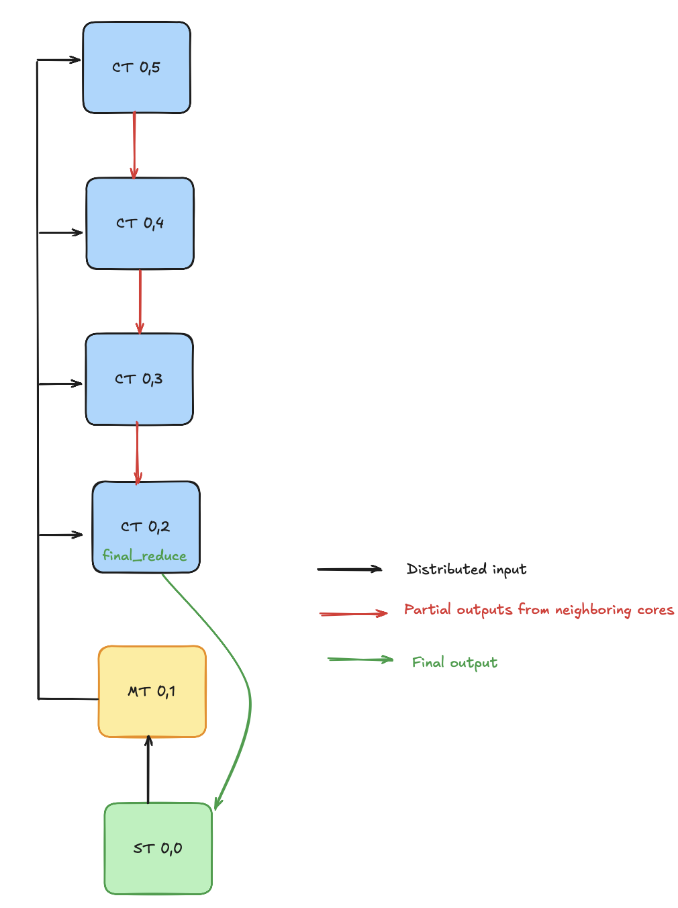

# Getting Started: Vector Reduce Max

This example demonstrates how to efficiently compute the maximum value of an input vector using a distributed, parallel approach across multiple cores in an AIE column. The input vector is partitioned into equal-sized chunks, with each core assigned a chunk to process. Each core independently calculates the local maximum for its chunk. These local maxima are then propagated along the column cascade-style reduction, where each core compares its local result with the incoming partial maxima from previous cores. The process continues until the final core produces the overall maximum value of the vector.

<br>

## Overview

This design consists of the following:

* `vector_reduce_max_1col.py`: A Python script that defines the AIE array structural design using MLIR-AIE operations. This generates MLIR that is then compiled using `aiecc.py` to produce design binaries (ie. XCLBIN and inst.bin for the NPU in Ryzen™ AI). 
* `vector_reduce_max.cc`: A C++ implementation of a vectorized `max` reduction operation for AIE cores. The code uses the AIE API, which is a C++ header-only library providing types and operations that get translated into efficient low-level intrinsics, and whose documentation can be found [here](https://www.xilinx.com/htmldocs/xilinx2023_2/aiengine_api/aie_api/doc/index.html).
* `test.cpp`: This C++ code is a testbench for the design example. The code is responsible for loading the compiled XCLBIN file, configuring the AIE module, providing input data, and executing the AIE design on the NPU. After executing, the program verifies the results.
* `Makefile`: Provides the build automation for compiling and linking all components of the design. It defines targets for generating the MLIR, building the kernel, compiling the testbench, and running the complete workflow. Reviewing the Makefile helps understand the integration and build dependencies between the Python, C++, and MLIR-AIE components.

## Ryzen™ AI Usage

### Compilation

To compile the design:

```shell
make
```

### C++ Testbench

To run the design:

```shell
make run
```
