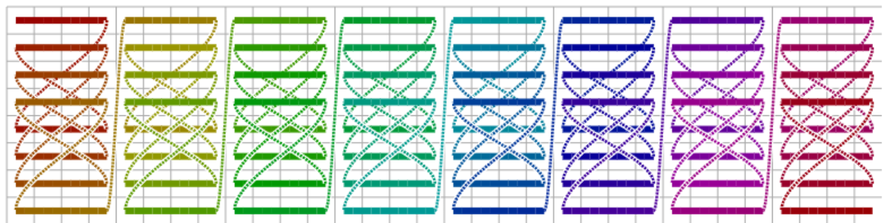

<!---//===- README.md -----------------------------------------*- Markdown -*-===//
//
// This file is licensed under the Apache License v2.0 with LLVM Exceptions.
// See https://llvm.org/LICENSE.txt for license information.
// SPDX-License-Identifier: Apache-2.0 WITH LLVM-exception
//
// Copyright (C) 2025, Advanced Micro Devices, Inc.
// 
//===----------------------------------------------------------------------===//-->

# Combined Transpose

This design takes a single input which is a row-major `M`x`N` matrix.
The design combines DMA data layout transformations and code on the compute core
(`VSHUFFLE` instructions) to produce a transposed matrix for arbirary input
sizes and a number of supported data types.

## Goals / Requirements

* Supports matrices of different sizes `M`, `N`.
* Supports transposing matrices of different data types, even data types that 
  are smaller than the DMA access granularity (e.g. `i16`).
* The input matrix is tiled into sub-tiles of size `m`, `n` for processing on 
  the compute core.
* After the transpose kernel has executed on on the compute core, the `m`x`n`
  tiles must be completely transposed, i.e., no transpose of the `m`x`n`-sized
  subtiles using the output DMAs may occur. This allows this design to be 
  modified and combined with other computations on the core after the transpose
  took place ("kernel fusion").

## Compile-time Environment Variables

To customize the design for different problem sizes, use the following 
environment variables:

```
make clean && M=64 N=32 m=16 n=16 s=4 make run
```

 * `M, N`: Overall matrix size
 * `m, n`: Size of the smaller matrix tiles that are processed individually
   on the compute cores.
 * `s`: Size of the smallest individual matrix tiles that the compute core
   transposes at a time. Currently, only `s==4` is supported.

All dimensions must evenly divide each other.

## Design

This design transposes the input matrix through a combination of data layout
transformations on the DMAs and `VSHUFFLE` operations on the compute cores.
Note that we rely on this combination, because transposing using only the DMAs
is impossible for small data types and potentially inefficient for larger
data types. The minimum access granularity of DMAs is four bytes, so any matrix
using a  data type smaller than four bytes cannot be fully transposed in the
DMA. Furthermore, accessing more contiguous data from the host at once results 
in better performance.

The transformation occurs as follows:

First, the DMA moving data from L3 (host) to L2 (mem tile) tiles the 
`M`x`N`-sized input matrix into tiles of size `m`x`n`. The DMA iterates over
these tiles in regular row-major order.

Then, the DMA moving data from L2 (mem tile) to L1 (core tile) performs a 
special data layout transformation. The following diagram shows how the
traversal order with which the DMA stores the incoming data. In the diagram, 
the colored line shows the order in which data arrive from the stream; the gray
grid represents where in memory those data are stored:



Although it may look complicated, this transform has a simple end goal: Each
`s`x`s`-sized sub-tile of the input should already be placed in its correct 
position in the transposed matrix. In other words, after transposing each of 
those `s`x`s`-sized sub-tiles individually in-place, the entire input will be
transposed.

The `transpose` kernel does exactly this, using `VSHUFFLE` (via the higher-level
`aie::interleave_zip` and `aie::interleave_unzip` methods). There is a 
specialized kernel for each supported size `s` which transposes every
`s`x`s`-sized block in the input individually. It achieves this by reading
`s` rows of the input and `VECTOR_SIZE` columns; then, it interleaves
the elements of each row with each other. Interleaving means concatenating one 
element from row 0, then row 1, then row 2, and so on, which is equivalent to 
forming a column, i.e. transposing the input.

Finally, we arrive at `n`x`m`-sized transposed subtiles on the compute core.
To return a completely transposed `N`x`M` sized matrix to the host, the DMA
stores each of those subtiles in their appropriate location in the host buffer
using one last L1 (core) to L3 (host) transformation.
