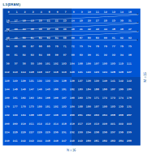
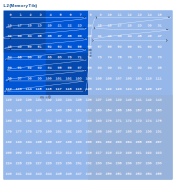
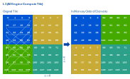
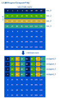

<!---//===- README.md -----------------------------------------*- Markdown -*-===//
//
// This file is licensed under the Apache License v2.0 with LLVM Exceptions.
// See https://llvm.org/LICENSE.txt for license information.
// SPDX-License-Identifier: Apache-2.0 WITH LLVM-exception
//
// Copyright (C) 2025, Advanced Micro Devices, Inc.
// 
//===----------------------------------------------------------------------===//-->

# Combined Transpose

This design takes a single input which is a row-major `M`x`N` matrix.
The design combines DMA data layout transformations and code on the compute core
(`VSHUFFLE` instructions) to produce a transposed matrix for arbirary input
sizes and a number of supported data types.

## Goals / Requirements

* Supports matrices of different sizes `M`, `N`.
* Supports transposing matrices of different data types, even data types that 
  are smaller than the DMA access granularity (e.g. `i16`).
* The input matrix is tiled into sub-tiles of size `m`, `n` for processing on 
  the compute core.
* After the transpose kernel has executed on on the compute core, the `m`x`n`
  tiles must be completely transposed, i.e., no transpose of the `m`x`n`-sized
  subtiles using the output DMAs may occur. This allows this design to be 
  modified and combined with other computations on the core after the transpose
  took place ("kernel fusion").

## Compile-time Environment Variables

To customize the design for different problem sizes, use the following 
environment variables:

```
make clean && M=64 N=32 m=16 n=16 s=4 make run
```

 * `M, N`: Overall matrix size
 * `m, n`: Size of the smaller matrix tiles that are processed individually
   on the compute cores.
 * `s`: Size of the smallest individual matrix tiles that the compute core
   transposes at a time. Currently, `s==4` and `s==8` are supported.

All dimensions must evenly divide each other.

## Design

This design transposes the input matrix through a combination of data layout
transformations on the DMAs and `VSHUFFLE` operations on the compute cores.
Note that we rely on this combination, because transposing using only the DMAs
is impossible for small data types and potentially inefficient for larger
data types. The minimum access granularity of DMAs is four bytes, so any matrix
using a  data type smaller than four bytes cannot be fully transposed using only 
the DMA. Furthermore, accessing more contiguous data from the host at once results 
in better performance.

The design refers to the memories as L3 (DRAM, farthest from AIE core), L2
(memory core) and L1 (on the AIE core). We start out with a to-be-transposed
matrix in L3 memory in regular row-major layout, as shown in the following
example for a `16`x`16` matrix:



In this diagram and the following ones, the arrow line represents the order in
in which the matrix elements are stored in memory. That is, reading memory from
the starting address of the matrix onwards, you would encounter the same matrix
elements as the ones you encounter when following the arrow line.

The first two transformations occur in the DMAs and are defined in 
`combined_transpose.py` as follows:

First, the ObjectFIFO from L3 (host) to L2 (mem tile) tiles the 
`M`x`N`-sized input matrix into tiles of size `m`x`n`. The DMA iterates over
these tiles in regular row-major order:



Then, the ObjectFIFO from L2 (mem tile) to L1 (core tile) performs a 
special data layout transformation. The following diagram shows how the
traversal order with which the DMA stores the incoming data. 



Although it may look complicated, this transformation has a simple effect:
The resulting matrix is transposed at a `s`x`s`-tile granularity. That is,
each `s`x`s` tile is still stored as row-major, but the order of tiles is
column-major, i.e. transposed. To stop here and look at this tile-level
transposed matrix (e.g., for debugging), you can swap out the `copy()` kernel
in place of the transpose kernel in `combined_transpose.py`.

After this L2 transformation, all that is left to do is to transpose each of the
`s`x`s`-sized sub-tiles individually in-place.

The `transpose` kernel defined in `transpose.cc` does exactly this, using 
`VSHUFFLE` (via the higher-level `aie::interleave_zip` and `aie::interleave_unzip` 
methods). There is a specialized kernel for each supported size `s` which 
transposes every `s`x`s`-sized block in the input individually. It achieves this
 by reading `s` rows of the input and `VECTOR_SIZE` columns; then, it 
interleaves every fourth elements of each row with every fourth element of each 
other row. Interleaving means concatenating the first element from row 0, then the
first element from row 1, then the first element from row 2, then the first element
from row 3, then the fourht element from row 0, the fourth element from row 1, 
and so on, which is equivalent to forming a column, i.e. transposing the input:



The AIE API and underlying intrinsics don't directly support interleaving four
(or eight) different vectors, one element at a time. Instead, we achieve
the same effect using two levels of interleave operations: First, we interleave
two elements at a time of rows 0 and 1, as well as 2 and 3, individually. Then,
we interleave the result two elements at a time.

After this kernel, the `m`x`n` tile is completely transposed. The output
transfer then makes sure the tiles are written back into their correct position
in the transposed output `M`x`N` matrix.