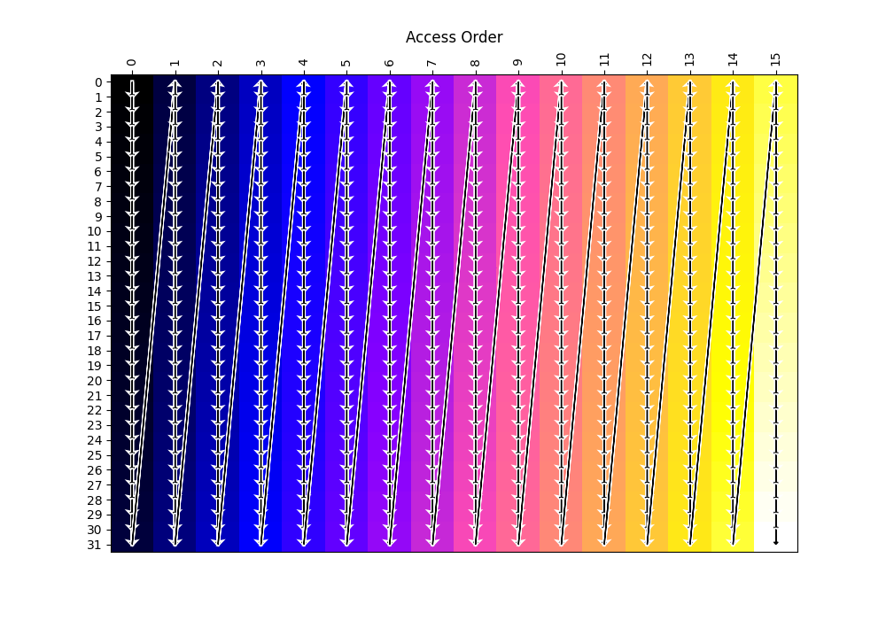

<!---//===- README.md --------------------------*- Markdown -*-===//
//
// This file is licensed under the Apache License v2.0 with LLVM Exceptions.
// See https://llvm.org/LICENSE.txt for license information.
// SPDX-License-Identifier: Apache-2.0 WITH LLVM-exception
//
// Copyright (C) 2024-2026, Advanced Micro Devices, Inc.
//
//===----------------------------------------------------------------------===//-->

# <ins> 2-D Array Transpose using AIE DMAs </ins>

This reference design can be run on a Ryzen™ AI NPU.

In the [design](./dma_transpose.py), a 2-D array in a row-major layout is read from external memory to a compute tile with a transposed layout,
by using an implicit copy via the compute tile's Direct Memory Access (DMA). The data is read from and written to external memory through a shim tile.

This data movement transformation can be visualized as a map which shows the order the data is streamed (e.g., in transposed layout):
<p align="center">
  
    <h3 align="center"> Visualization of the Transpose Data Transformation for M=64, K=32.
 </h3>
</p>

The implicit copy is performed using the `ObjectFifo.forward()` function that specifies how input data arriving via `of_in` should be sent further via `of_out` by specifically leveraging a compute tile's (`AnyComputeTile`'s) DMA.

## Source Files Overview

`dma_transpose.py` is a single `@iron.jit`-decorated design that can either be driven standalone (compile + run + verify end-to-end via `iron.tensor`) or from the `Makefile` in compile-only mode for use with `test.cpp`.

## Usage

### Standalone (no Makefile)

```shell
python3 dma_transpose.py
```

`-d npu2` for Strix; `-M` / `-K` to override the matrix dimensions.

### Makefile flow (C++ testbench)

```shell
make
make run
```

For NPU2 (Strix): `make devicename=npu2 && make run devicename=npu2`.

### Visualize the access pattern

```shell
make generate_access_map
```
