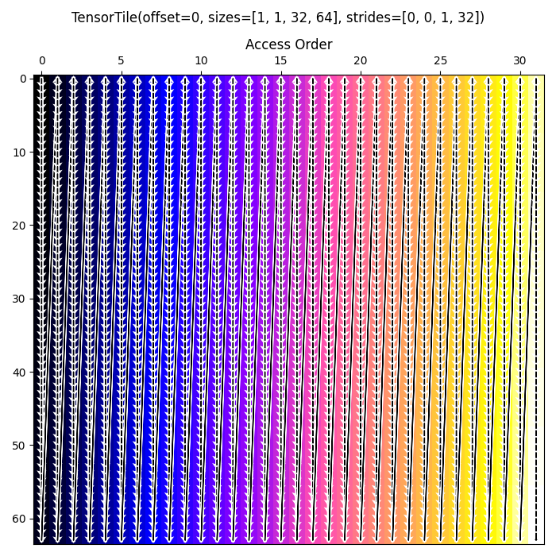

<!---//===- README.md --------------------------*- Markdown -*-===//
//
// This file is licensed under the Apache License v2.0 with LLVM Exceptions.
// See https://llvm.org/LICENSE.txt for license information.
// SPDX-License-Identifier: Apache-2.0 WITH LLVM-exception
//
// Copyright (C) 2024, Advanced Micro Devices, Inc.
// 
//===----------------------------------------------------------------------===//-->

# <ins> 2-D Array Transpose using AIE DMAs </ins>

This reference design can be run on a Ryzen™ AI NPU.

In the [design](./aie2.py), a 2-D array in a row-major layout is read from external memory to `ComputeTile2` with a transposed layout,
by using an implicit copy via the compute tile's Data Movement Accelerator (DMA). The data is read from and written to external memory through the Shim tile (`col`, 0).

This data movement transformation can be visualized as a map which shows the order the data the data is streamed (e.g., in transposed layout):
<p align="center">
  
    <h3 align="center"> Visualization of the Transpose Data Transformation for M=32, K=16. 
 </h3> 
</p>

The implicit copy is performed using the `object_fifo_link` operation that specifies how input data arriving via `of_in` should be sent further via `of_out` by specifically leveraging the compute tile's DMA. This operation and its functionality are described in more depth in [Section-2b](../../../programming_guide/section-2/section-2b/README.md/#object-fifo-link) of the programming guide.


To compile and run the design for NPU:
```bash
make
make run
```

To generate a data visualization of the transpose (like that above), run:
```bash
make generate_access_map
```