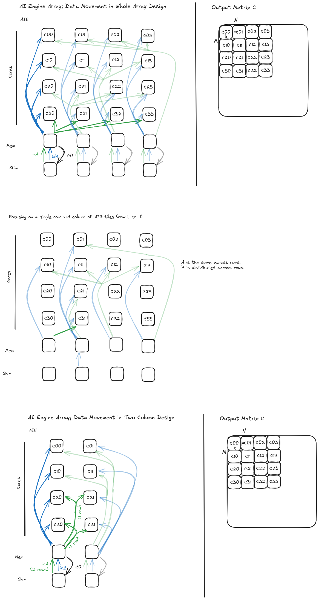

<!---//===- README.md -----------------------------------------*- Markdown -*-===//
//
// This file is licensed under the Apache License v2.0 with LLVM Exceptions.
// See https://llvm.org/LICENSE.txt for license information.
// SPDX-License-Identifier: Apache-2.0 WITH LLVM-exception
//
// Copyright (C) 2024, Advanced Micro Devices, Inc.
// 
//===----------------------------------------------------------------------===//-->

# Matrix Multiplication - Whole Array Design

The code in this directory showcases an example matrix multiplication design for a Ryzen AI device with an NPU (Neural Processing Unit). The NPU consists of an array of compute cores, called AI Engines (AIEs). The example design configures each of those compute cores to perform multiplications of distinct sub-matrices in parallel.

At a high level, the code does the following (in order):

1. [**Defining Matrix Dimensions and Data Types:**](#1-defining-matrix-dimensions-and-data-types) We first specify the dimensions `M`, `K`, `N` for the input matrices `A` (`M`&times;`K`), and `B` (`K`&times;`N`), and the output matrix `C` (`M`&times;`N`), as well as their data type. To enable efficient computation, our design will split large input matrices into smaller sub-matrix blocks on two levels; we thus also define the sizes of those sub-matrices. At the first level, the constants `m`, `k`, and `n` define the size of the submatrices processed by each AIE core. At the second level, we further subdivide using smaller sizes `r`, `s` and `t` -- these are the sizes of required by the vector computation intrinsics of the AIEs. 

1. [**Constructing an AIE Array Configuration:**](#2-constructing-an-aie-array-configuration) The NPU hardware is comprised of components laid out in a two-dimensional grid of rows and columns. Based on the matrix sizes and tiling factors, we choose the number of rows, columns, and total number of compute cores of the AIE device that the design should utilize. We then configure the AI Engine array, memory tiles, and shim tiles.

1. [**Defining Data Movement Inside the NPU:**](#3-defining-data-movement-inside-the-npu) ObjectFifos are a data movement abstraction for buffering data and synchronizing between AIE components. We configure ObjectFifos for `A`, `B` and `C` to transfer and buffer data between AIE components in chunks of the previously defined sizes (`m`&times;`k`, `k`&times;`n` and `m`&times;`n`, respectively).

1. [**Defining Core Computations:**](#4-defining-core-computations) The `core_fn()` function — wrapped in a `Worker` — contains the code that will be loaded onto each AIE core. This code calls the matrix-multiply microkernel from the library (`kernels.mm`) on the input sub-matrix elements acquired through the ObjectFifos, accumulating into the output sub-matrix.

1. [**Defining External Data Transfer Sequences:**](#5-defining-external-data-transfer-sequences) `Runtime.sequence()` sets up matrix data movement from the host into the AIE compute cores, and back to the host after computation, via `rt.fill()` / `rt.drain()` calls that consume `TensorTiler2D`-generated access patterns.

1. **Generating the Design:** The `_build_design()` function constructs the IRON design and resolves it to an MLIR module. The `@iron.jit`-decorated `whole_array()` is the single entry point for compilation; `main()` either compiles + runs on hardware or compiles ahead-of-time to caller-specified xclbin/insts paths (used by the Makefile so `test.cpp` + `sweep.sh` can drive the design).  The `generate_taps()` helper calls into the same design body to produce TAP sequences for the visualization notebook.

In summary, this design leverages an AI Engine accelerator to accomplish matrix multiplication efficiently by breaking large matrices into smaller, manageable submatrices. The design uses parallelism, pipelining, and efficient data movement strategies to minimize computation time on the AI Engine array.

## Building and Running the Design

With the default configuration, this design will set up an array of AIEs to perform matrix-matrix multiplication on an `int16` input data type (`int32` output). The tiling size is configured as `64` &times; `64` for `a`, `b`, and `c` by default.

The Python source ([`whole_array.py`](./whole_array.py)) supports two execution paths:

* **`make`-driven, with `test.cpp` host harness:** the Makefile invokes Python with `--xclbin-path` / `--insts-path` so the JIT pipeline writes artifacts straight to `build/`; `test.cpp` then runs against them. All existing lit configs and the matmul sweep go through this path. You will need C++23 for `bfloat16_t` support in the `test.cpp`, which can be found in `g++-13`: [https://lindevs.com/install-g-on-ubuntu](https://lindevs.com/install-g-on-ubuntu).

  ```shell
  make
  make run
  ```

* **Direct Python run + verify:** invoke the script with no `--xclbin-path` and it compiles + runs on the attached NPU in one step, verifying against a numpy reference. Useful for fast iteration and avoids the C++ test harness entirely.

  ```shell
  python3 whole_array.py                            # default 4-col i16/i16, 512x512x512
  python3 whole_array.py --c-col-maj 1              # column-major C output
  python3 whole_array.py --b-col-maj 1              # column-major B input
  python3 whole_array.py --dtype_in bf16 --dtype_out bf16
  python3 whole_array.py --help                     # full flag list
  ```

Both paths share one design body and one set of `@iron.jit` compile machinery — the only difference is whether artifacts land in `build/` (for `test.cpp`) or in the JIT cache (for direct run).

## Detailed Design Explanation

The configuration of the AI Engine array is described in the [`whole_array.py`](./whole_array.py) file, which uses the IRON high-level builders (`Worker` / `Runtime` / `Program`) and is decorated with `@iron.jit`. The design is linked against a compute microkernel which is implemented in C++. The accompanying [notebook](./mat_mul_whole_array_visualization.ipynb) provides data-movement visualization for the runtime sequence (driven by the same source file via the `generate_taps()` helper).
The following sections elaborate on each of the steps outlined in the high-level summary above.

> Note: The term "tile" has two distinct meanings in the following discussion that should be distinguishable from context:
>  * AIE tiles are components of the hardware, specifically Shim, Memory and Compute tiles.
>  * Matrix tiles are smaller sub-matrices of the larger input and output matrices.

### 1. Defining Matrix Dimensions and Data Types

In the first section of the code in `whole_array.py`, we define the following constants:

| Matrix        | Size      | Submatrix Size (1.) | Vector Intrinsic Size (2.) |
|---------------|-----------|---------------------|-----------------------|
| `A` (Input)   | `M`  &times;  `K` | `m`  &times;  `k`           | `r`  &times;  `s`             |
| `B` (Input)   | `K`  &times;  `N` | `k`  &times;  `n`           | `s`  &times;  `t`             |
| `C` (Output)  | `M`  &times;  `N` | `m`  &times;  `n`           | `r`  &times;  `t`             |


The input and output matrix sizes are given by the user. We subdivide the input matrices `A`, `B` and the output matrix `C` into smaller, manageable "tiles" (or submatrices) at two levels:

1. **Tiling to Compute Core Submatrix Chunks:** The input and output matrices stream to/from the AIE compute cores in chunks of size of `m`&times;`k`, `k`&times;`n` and `n`&times;`m`. Tiling into these chunks allows each of the computation cores to concurrently work on distinct sub-sections of the input matrices in parallel, which improves performance. This also reduces on-chip memory requirements. The final result is re-assembled using the sub-matrix results of all cores.

    > This tiling occurs in the `Runtime.sequence()` body's host-to-memtile `rt.fill()` calls.
We describe it further below, in section *"5. Defining External Data Transfer Sequences"*.

1. **Tiling to Vector Intrinsic Size:** The AIE compute cores calculate the matrix multiplication using efficient "multiply-accumulate" vector intrinsic instructions (`MAC` instructions). These hardware instructions process very small blocks of the matrix: size `r`&times;`s` blocks of `A` and size `s`&times;`t` blocks of  `B`, producing an output of size `r`&times;`t` (`C`). 
    > This tiling occurs in the inner-AIE data movements. We describe it in the section *"3. Defining Data Movement Inside the NPU"*.

    > The vector intrinsic size is dictated by the hardware and the compute microkernel.

### 2. Constructing an AIE Array Configuration

The Neural Processing Unit (NPU) is physically structured as an array of 6 rows and 4 columns (or up to 8 columns on NPU2 / Strix).  The lower two rows contain so-called "shim" and "memory" tiles, and the upper four rows are made up of AIE compute cores:

1. **Shim tiles** (row 0): interface with the external host for data movement.

1. **Memory tiles** (row 1): scratchpad memory that stages and distributes data during processing.

1. **Compute tiles** (rows 2–5): the AIE cores that run the matmul microkernel.  Across `n_aie_cols` columns × 4 rows we get a 4 × `n_aie_cols` grid of cores (16 by default with `n_aie_cols=4`).

In iron we don't usually enumerate tiles by name.  Instead, the design picks the device family (and column count) via `from_name(opts.dev, n_cols=…)`, builds explicit `Tile(col, row)` handles where needed (for the per-worker placement and for the shim/memtile endpoints of `ObjectFifo.split()` / `forward()` / `join()` calls), and lets the rest of the placement fall out of the FIFO topology:

```python
core_tiles = tiles[2:]                # rows 2..5: compute tiles
# ...
workers.append(Worker(core_fn, [...], tile=Tile(tile_col, tile_row)))
```

The 4 × `n_aie_cols` `workers` list is the design's "tile grid"; each `Worker` is implicitly pinned to one compute tile.

### 3. Defining Data Movement Inside the NPU: 

We use `ObjectFifo`s to abstractly describe the data movement and synchronization between AIE Compute, Memory and Shim tiles. An `ObjectFifo` presents a First-In-First-Out interface; under the hood it takes care of DMA configuration, lock acquisition / release, and double-buffering.

The design names FIFOs after the level-of-hierarchy hop they implement (L3 = host DDR / shim, L2 = memtile, L1 = compute tile):

1. **Host → Memory tiles (L3 → L2):** `A_l3l2_fifos[i]` / `B_l3l2_fifos[col]` move the input matrices from the host through the shim tiles into the memtiles.

2. **Memory tiles → Compute tiles (L2 → L1):** `A_l2l1_fifos[row]` / `B_l2l1_fifos[col]` deliver each compute tile's `(m, k)` / `(k, n)` sub-matrix.  These are *derived* from the corresponding L3↔L2 FIFOs — there is no separate hand-wired `object_fifo_link` in the iron version.  Instead, you call `.cons().split(...)` on the L3↔L2 producer FIFO (for A) or `.cons().forward(...)` (for B), and iron emits the equivalent staged transfer.

3. **Compute tiles → Memory tiles → Host (L1 → L2 → L3):** `C_l1l2_fifos[row][col]` move per-tile `(m, n)` results into the memtile, and `C_l2l3_fifos[col]` from the memtile back to the shim.  The L1↔L2 set is built via `C_l2l3_fifos[col].prod().join(...)` — again, the link is implicit in the construction.

Concretely, for matrix A the chain looks like (simplified):

```python
A_l3l2_fifos[i] = ObjectFifo(A_l2_ty, name=f"A_L3L2_{i}", depth=fifo_depth)
A_l2l1_fifos[start_row : stop_row] = A_l3l2_fifos[i].cons().split(
    of_offsets,
    obj_types=[A_l1_ty] * (stop_row - start_row),
    dims_to_stream=dims_to_stream,
    tile=Tile(2 * i if n_aie_cols == 8 else i, 1),  # memtile row 1
)
```

`split()` consumes the L3→L2 stream and fans it out into per-compute-row L2→L1 FIFOs; the `dims_to_stream=` argument carries the wraps/strides DMA-layout transform described below.  Matrix B uses `.cons().forward(...)` (1 → 1) since each column gets one shared B sub-tile; matrix C uses `.prod().join(...)` (n_aie_rows → 1) to combine per-row outputs.

[](https://excalidraw.com/#room=23df780b85d72d80cbc6,1czLdPr_vK9-OjtxFIWTpw)

#### Tiling and Data Layout Transformations

We assume our data are stored in **row-major format** in the host's memory. For processing on the AIE compute cores, we need to transform the data layouts, such the above listed *sub-matrix tiles* are laid out contiguously in AIE compute core memory. Thankfully, AIE hardware has extensive support for transforming data using the DMAs as it is received and sent with zero cost. In the following, we will explain how we make use of this hardware feature to transform our data.

#### Runtime Sequence Tiling and Data Layout Transformations Notebook

There is a notebook that includes visualization for the runtime sequence's `rt.fill` / `rt.drain` shim DMA transfers for matrices A, B, and C — its TAPs come from the same `TensorTiler2D` calls the design uses, surfaced via the design's `generate_taps=True` mode.

To run the notebook:
* Start a jupyter server at the root directory of your clone of `mlir-aie`.
  Make sure you use a terminal that has run the `utils/setup_env.sh` script
  so that the correct environment variables are percolated to jupyter.
  Below is an example of how to start a jupyter server:
  ```bash
  python3 -m jupyter notebook --no-browser --port=8080
  ```
* In your browser, navigate to the URL (which includes a token) which is found
  in the output of the above command.
* Navigate to `programming_examples/basic/matrix_multiplication/whole_array`
* Double click `mat_mul_whole_array_visualization.ipynb` to start the notebook; choose the ipykernel called `ironenv`.
* You should now be good to go! Note that generating the animations in the notebook can take several minutes.

##### Tiling to Vector Intrinsic Size

The `A_l2l1_fifos` and `B_l2l1_fifos` deliver sub-matrices of size `m`&times;`k` and `k`&times;`n` to each core.  Along the way the FIFOs translate those matrices from row-major (or column-major for `B` when `b_col_maj` is set) into the `r`&times;`s`-sized and `s`&times;`t`-sized blocks the hardware's MAC vector intrinsics expect.

For matrix A this transformation is expressed as the `dims_to_stream=` argument passed to `A_l3l2_fifos[i].cons().split(...)`, as a list of `(wrap, stride)` tuples:
(Note that `//` denotes integer floor-division in Python.)


```python
    [
        (m // r, r * k),   # Pair 1
        (k // s, s),       # Pair 2
        (r, k),            # Pair 3
        (s, 1),            # Pair 4
    ]
```

Let us break down each component of this pattern. We do so back-to-front for ease of understanding:

* Pair 4: `(s, 1)`
    * This dimension represents the transfer of a single row of a `r`&times;`s`-sized tile (our target tile size after the transformation).
    * Wrap: `s` is the length of a row of a `r`&times;`s`-sized block in units of 4 bytes (i32 elements).
    * Stride: A stride of `1` retrieves contiguous elements.
* Pair 3: `(r, k)`
    * Together with the previous dimension, this dimenison represents the transfer of a single `r`&times;`s`-sized tile.
    * Wrap: `r` is the number of rows of a `r`&times;`s`-sized tile.
    * Stride: `k` is the stride between first element of each consecutive row along the `m` dimension, i.e. adding this stride to a memory address points to the element in the matrix directly below the original address. 
* Pair 2: `(k // s, s)`
    * Together with the previous dimensions, this dimension represents the transfer of one row of `r`&times;`s`-sized tiles, i.e. the first `k`&times;`s` elements of the input array.
    * Wrap: `k // s` is the number of `r`&times;`s`-sized tiles along the `k` (columns) dimension.
    * Stride: `s` is the stride between starting elements of consecutive blocks along the `k` dimension, i.e. adding this stridde to a memory address points to the same element in the `r`&times;`s`-sized block directly to the right of the block of the original address.
* Pair 1: `(m // r, r * k)`
    * Together with the previous dimensions, this dimension transfers the entire `m`&times;`k`-sized matrix as blocks of `r`&times;`s`-sized tiles.
    * Wrap: `m // r` is the number of `r`&times;`s`-sized blocks along the `m` (rows) dimension.
    * Stride: `r * k` is the stride between starting elements of consecutive blocks along the `m` dimension, i.e. adding this stride to a memory address points to the same element in the `r`&times;`s`-sized block directly below the block of the original address.

> You can use this [data layout visualizer](http://andreroesti.com/data-layout-viz/data_layout.html) to better understand data layout transformations expressed as wraps and strides.

The matrix B transformation (`B_l2l1_fifos`) is equivalent after substituting the correct dimensions (`k`&times;`n` instead of `m`&times;`k` and `s`&times;`t` instead of `r`&times;`s`). If a column-major layout is used for `B` (argument `b_col_maj` is set), the transformation is analogous but transposed.

Analogously, the output matrix C is transformed back from `r`&times;`t`-sized blocks into a row-major matrix of contiguous rows of size `m`&times;`n` (or column-major when `c_col_maj` is set), via the `dims_to_stream=` argument on the `C_l2l3_fifos[col]` ObjectFifo constructor.


### 4. Defining Core Computations

A single `core_fn(in_a, in_b, out_c, zero, matmul)` body is shared by all `4 * n_aie_cols` workers — each `Worker` binds the same function to a different `(row, col)` pair of `ObjectFifo` endpoints plus a tile placement:

```python
def core_fn(in_a, in_b, out_c, zero, matmul):
    for _ in range_(n_tiles_per_core):
        elem_out = out_c.acquire(1)
        zero(elem_out)                                  # clear C tile
        for _ in range_(K // k):
            elem_in_a = in_a.acquire(1)
            elem_in_b = in_b.acquire(1)
            matmul(elem_in_a, elem_in_b, elem_out)      # accumulate
            in_a.release(1)
            in_b.release(1)
        out_c.release(1)

for row in range(n_aie_rows):
    for col in range(n_aie_cols):
        workers.append(Worker(core_fn, [
            A_l2l1_fifos[row].cons(),
            B_l2l1_fifos[col].cons(),
            C_l1l2_fifos[row][col].prod(),
            zero_kernel,
            matmul_kernel,
        ], tile=Tile(*core_tiles[row][col])))
```

Per output tile, each core: acquires an `m`&times;`n` slot from `C_l1l2_fifos`, zero-initialises it, then for each of the `K // k` k-iterations acquires its next `(m, k)` and `(k, n)` input tiles and calls `matmul(...)`.  Result is accumulated into `elem_out` and released once the full reduction is done.

Both `zero_kernel` and `matmul_kernel` come from the library — `kernels.mm(dim_m=m, dim_k=k, dim_n=n, input_dtype=…, output_dtype=…)` returns the matmul `ExternalFunction` with a `.zero` attribute that pairs the matching zeroing kernel.  See [Compute Microkernels](#compute-microkernels) below for the C++ side.

### 5. Defining External Data Transfer Sequences

`rt.sequence(A_ty, B_ty, C_ty)` opens a host-side block whose handles (`A`, `B`, `C`) stand in for the three external buffers on the AIE's shim tiles.  Inside that block, `rt.fill(fifo.prod(), buffer, tap=tap)` and `rt.drain(fifo.cons(), buffer, tap=tap)` describe the per-shim DMA transfers — `tap` is a `TensorAccessPattern` that encodes the wraps/strides for tiling `M`&times;`K`, `K`&times;`N`, and `M`&times;`N` into the sub-matrices the in-array FIFOs expect.

The full set of TAPs is produced once via `TensorTiler2D`:

```python
A_tiles = TensorTiler2D.group_tiler(
    (M, K), (m * n_A_tiles_per_shim, k), (1, K // k),
    pattern_repeat=N // n // n_aie_cols, prune_step=False)
B_tiles = TensorTiler2D.step_tiler(
    (K, N), (k, n),
    tile_group_repeats=(K // k, N // n // n_aie_cols),
    tile_group_steps=(1, n_aie_cols), tile_group_col_major=True,
    prune_step=False)
C_tiles = TensorTiler2D.step_tiler(
    (M, N), (m * n_aie_rows, n),
    tile_group_repeats=(tb_n_rows, N // n // n_aie_cols),
    tile_group_steps=(1, n_aie_cols), prune_step=False)
```

(The two `b_col_maj=1` / `c_col_maj=1` branches build slightly different `step_tiler` configs that emit the col-major DMA pattern.)

The runtime body then walks the tile-row blocks with explicit ping-pong:

```python
tg = rt.task_group()
for tb in range(ceildiv(M // m // n_aie_rows, tb_max_n_rows)):
    for pingpong in [0, 1]:
        for col in range(n_aie_cols):
            rt.drain(C_l2l3_fifos[col].cons(), C, tap=C_tiles[c_index],
                     wait=True, task_group=tg, tile=Tile(col, 0))
            c_index += 1
            for tile_row in range(current_tb_n_rows):
                # interleave A and B fills with the C drain
                rt.fill(A_l3l2_fifos[col].prod(), A,
                        tap=A_tiles[…], task_group=tg, tile=Tile(…, 0))
                rt.fill(B_l3l2_fifos[col].prod(), B,
                        tap=B_tiles[col], task_group=tg, tile=Tile(col, 0))
        if tb > 0 or pingpong > 0:
            rt.finish_task_group(tg)        # awaits half the BDs
            tg = rt.task_group()            # opens the next half
rt.finish_task_group(tg)
```

The two-phase `task_group` open/finish dance is the iron equivalent of the old "ping/pong" buffer-descriptor split: while half the shim DMA BDs are still running, the other half are being reconfigured for the next set of tiles.  This overlap is what keeps the array fed.

`tb_max_n_rows` controls how many tile-rows live in one ping-pong half; `tb_n_rows = tb_max_n_rows // 2` is the number of A row-blocks per half.  Setting either knob too low starves the cores; too high overflows the shim DMA BD pool.

## Compute Microkernels

This C++ code demonstrates how to implement matrix multiplication for different data types and operations using AIE (AI Engine) API and templates. The AI Engine is designed for efficient computation and data movement, especially for matrix multiplication-intensive machine learning workloads. The code has the following main components:

1. `matmul_scalar`: A scalar function that performs matrix multiplication for input matrices `a` and `b` and adds the result to matrix `c`. This function iterates through each row in matrix `a` and each column in matrix `b`, performing the multiplication of the corresponding elements and accumulating their sum to populate matrix `c`.

1. `matmul_vectorized` and `matmul_vectorized_XxX`: Vectorized matrix multiplication functions for different block sizes and input/output types for the AI Engine. These functions use the AIE API for efficient vectorized matrix multiplication, with support for various input and output tensor data types (e.g., int16, bfloat16). These functions expand the vectorized matrix multiplications to different shapes (4x4, 2x2, 4x4) to achieve higher kernel efficiency through higher accumulator register usage.

1. `matmul_vectorized_4x4x4_i16_i16`, `matmul_vectorized_4x8x4_bf16_bf16`, `matmul_vectorized_4x8x4_bf16_f32`, ... : Helper functions for calling the corresponding `matmul_vectorized` functions with specific input and output types and block sizes. The shapes of the intrinsic calls (ex: `4x8x4`) have been selected among the available ones for their higher performance. The full list of available matrix multiplication modes can be found [here](https://xilinx.github.io/aie_api/group__group__mmul.html).

1. Extern "C" interface functions: These functions provide a C-compatible interface to the main matrix multiplication functions, making it easier to call these functions from other languages or environments.

1. Zeroing functions: Functions like `zero_vectorized` and `zero_scalar` initialize the output matrix (`c_out`) with all zero values.

1. `matmul_vectorized_b_col_maj` functions: These functions are identical to the `matmul_vectorized_2x2` implementation except for diffrences in pointer arithmetic for accessing the `B` matrix and issuing a transpose instruction for `B`. This allows us to feed column-major `s`&times;`t`-sized tiles into the compute kernel, which then transposes those into row-major.

This code showcases efficient performance in matrix multiplication-intensive workloads and can be adapted for other types of inputs and operations as needed.
