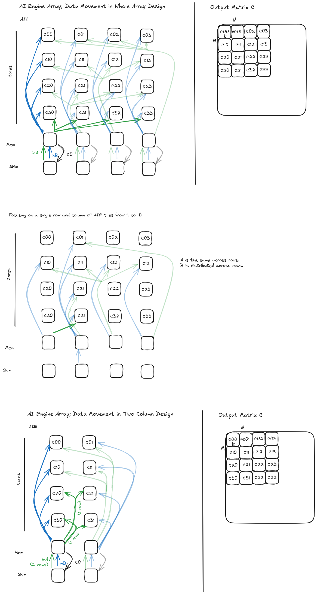

<!---//===- README.md -----------------------------------------*- Markdown -*-===//
//
// Copyright (C) 2023-2026 Advanced Micro Devices, Inc.
// SPDX-License-Identifier: Apache-2.0 WITH LLVM-exception
//
//===----------------------------------------------------------------------===//-->

# Matrix Multiplication - Whole Array Design

The code in this directory showcases an example matrix multiplication design for a Ryzen AI device with an NPU (Neural Processing Unit). The NPU consists of an array of compute cores, called AI Engines (AIEs). The example design configures each of those compute cores to perform multiplications of distinct sub-matrices in parallel.

At a high level, the code does the following (in order):

1. [**Defining Matrix Dimensions and Data Types:**](#1-defining-matrix-dimensions-and-data-types) We first specify the dimensions `M`, `K`, `N` for the input matrices `A` (`M`&times;`K`), and `B` (`K`&times;`N`), and the output matrix `C` (`M`&times;`N`), as well as their data type. To enable efficient computation, our design will split large input matrices into smaller sub-matrix blocks on two levels; we thus also define the sizes of those sub-matrices. At the first level, the constants `m`, `k`, and `n` define the size of the submatrices processed by each AIE core. At the second level, we further subdivide using smaller sizes `r`, `s` and `t` -- these are the sizes of required by the vector computation intrinsics of the AIEs.

1. [**Constructing an AIE Array Configuration:**](#2-constructing-an-aie-array-configuration) The NPU hardware is comprised of components laid out in a two-dimensional grid of rows and columns. Based on the matrix sizes and tiling factors, we choose the number of rows, columns, and total number of compute cores of the AIE device that the design should utilize. We then configure the AI Engine array, memory tiles, and shim tiles.

1. [**Defining Data Movement Inside the NPU:**](#3-defining-data-movement-inside-the-npu) ObjectFifos are a data movement abstraction for buffering data and synchronizing between AIE components. We configure ObjectFifos for `A`, `B` and `C` to transfer and buffer data between AIE components in chunks of the previously defined sizes (`m`&times;`k`, `k`&times;`n` and `m`&times;`n`, respectively).

1. [**Defining Core Computations:**](#4-defining-core-computations) The `core_fn()` function — wrapped in a `Worker` — contains the code that will be loaded onto each AIE core. This code calls the matrix-multiply microkernel from the library (`kernels.mm`) on the input sub-matrix elements acquired through the ObjectFifos, accumulating into the output sub-matrix.

1. [**Defining External Data Transfer Sequences:**](#5-defining-external-data-transfer-sequences) A `sequence()` function handed to `Runtime(...)` sets up matrix data movement from the host into the AIE compute cores, and back to the host after computation, via `handle.fill()` / `handle.drain()` calls that consume `TensorAccessPattern` tilings.

1. **Generating the Design:** The `@iron.jit`-decorated `whole_array()` builds the IRON design and resolves it to an MLIR module; it is the single entry point for compilation. `main()` either compiles + runs on hardware or compiles ahead-of-time to caller-specified xclbin/insts paths (used by the Makefile so `test.cpp` + `sweep.sh` can drive the design). `tile_matrices()` builds the access patterns and `step_transfers()` lists one row block's shim transfers; the runtime sequence issues them, and the visualization notebook plots them without building the design.

In summary, this design leverages an AI Engine accelerator to accomplish matrix multiplication efficiently by breaking large matrices into smaller, manageable submatrices. The design uses parallelism, pipelining, and efficient data movement strategies to minimize computation time on the AI Engine array.

## Building and Running the Design

With the default configuration, this design will set up an array of AIEs to perform matrix-matrix multiplication on an `int16` input data type (`int32` output). The tiling size is configured as `64` &times; `64` for `a`, `b`, and `c` by default.

The Python source ([`whole_array.py`](./whole_array.py)) supports two execution paths:

* **`make`-driven, with `test.cpp` host harness:** the Makefile invokes Python with `--xclbin-path` / `--insts-path` so the JIT pipeline writes artifacts straight to `build/`; `test.cpp` then runs against them. All existing lit configs and the matmul sweep go through this path. You will need C++23 for `bfloat16_t` support in the `test.cpp`, which can be found in `g++-13`: [https://lindevs.com/install-g-on-ubuntu](https://lindevs.com/install-g-on-ubuntu).

  ```shell
  make
  make run
  ```

* **Direct Python run + verify:** invoke the script with no `--xclbin-path` and it compiles + runs on the attached NPU in one step, verifying against a numpy reference. Useful for fast iteration and avoids the C++ test harness entirely.

  ```shell
  python3 whole_array.py                            # default 4-col i16/i16, 512x512x512
  python3 whole_array.py --c-col-maj 1              # column-major C output
  python3 whole_array.py --b-col-maj 1              # column-major B input
  python3 whole_array.py --dtype_in bf16 --dtype_out bf16
  python3 whole_array.py --help                     # full flag list
  ```

* **One compile, many shapes:** `--dynamic` compiles once for host buffers sized to the largest of the listed shapes and runs every shape on that one xclbin (see [Dispatch-Time Shapes](#dispatch-time-shapes)).

  ```shell
  python3 whole_array.py --dev npu2 --dtype_out i32 --dynamic 512x512x512 512x256x512 768x256x256
  ```

All paths share one design body and one set of `@iron.jit` compile machinery — the only difference is whether artifacts land in `build/` (for `test.cpp`) or in the JIT cache (for direct run).

## Detailed Design Explanation

The configuration of the AI Engine array is described in the [`whole_array.py`](./whole_array.py) file, which uses the IRON high-level builders (`Worker` / `Runtime` / `Program`) and is decorated with `@iron.jit`. The design is linked against a compute microkernel which is implemented in C++. The accompanying [notebook](./mat_mul_whole_array_visualization.ipynb) provides data-movement visualization for the runtime sequence (driven by the same `tile_matrices()` and `step_transfers()`).
The following sections elaborate on each of the steps outlined in the high-level summary above.

> Note: The term "tile" has two distinct meanings in the following discussion that should be distinguishable from context:
>  * AIE tiles are components of the hardware, specifically Shim, Memory and Compute tiles.
>  * Matrix tiles are smaller sub-matrices of the larger input and output matrices.

### 1. Defining Matrix Dimensions and Data Types

In the first section of the code in `whole_array.py`, we define the following constants:

| Matrix        | Size      | Submatrix Size (1.) | Vector Intrinsic Size (2.) |
|---------------|-----------|---------------------|-----------------------|
| `A` (Input)   | `M`  &times;  `K` | `m`  &times;  `k`           | `r`  &times;  `s`             |
| `B` (Input)   | `K`  &times;  `N` | `k`  &times;  `n`           | `s`  &times;  `t`             |
| `C` (Output)  | `M`  &times;  `N` | `m`  &times;  `n`           | `r`  &times;  `t`             |


The input and output matrix sizes are given by the user. We subdivide the input matrices `A`, `B` and the output matrix `C` into smaller, manageable "tiles" (or submatrices) at two levels:

1. **Tiling to Compute Core Submatrix Chunks:** The input and output matrices stream to/from the AIE compute cores in chunks of size of `m`&times;`k`, `k`&times;`n` and `n`&times;`m`. Tiling into these chunks allows each of the computation cores to concurrently work on distinct sub-sections of the input matrices in parallel, which improves performance. This also reduces on-chip memory requirements. The final result is re-assembled using the sub-matrix results of all cores.

    > This tiling occurs in the `Runtime` sequence body's host-to-memtile `handle.fill()` calls.
We describe it further below, in section *"5. Defining External Data Transfer Sequences"*.

1. **Tiling to Vector Intrinsic Size:** The AIE compute cores calculate the matrix multiplication using efficient "multiply-accumulate" vector intrinsic instructions (`MAC` instructions). These hardware instructions process very small blocks of the matrix: size `r`&times;`s` blocks of `A` and size `s`&times;`t` blocks of  `B`, producing an output of size `r`&times;`t` (`C`).
    > This tiling occurs in the inner-AIE data movements. We describe it in the section *"3. Defining Data Movement Inside the NPU"*.

    > The vector intrinsic size is dictated by the hardware and the compute microkernel.

### 2. Constructing an AIE Array Configuration

The Neural Processing Unit (NPU) is physically structured as an array of 6 rows and 4 columns (or up to 8 columns on NPU2 / Strix).  The lower two rows contain so-called "shim" and "memory" tiles, and the upper four rows are made up of AIE compute cores:

1. **Shim tiles** (row 0): interface with the external host for data movement.

1. **Memory tiles** (row 1): scratchpad memory that stages and distributes data during processing.

1. **Compute tiles** (rows 2–5): the AIE cores that run the matmul microkernel.  Across `n_aie_cols` columns × 4 rows we get a 4 × `n_aie_cols` grid of cores (16 by default with `n_aie_cols=4`).

In IRON we don't usually enumerate tiles by name.  The command line picks the device family (and, on NPU1, the column count) with `from_name(opts.dev, n_cols=…)`; the design itself names no tile.  `Worker.grid()` builds the 4 × `n_aie_cols` grid of workers, one per compute core, and the placer chooses the compute, memory and shim tiles from the FIFO topology:

```python
workers = Worker.grid(
    n_aie_rows,
    n_aie_cols,
    lambda row, col: Worker(core_fn, [A_l2l1_fifos[row].cons(), ...]),
)
```

`workers[row][col]` is the worker that consumes row `row`'s A FIFO and column `col`'s B FIFO.

### 3. Defining Data Movement Inside the NPU:

We use `ObjectFifo`s to abstractly describe the data movement and synchronization between AIE Compute, Memory and Shim tiles. An `ObjectFifo` presents a First-In-First-Out interface; under the hood it takes care of DMA configuration, lock acquisition / release, and double-buffering.

The design names each FIFO after the level-of-hierarchy hop it implements (L3 = host DDR / shim, L2 = memtile, L1 = compute tile):

1. **Host → Memory tiles (L3 → L2):** `A_l3l2_fifos[i]` / `B_l3l2_fifos[col]` move the input matrices from the host through the shim tiles into the memtiles.

2. **Memory tiles → Compute tiles (L2 → L1):** `A_l2l1_fifos[row]` / `B_l2l1_fifos[col]` deliver each compute tile's `(m, k)` / `(k, n)` sub-matrix.  These are *derived* from the corresponding L3↔L2 FIFOs — there is no separate hand-wired `object_fifo_link` in the IRON version.  Instead, you call `.cons().split(...)` on the L3↔L2 producer FIFO (for A) or `.cons().forward(...)` (for B), and IRON emits the equivalent staged transfer.

3. **Compute tiles → Memory tiles → Host (L1 → L2 → L3):** `C_l1l2_fifos[row][col]` move per-tile `(m, n)` results into the memtile, and `C_l2l3_fifos[col]` from the memtile back to the shim.  The L1↔L2 set is built via `C_l2l3_fifos[col].prod().join(...)` — again, the link is implicit in the construction.

Concretely, for matrix A the chain looks like (simplified):

```python
a_l3l2 = ObjectFifo(A_l2_ty, name=f"A_L3L2_{i}", depth=fifo_depth)
A_l2l1_fifos.extend(
    a_l3l2.cons().split(
        [m * k * j for j in range(n_A_tiles_per_shim)],
        obj_types=[A_l1_ty] * n_A_tiles_per_shim,
        to_stream=[dims.A] * n_A_tiles_per_shim,
    )
)
```

`split()` consumes the L3→L2 stream and fans it out into per-compute-row L2→L1 FIFOs; the `to_stream=` argument carries the DMA-layout transform described below.  Matrix B uses `.cons().forward(...)` (1 → 1) since each column gets one shared B sub-tile; matrix C uses `.prod().join(...)` (n_aie_rows → 1) to combine per-row outputs.

[](https://excalidraw.com/#room=23df780b85d72d80cbc6,1czLdPr_vK9-OjtxFIWTpw)

#### Tiling and Data Layout Transformations

We assume our data are stored in **row-major format** in the host's memory. For processing on the AIE compute cores, we need to transform the data layouts, such the above listed *sub-matrix tiles* are laid out contiguously in AIE compute core memory. Thankfully, AIE hardware has extensive support for transforming data using the DMAs as it is received and sent with zero cost. In the following, we will explain how we make use of this hardware feature to transform our data.

#### Runtime Sequence Tiling and Data Layout Transformations Notebook

There is a notebook that includes visualization for the runtime sequence's `handle.fill` / `handle.drain` shim DMA transfers for matrices A, B, and C — it plots the tilings from the same `tile_matrices()` and `step_transfers()` the runtime sequence issues, so the notebook needs neither a compiler nor an NPU.

To run the notebook:
* Start a jupyter server at the root directory of your clone of `mlir-aie`.
  Make sure you use a terminal that has run the `utils/setup_env.sh` script
  so that the correct environment variables are percolated to jupyter.
  Below is an example of how to start a jupyter server:
  ```bash
  python3 -m jupyter notebook --no-browser --port=8080
  ```
* In your browser, navigate to the URL (which includes a token) which is found
  in the output of the above command.
* Navigate to `programming_examples/basic/matrix_multiplication/whole_array`
* Double click `mat_mul_whole_array_visualization.ipynb` to start the notebook; choose the ipykernel called `ironenv`.
* You should now be good to go! Note that generating the animations in the notebook can take several minutes.

##### Tiling to Vector Intrinsic Size

The `A_l2l1_fifos` and `B_l2l1_fifos` deliver sub-matrices of size `m`&times;`k` and `k`&times;`n` to each core.  Along the way the FIFOs translate those matrices from row-major (or column-major for `B` when `b_col_maj` is set) into the `r`&times;`s`-sized and `s`&times;`t`-sized blocks the hardware's MAC vector intrinsics expect.

For matrix A this transformation is the `to_stream=` argument passed to `A_l3l2_fifos[i].cons().split(...)`. The matmul kernel carries it (`dims = matmul_kernel.stream_dims`), built as a `TensorAccessPattern` that walks the `m`&times;`k` tile in `r`&times;`s` blocks:

```python
dims.A == TensorAccessPattern.full((m, k)).tile((r, s))
```

`tile()` splits each dimension into a tile index and a position within the tile, and orders the tile indices first. The resulting pattern has four `(size, stride)` dimensions, which the DMA walks outermost first (`//` denotes integer floor-division in Python):

```python
    [
        (m // r, r * k),   # Pair 1
        (k // s, s),       # Pair 2
        (r, k),            # Pair 3
        (s, 1),            # Pair 4
    ]
```

`print(dims.A)` shows these sizes and strides. Let us break down each component of this pattern. We do so back-to-front for ease of understanding:

* Pair 4: `(s, 1)`
    * This dimension represents the transfer of a single row of a `r`&times;`s`-sized tile (our target tile size after the transformation).
    * Wrap: `s` is the length of a row of a `r`&times;`s`-sized block in units of 4 bytes (i32 elements).
    * Stride: A stride of `1` retrieves contiguous elements.
* Pair 3: `(r, k)`
    * Together with the previous dimension, this dimension represents the transfer of a single `r`&times;`s`-sized tile.
    * Wrap: `r` is the number of rows of a `r`&times;`s`-sized tile.
    * Stride: `k` is the stride between first element of each consecutive row along the `m` dimension, i.e. adding this stride to a memory address points to the element in the matrix directly below the original address.
* Pair 2: `(k // s, s)`
    * Together with the previous dimensions, this dimension represents the transfer of one row of `r`&times;`s`-sized tiles, i.e. the first `k`&times;`s` elements of the input array.
    * Wrap: `k // s` is the number of `r`&times;`s`-sized tiles along the `k` (columns) dimension.
    * Stride: `s` is the stride between starting elements of consecutive blocks along the `k` dimension, i.e. adding this stridde to a memory address points to the same element in the `r`&times;`s`-sized block directly to the right of the block of the original address.
* Pair 1: `(m // r, r * k)`
    * Together with the previous dimensions, this dimension transfers the entire `m`&times;`k`-sized matrix as blocks of `r`&times;`s`-sized tiles.
    * Wrap: `m // r` is the number of `r`&times;`s`-sized blocks along the `m` (rows) dimension.
    * Stride: `r * k` is the stride between starting elements of consecutive blocks along the `m` dimension, i.e. adding this stride to a memory address points to the same element in the `r`&times;`s`-sized block directly below the block of the original address.

> You can use this [data layout visualizer](http://andreroesti.com/data-layout-viz/data_layout.html) to better understand data layout transformations expressed as wraps and strides.

The matrix B transformation (`B_l2l1_fifos`) is equivalent after substituting the correct dimensions, `TensorAccessPattern.full((k, n)).tile((s, t))`. If a column-major layout is used for `B` (argument `b_col_maj` is set), the transformation is analogous but transposed: `TensorAccessPattern.full((n, k)).tile((t, s))`.

The output matrix C goes the other way: the DMA reads the core's `r`&times;`t` blocks and emits a row-major `m`&times;`n` tile (or column-major when `c_col_maj` is set). That is the inverse of the blocking walk, the `to_stream=` argument on the `C_l2l3_fifos[col]` ObjectFifo constructor:

```python
dims.C == TensorAccessPattern.full((m, n)).tile((r, t)).inverse()
```


### 4. Defining Core Computations

A single `core_fn` body is shared by all `4 * n_aie_cols` workers — each `Worker` binds the same function to a different `(row, col)` pair of `ObjectFifo` endpoints, plus that worker's runtime parameters and barrier:

```python
def core_fn(in_a, in_b, out_c, zero, matmul, rtp, barrier):
    barrier.wait_for_value(1)                           # this dispatch's RTPs are written
    k_iters = rtp[0]                                    # K // k
    n_tiles = rtp[1]                                    # output tiles for this core
    barrier.release_with_value(1)
    for _ in range_(n_tiles):
        elem_out = out_c.acquire(1)
        zero(elem_out)                                  # clear C tile
        for _ in range_(k_iters):
            elem_in_a = in_a.acquire(1)
            elem_in_b = in_b.acquire(1)
            matmul(elem_in_a, elem_in_b, elem_out)      # accumulate
            in_a.release(1)
            in_b.release(1)
        out_c.release(1)

workers = Worker.grid(
    n_aie_rows,
    n_aie_cols,
    lambda row, col: Worker(
        core_fn,
        [
            A_l2l1_fifos[row].cons(),
            B_l2l1_fifos[col].cons(),
            C_l1l2_fifos[row][col].prod(),
            zero_kernel,
            matmul_kernel,
            rtps[row][col],
            barriers[row][col],
        ],
        stack_size=0xD00,
    ),
)
```

Per output tile, each core: acquires an `m`&times;`n` slot from `C_l1l2_fifos`, zero-initialises it, then for each of the `K // k` k-iterations acquires its next `(m, k)` and `(k, n)` input tiles and calls `matmul(...)`.  Result is accumulated into `elem_out` and released once the full reduction is done.

The trip counts depend on `M`, `K` and `N`, so they are not baked into the core program. Each worker owns a two-element runtime-parameter `Buffer` that the runtime sequence writes, and a `WorkerRuntimeBarrier` the sequence sets once they are written. `wait_for_value(1)` leaves the barrier at 1, so the core steps it back off with `release_with_value(1)` after reading; its next dispatch then waits for that dispatch's own values instead of reusing these.

Both `zero_kernel` and `matmul_kernel` come from the library — `kernels.mm(dim_m=m, dim_k=k, dim_n=n, input_dtype=…, output_dtype=…)` returns the matmul `ExternalFunction` with a `.zero` attribute that pairs the matching zeroing kernel.  See [Compute Microkernels](#compute-microkernels) below for the C++ side.

### 5. Defining External Data Transfer Sequences

`Runtime(sequence, [A, B, C, M, K, N, A_prods, B_prods, C_conses])` wires a host-side `sequence` function whose parameters `A`, `B`, `C` stand in for the three external buffers on the AIE's shim tiles and `M`, `K`, `N` for the shape, followed by the ObjectFifo handles passed as the trailing entries.  Inside the body, `handle.fill(buffer, tap=tap)` on a producer handle and `handle.drain(buffer, tap=tap)` on a consumer handle describe the per-shim DMA transfers — `tap` is a `TensorAccessPattern` that encodes the wraps/strides for tiling `M`&times;`K`, `K`&times;`N`, and `M`&times;`N` into the sub-matrices the in-array FIFOs expect.

`tile_matrices()` builds each matrix's tiling from `TensorAccessPattern.full`. A tiling is itself a `TensorAccessPattern` whose leading dimensions index the grid of tiles, so indexing or slicing those dimensions picks out the tiles one transfer moves:

```python
A_tiles = (
    TensorAccessPattern.full((M, K))
    .tile((m * n_A_tiles_per_shim, k))
    .repeat(N // n // n_aie_cols)
    .permute((1, 0, 2, 3, 4))
)  # A_tiles[i]: row block i of A, walked once per output tile column
B_tiles = TensorAccessPattern.full((K, N)).tile((k, n)).permute((1, 0, 2, 3))
# B_tiles[j]: column j of B tiles
C_tiles = TensorAccessPattern.full((M, N)).tile((m * n_aie_rows, n))
# C_tiles[i, j]: the C tile at row block i, column j
```

(The `b_col_maj=1` / `c_col_maj=1` branches tile the transposed layouts instead.)

The sequence walks the row blocks of C one at a time. `step_transfers()` lists one row block's transfers as `(tensor, col, tap)`; each shim column takes every `n_aie_cols`-th column of tiles:

```python
for col in range(n_aie_cols):
    transfers.append(("C", col, tilings.C[row, col::n_aie_cols]))
    if col < n_shim_mem_A:
        transfers.append(("A", col, tilings.A[row * n_shim_mem_A + col]))
    transfers.append(("B", col, tilings.B[col::n_aie_cols]))
```

The runtime body — a plain function that receives the three host buffers, the shape and the shim ObjectFifo handles — first writes each worker's trip counts and sets its barrier, then issues each row block's transfers into one `TaskGroup`:

```python
def sequence(A, B, C, M, K, N, A_hs, B_hs, C_hs):
    require(M % (m * n_aie_rows) == 0, "M must be a multiple of m * n_aie_rows")
    ...
    for row in range(n_aie_rows):
        for col in range(n_aie_cols):
            rtps[row][col][0] = K // k
            rtps[row][col][1] = (M // m) * (N // n) // n_aie_cores
            barriers[row][col].set(1)

    tilings = tile_matrices(M, K, N, m, k, n, n_aie_cols, b_col_maj, c_col_maj)
    for row, tg in TaskGroup.pipelined(M // m // n_aie_rows, depth=4):
        for tensor, col, tap in step_transfers(tilings, row, n_aie_cols):
            if tensor == "C":
                C_hs[col].drain(C, tap=tap, wait=True, group=tg)
            elif tensor == "A":
                A_hs[col].fill(A, tap=tap, group=tg)
            else:
                B_hs[col].fill(B, tap=tap, group=tg)
```

`TaskGroup.pipelined(n, depth=4)` keeps four row blocks in flight: a block's group is finished, waiting on its C drains and freeing its buffer descriptors, only after the next three blocks have been issued. This is the IRON equivalent of the old "ping/pong" buffer-descriptor split: while earlier blocks' shim DMA BDs are still running, the next blocks' are being configured.  This overlap is what keeps the array fed.  The handles in `A_hs` / `B_hs` / `C_hs` are the `.prod()` / `.cons()` endpoints passed as trailing entries in the `Runtime`'s arg list; the shim tile each uses is chosen by the compiler.

`require(condition, message)` checks the shape. For a shape fixed at compile time it raises a `ValueError` while the design is generated; for a dispatch-time shape it becomes a guard that refuses the call before anything reaches the NPU.

## Compute Microkernels

This C++ code demonstrates how to implement matrix multiplication for different data types and operations using AIE (AI Engine) API and templates. The AI Engine is designed for efficient computation and data movement, especially for matrix multiplication-intensive machine learning workloads. The code has the following main components:

1. `matmul_scalar`: A scalar function that performs matrix multiplication for input matrices `a` and `b` and adds the result to matrix `c`. This function iterates through each row in matrix `a` and each column in matrix `b`, performing the multiplication of the corresponding elements and accumulating their sum to populate matrix `c`.

1. `matmul_vectorized` and `matmul_vectorized_XxX`: Vectorized matrix multiplication functions for different block sizes and input/output types for the AI Engine. These functions use the AIE API for efficient vectorized matrix multiplication, with support for various input and output tensor data types (e.g., int16, bfloat16). These functions expand the vectorized matrix multiplications to different shapes (4x4, 2x2, 4x4) to achieve higher kernel efficiency through higher accumulator register usage.

1. `matmul_vectorized_4x4x4_i16_i16`, `matmul_vectorized_4x8x4_bf16_bf16`, `matmul_vectorized_4x8x4_bf16_f32`, ... : Helper functions for calling the corresponding `matmul_vectorized` functions with specific input and output types and block sizes. The shapes of the intrinsic calls (ex: `4x8x4`) have been selected among the available ones for their higher performance. The full list of available matrix multiplication modes can be found [here](https://xilinx.github.io/aie_api/group__group__mmul.html).

1. Extern "C" interface functions: These functions provide a C-compatible interface to the main matrix multiplication functions, making it easier to call these functions from other languages or environments.

1. Zeroing functions: Functions like `zero_vectorized` and `zero_scalar` initialize the output matrix (`c_out`) with all zero values.

1. `matmul_vectorized_b_col_maj` functions: These functions are identical to the `matmul_vectorized_2x2` implementation except for differences in pointer arithmetic for accessing the `B` matrix and issuing a transpose instruction for `B`. This allows us to feed column-major `s`&times;`t`-sized tiles into the compute kernel, which then transposes those into row-major.

This code showcases efficient performance in matrix multiplication-intensive workloads and can be adapted for other types of inputs and operations as needed.

## Dispatch-Time Shapes

`M`, `K` and `N` are `DispatchTime[np.int32]` parameters. Specialized, with
`whole_array.specialize(M=.., K=.., N=..)` as the default command line does,
they are constants and the runtime sequence unrolls into a fixed instruction
stream. Left free, the design compiles once for the tensors it is called with,
and every call rebuilds the instruction stream on the host in C++ from the same
xclbin, with no Python in the loop:

```python
A = iron.zeros((4096 * 4096,), dtype=bfloat16, device="npu")
B = iron.zeros((4096 * 4096,), dtype=bfloat16, device="npu")
C = iron.zeros((4096 * 4096,), dtype=np.float32, device="npu")
tiles = dict(m=64, k=64, n=32, n_aie_cols=4)
whole_array(A, B, C, M=512, K=1024, N=2048, **tiles)  # one compile serves every shape
whole_array(A, B, C, M=4096, K=4096, N=4096, **tiles)
whole_array(A, B, C, M=100, K=64, N=64, **tiles)      # refused: M must be a multiple of m * n_aie_rows
```

The same `tile_matrices()` and `step_transfers()` run inside the runtime
sequence on the dispatch-time shape: the taps become arithmetic on `M`, `K` and
`N`, `TaskGroup.pipelined` keeps the row-block loop rolled, and each `require`
becomes a guard. The cores read their trip counts from the runtime parameters
described in [section 4](#4-defining-core-computations), so they need no
recompile either. Any shape whose matrices fit the buffers (packed row-major at
the front) runs; a larger one is refused with `a runtime DMA access runs past
the end of its N-element host buffer`.

On the command line, `--dynamic` compiles once for the largest of the shapes it
is given and runs them all on that one xclbin:

```
python3 whole_array.py --dev npu2 --dtype_out i32 --dynamic 512x512x512 512x256x512 768x256x256
```

To see what a call would run without an NPU, bind the tensor types and ask for
the instruction words:

```python
design = whole_array.specialize(A=np.ndarray[(512, 256), np.dtype[np.int16]], ...)
words = design.instructions(M=256, K=128, N=128)
```

`tests/dispatch_txn.py` compares those words against fully static
specializations with `aie.utils.txn_trace`, and `python -m aie.utils.txn_trace
insts.bin` explains a stream saved to disk.
