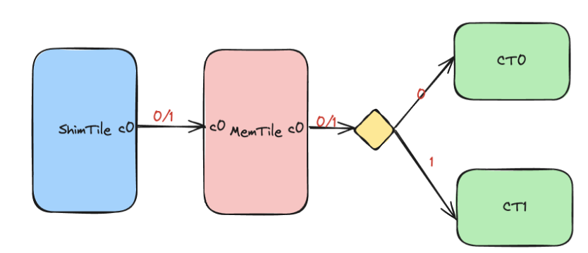

<!---//===- README.md --------------------------*- Markdown -*-===//
//
// This file is licensed under the Apache License v2.0 with LLVM Exceptions.
// See https://llvm.org/LICENSE.txt for license information.
// SPDX-License-Identifier: Apache-2.0 WITH LLVM-exception
//
// Copyright (C) 2025, Advanced Micro Devices, Inc.
// 
//===----------------------------------------------------------------------===//-->

# <ins>Packet Switch</ins>

A simple design that shows how to use the packet switch feature of the AIE. It uses two cores, one to multiply and one to add two vectors together. The dataflow diagram is shown below:


There are three data paths in the design:

1. Data path from the shim tile to the memory tile. It is assigned with two possible packet IDs: 0 and 1.
2. Data path from the memory tile to the add compute tile (CT0). It is assigned with packet ID: 0
3. Data path from the memory tile to the multiply compute tile (CT1). It is assigned with packet ID: 1

The initial packet ID is generated by the shim tile (runtime_sequence part) and the packet ID is passed to the memory tile. The packet id is kept in the memory tile therefore the total packet length is increased by 4 bytes. Then the packet is read out from the memory tile the AIE automatically uses the first 4 bytes as the packet ID. Therefore, the packet ID initiated by the shim tile is used again to determine where the packet should be sent (CT0 or CT1). Finally, the processed data is sent back to the host for verification.

During the compilation, only one xclbin is generated and is shared by both add and multiply operations. Two instruction files are generated with respect to the add and multiply configurations in the shim tile.


## Source Files Overview

1. `aie_add_placed.py`: A Python file that describes the AIE design. The shim tile initializes the packet ID as 0 and therefore the packet will be sent to CT0 (doing add operation).

2. `aie_mul_placed.py`: A Python file that describes the AIE design. The shim tile initializes the packet ID as 1 and therefore the packet will be sent to CT1 (doing multiply operation).

3. `host/host.cpp`: This C++ code is a testbench for the design example targetting Ryzen™ AI (AIE-ML). It receives a flag 0 or 1 as an input argument to determine which operation to perform (0 to add and 1 to multiply).


## Ryzen™ AI Usage

### Compilation

To compile all files required for the design:
```shell
make all
```

To compile the design on npu1:
```shell
make all DEVICE=npu1
```

To compile the design on npu2:
```shell
make all DEVICE=npu2
```


To compile the C++ testbench:
```shell
make host
```


### C++ Testbench

To run the design (both add and multiply):

```shell
make run
```

To run the design with add operation:

```shell
make run_add
```

To run the design with multiply operation:

```shell
make run_mul
```  
