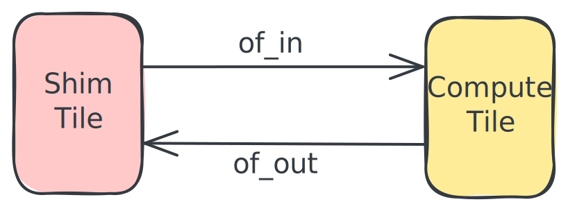

<!---//===- README.md -----------------------------------------*- Markdown -*-===//
//
// This file is licensed under the Apache License v2.0 with LLVM Exceptions.
// See https://llvm.org/LICENSE.txt for license information.
// SPDX-License-Identifier: Apache-2.0 WITH LLVM-exception
//
// Copyright (C) 2024-2026, Advanced Micro Devices, Inc.
//
//===----------------------------------------------------------------------===//-->

# Passthrough Kernel

This IRON design example demonstrates a vectorized memcpy on a vector of `uint8_t`. A single AIE core copies a `4096`-byte input to the output in `1024`-byte sub-tensors via a depth-2 ObjectFifo, so DMA transfers overlap with compute.

The example uses the IRON high-level builders (`Worker` / `Runtime` / `Program`) and the `@iron.jit` decorator, so kernel compilation and xclbin generation happen on the first invocation — there is no separate `aiecc` / xclbin / testbench step.

## Source Files

1. [`passthrough_kernel.py`](passthrough_kernel.py) — IRON structural design plus the host-side test driver. Decorated with `@iron.jit`; on first call it compiles the design and runs it on the NPU, then verifies the result against the input.
1. [`passThrough.cc`](../../../aie_kernels/generic/passThrough.cc) — vectorized memcpy implementation for the AIE core. The C++ wrappers `passThroughLine` / `passThroughTile` are templated on `BIT_WIDTH` (set to `8` here for `uint8_t`). The IRON design references this kernel through the `kernels.passthrough(...)` helper rather than naming the `.cc.o` directly, so there is no manual `aiecc` step to bind the object.

## Design Overview



1. ObjectFifo `in` connects a Shim Tile to a Compute Tile; `out` connects the Compute Tile back to the Shim Tile.
2. The runtime moves `4096` `uint8_t` from host memory to the compute tile and back.
3. The compute tile acquires input data in `1024`-element blocks from `in`, calls `passThroughLine`, and releases the result through `out`.
4. Because the ObjectFifos are double-buffered (default depth `2`), Shim and Compute DMAs run concurrently with the AIE core.

## Usage

```shell
make run        # compile + execute on the attached NPU (auto-detected)
make trace      # execute with hardware tracing enabled
make clean
```

The actual NPU generation (NPU1 / NPU2) is auto-detected by the IRON runtime at JIT time, so no device flag is needed.

`make run` reports both NPU latency (from the runtime) and end-to-end Python wall-clock so the host-side overhead delta is visible. `make trace` additionally dumps a per-tile cycle summary parsed from the trace buffer.

For finer-grained benchmarking, invoke the script directly:

```shell
python3 passthrough_kernel.py -i1s 4096 -w 20 -n 100   # warmup + iters
```

Run `python3 passthrough_kernel.py --help` for the full flag list.
