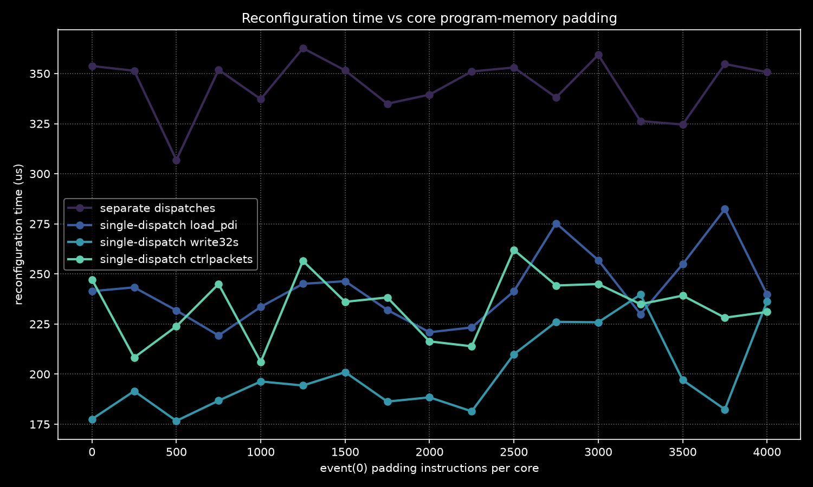
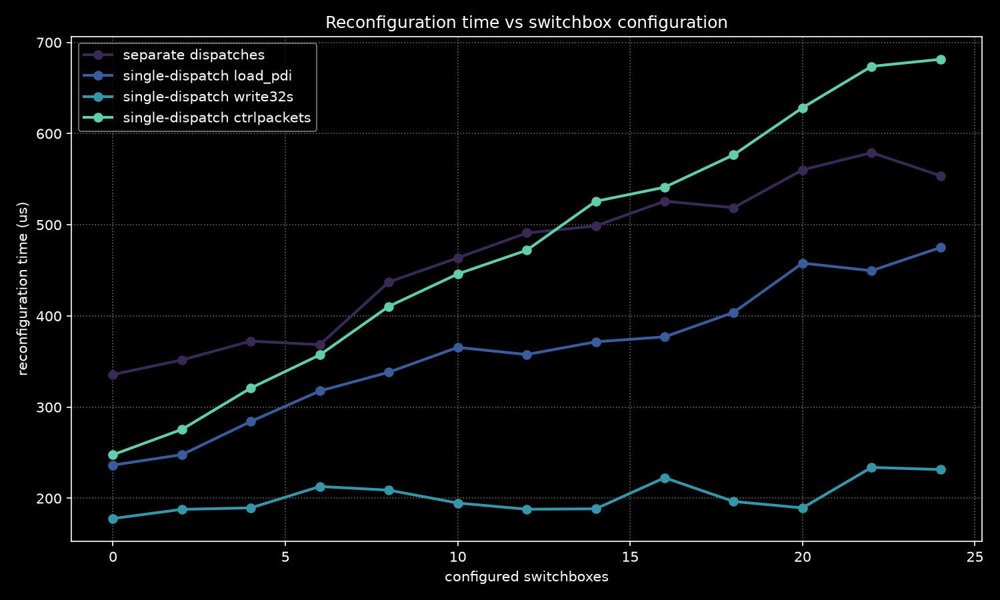

<!---//===- README.md --------------------------*- Markdown -*-===//
//
// Copyright (C) 2026 Advanced Micro Devices, Inc.
// SPDX-License-Identifier: Apache-2.0 WITH LLVM-exception
//
//===----------------------------------------------------------------------===//
-->

# Reconfiguration

Many workloads, including large language models, execute a sequence of different
operations. A dataflow mapping can implement the whole workload as one design,
but such a design requires substantial integration work. A layer-by-layer
mapping implements each meaningful operation as a standalone operator and
dispatches the operators in sequence at run time.

Layer-by-layer mappings improve modularity because multiple workloads can reuse
the same operator implementations. They also let developers study one operation
at a time. However, they require quick reconfiguration. Slow device-image
replacement can make the layer-by-layer approach impractical.

This example compares four ways to run or reconfigure one NPU2 device image:

- `separate-dispatch`: compile an xclbin and create one CPU-to-NPU dispatch for
  each run.
- `load-pdi`: use one full-ELF dispatch and load each device image as a PDI.
- `expand-load-pdis`: use one full-ELF dispatch and expand each PDI into
  register writes at compile time.
- `control-packets`: use one full-ELF dispatch and expand each PDI into control
  packets at compile time.

`separate-dispatch` requires the CPU to create and submit every dispatch. This
is the slowest path. Each full-ELF mode uses one dispatch. Its runtime sequence
contains the reconfiguration commands, and the NPU command processor executes
those commands. `load-pdi` makes the command processor load and parse a device
image. The other full-ELF modes replace that work with register writes or
control packets during compilation.

`reconfiguration.py` contains one `@iron.jit` design. One
`DeviceConfiguration` owns the workers and their runtime sequence. The xclbin
path wraps that configuration in a `Program` whose entry is the worker runtime.
The full-ELF paths use the same configuration and add one coordinator runtime;
the coordinator enters `configuration.configure()` and calls the worker runtime.

The design accepts array dimensions, program-memory padding, switchbox padding,
and the number of configure-and-run operations per full-ELF dispatch.
`event(0)` instructions increase core program-memory use without changing the
result. Dummy bidirectional flows increase switchbox configuration-data size.
These controls measure how each reconfiguration path scales with both forms of
configuration data.

```bash
python reconfiguration.py --mode expand-load-pdis --cols 4 --rows 2 \
  --nops 2000 --switchboxes 12 --reconfigs 4 --warmup 2 --iters 10
```

The script validates the output and prints every critical-section runtime plus
mean, minimum, and maximum values. Add `--csv` for one row per timed iteration.

`run_scaling.sh` invokes the same script for all modes while varying core
program-memory padding and switchbox configuration. It concatenates the rows
into one CSV:

```bash
ITERS=12 ./run_scaling.sh benchmark.csv
```

After benchmarking with `run_scaling.sh`, generate plots like the ones below by
selecting the X axis:

```bash
python plot.py --csv benchmark.csv --x nops --output progmem.png
python plot.py --csv benchmark.csv --x switchboxes --output switchbox.png
```




