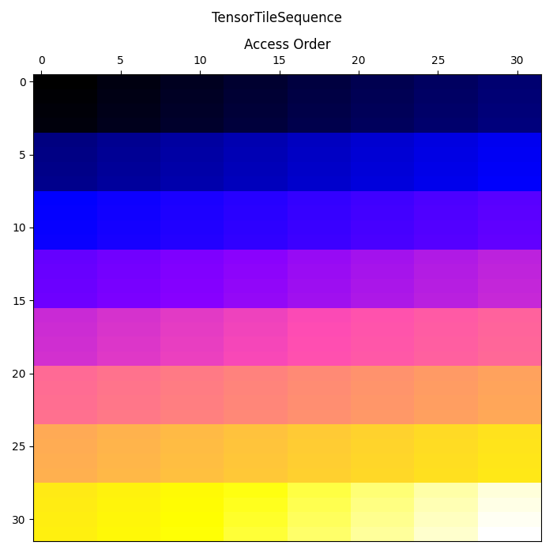

<!---//===- README.md -----------------------------------------*- Markdown -*-===//
//
// Copyright (C) 2024-2026 Advanced Micro Devices, Inc.
// SPDX-License-Identifier: Apache-2.0 WITH LLVM-exception
//
//===----------------------------------------------------------------------===//-->

# Tiling Exploration

This IRON design flow example, called "Tiling Exploration: Per Tile", demonstrates how data may be `tiled` into smaller chunks and sent/received through the `Runtime.sequence()` function. This is a common data transformation pattern, and this example is meant to be interactive.

## Source Files Overview

1. `per_tile.py`: An `@iron.jit`-decorated design that uses `TensorTiler2D` to specify `TensorAccessPatterns` (*taps*) of data to be transferred out of the design.  When invoked standalone, `@iron.jit` JIT-compiles to an xclbin/insts pair, runs on the NPU, and verifies the output against the expected tiled pattern.

## Design Overview

This design has no inputs; it produces a single output tensor. The single core used in this design touches each element in the output tensor seemingly sequentially. However, due to the data transformation (via `TensorAccessPattern`s) in the `runtime_sequence`, the output data is in 'tiled' order, as seen in the picture below.

<p align="center">
  
    <h3 align="center"> Visualization of the Per-Tile Data Movement
 </h3>
</p>

## Usage

Run the self-verifying JIT path directly; tensor and tile dimensions are command-line options:

```shell
python3 per_tile.py --dev npu
python3 per_tile.py --dev npu2 --tensor-height 8 --tensor-width 8 --tile-height 2 --tile-width 2
```

The Makefile remains available for producing an explicit XCLBIN/instruction pair. To generate a data visualization like the one above:

```shell
make generate_access_map
```
