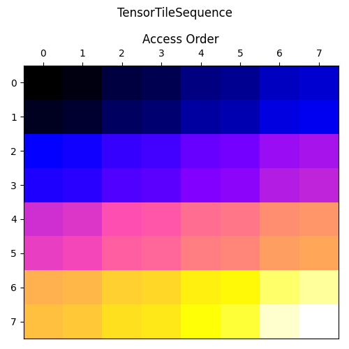

<!---//===- README.md -----------------------------------------*- Markdown -*-===//
//
// This file is licensed under the Apache License v2.0 with LLVM Exceptions.
// See https://llvm.org/LICENSE.txt for license information.
// SPDX-License-Identifier: Apache-2.0 WITH LLVM-exception
//
// Copyright (C) 2024, Advanced Micro Devices, Inc.
// 
//===----------------------------------------------------------------------===//-->

# Tiling Exploration

This IRON design flow example, called "Tiling Exploration: Per Tile", demonstrates how data may be `tiled` into smaller chunks and sent/received through the `runtime_sequence`. This is a common data transformation pattern, and this example is meant to be interactive.

## Source Files Overview

1. `aie2.py`: A Python script that defines the AIE array structural design using MLIR-AIE operations and the `TensorTiler2D` to specify `TensorAccessPatterns` (*taps*) of data to be transferred out of the design. The file generates MLIR that is then compiled using `aiecc.py` to produce design binaries (ie. XCLBIN and inst.txt for the NPU in Ryzen™ AI). 

1. `test.py`: This Python code is responsible for loading the compiled XCLBIN file, configuring the AIE module, providing input data, and executing the AIE design on the NPU. After executing, the script verifies the results against expected output.

## Design Overview

This design has no inputs; it produces a single output tensor. The single core used in this design touches each element in the output tensor seemingly sequentially. However, due to the data transformation (via `TensorAccessPattern`s) in the `runtime_sequence`, the output data is in 'tiled' order, as seen in the picture below.

<p align="center">
  
    <h3 align="center"> Visualization of the Per-Tile Data Movement 
 </h3> 
</p>

## Usage

Modify tensor and tile dimensions in the `Makefile`.

To compile and run the design for NPU:
```bash
make clean
make run
```

To generate a data visualization (like that above), run:
```bash
make generate_access_map
```
