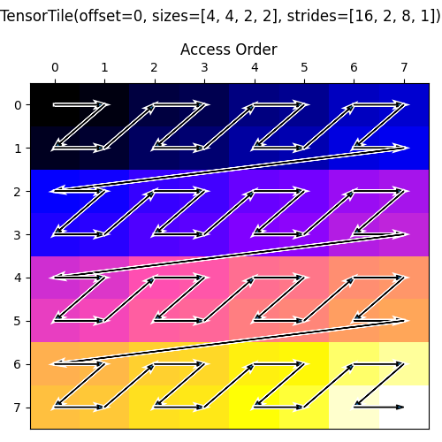

<!---//===- README.md -----------------------------------------*- Markdown -*-===//
//
// This file is licensed under the Apache License v2.0 with LLVM Exceptions.
// See https://llvm.org/LICENSE.txt for license information.
// SPDX-License-Identifier: Apache-2.0 WITH LLVM-exception
//
// Copyright (C) 2024, Advanced Micro Devices, Inc.
// 
//===----------------------------------------------------------------------===//-->

# Tiling Exploration

This IRON design flow example, called "Tiling Exploration: Tile Group", demonstrates how data may be `tiled` into smaller chunks and grouped into collections of tiles and sent/received through the `runtime.sequence()` function. This is a common data transformation pattern, and this example is meant to be interactive.

## Source Files Overview

1. `tile_group.py`: An `@iron.jit`-decorated design that uses `TensorTiler2D` to specify `TensorAccessPattern`s (*taps*) of data to be transferred out of the design.  When invoked standalone, `@iron.jit` JIT-compiles to an xclbin/insts pair, runs on the NPU, and verifies the output against the expected tile-group pattern.

## Design Overview

This design has no inputs; it produces a single output tensor. The single core used in this design touches each element in the output tensor seemingly sequentially. However, due to the data transformation (via `TensorAccessPattern`s) in the `runtime_sequence`, the output data is in 'tiled' order, as seen in the picture below. Rather than being collected one tile at a time, a group of tiles (all the tiles that make up the tensor) are collected all at once.

<p align="center">
  
    <h3 align="center"> Visualization of a Tile Group Data Movement 
 </h3> 
</p>

## Usage

Modify tensor and tile dimensions in the `Makefile`.

To compile and run the design for NPU:
```bash
make clean
make run_py
```

To generate a data visualization (like that above), run:
```bash
make generate_access_map
```
