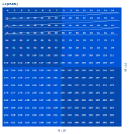
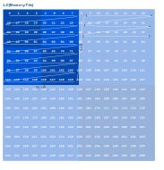
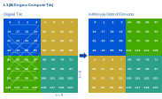
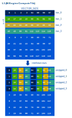

<!---//===- README.md --------------------------*- Markdown -*-===//
//
// This file is licensed under the Apache License v2.0 with LLVM Exceptions.
// See https://llvm.org/LICENSE.txt for license information.
// SPDX-License-Identifier: Apache-2.0 WITH LLVM-exception
//
// Copyright (C) 2024-2026, Advanced Micro Devices, Inc.
//
//===----------------------------------------------------------------------===//-->

# Transposes — four ways

A single [`@iron.jit`](./transposes.py) design exposing four distinct on-device transpose mechanisms.  All four produce the same end result: a full `M × K → K × M` transpose.  Only the on-device mechanism differs — pick one via `--strategy`.

| `--strategy`  | mechanism                                                     | dtypes      | size constraints                               |
| ------------- | ------------------------------------------------------------- | ----------- | ---------------------------------------------- |
| `dma`         | pure shim-DMA stride; no compute core                         | int32/uint32 only<sup>1</sup>      | any                                            |
| `dma_packet`  | same as `dma` but lowered with `--packet-sw-objFifos`         | int32/uint32 only<sup>1</sup>      | any                                            |
| `shuffle`     | per-tile VSHUFFLE (hand-coded `transpose_16x16` kernel)       | uint8 only<sup>2</sup>             | M = K = 16 only                                |
| `combined`    | hybrid: shim DMA outer reshuffle + VSHUFFLE inner sub-tile    | i8 / i16 / i32 (`--dtype-bytes`)   | `m \| M`, `n \| K`, `s \| m`, `s \| n`<sup>3</sup> |

<sup>1</sup> Shim DMA stride-1 must be ≥ 4 bytes, so 1- and 2-byte elements would lower to `aie.dma_bd` with stride < 4 bytes and be rejected.
<sup>2</sup> The `shuffle_16x16.cc` kernel is hand-written for `uint8 16x16`; supporting other dtypes / sizes would require new kernels.
<sup>3</sup> Plus an empirical lower bound — `s = 8` needs `m, n ≥ 32` for the underlying `transpose_8x8` VECTOR_SIZE arithmetic to do the right block interleave.

Each `@iron.jit` function in [`transposes.py`](./transposes.py) raises `ValueError` if asked for a combo outside its support envelope.

## Usage

Standalone (JIT + verify on NPU, no C++):

```shell
python3 transposes.py -d npu2 -s dma          # int32 64x64
python3 transposes.py -d npu2 -s dma_packet   # int32 64x32
python3 transposes.py -d npu2 -s shuffle      # uint8 16x16
python3 transposes.py -d npu2 -s combined     # int32 128x128, m=n=32, s=8
```

Pick `--dtype-bytes 1|2|4`, `-M`, `-K`, plus `-m`/`-n`/`--ss` for `combined`.  Strategies that can't satisfy the request fail fast with a clear `ValueError`.

Via Makefile + C++ testbench (default `STRATEGY=dma`):

```shell
make
make run
```

Switch strategy / sizes:

```shell
make STRATEGY=shuffle run                       # uint8 16x16
make STRATEGY=combined M=128 K=128 run          # int32 128x128 with built-in m=n=32, s=8
```

## DMA strategy: `--strategy dma`

The `dma` strategy reads a 2-D `M × K` row-major array from external
memory into a compute tile with a *transposed* layout, using the
compute tile's DMA. The host writes the matrix as-is — the transpose
is the byte-order in which the DMA *streams* it into L1.

The implicit copy is set up via `ObjectFifo.forward()`, which specifies
how data arriving on the input fifo is re-emitted onto the output fifo
through the compute tile's own DMA. No compute-core code runs; the
transpose is purely a stride pattern on the BD chain.

Because shim DMA stride-1 must be ≥ 4 bytes, this strategy is
restricted to `int32`/`uint32`. Smaller types fall through to
`combined`, which adds VSHUFFLE on the core.

## How the combined strategy works

`combined` transposes the input matrix through a combination of DMA
data-layout transformations *and* `VSHUFFLE` operations on the compute
cores. We rely on this combination because transposing using only the
DMAs is impossible for small data types and inefficient for larger
ones: the minimum DMA access granularity is four bytes, so any matrix
with a sub-4-byte element cannot be fully transposed by DMA alone, and
accessing more contiguous data from the host at once yields better
performance.

We refer to the memories as **L3** (DRAM, farthest from the AIE core),
**L2** (mem-tile scratchpad) and **L1** (on the AIE core). We start with
the to-be-transposed matrix in L3 in regular row-major layout — shown
here for a `16 × 16` matrix:



In each diagram, the arrow line is the order in which the matrix
elements live in memory: reading from the start address onwards, you
encounter the elements in the order the arrow traverses them.

The first two transformations occur in the DMAs. In
[`transposes.py`](./transposes.py) the `combined` strategy expresses
both as `TensorAccessPattern`s (`tap_in_L3L2`, `tap_in_L2L1`) and feeds
the L2→L1 layout through the L3→L2 ObjectFifo's consumer
(`.cons(dims_from_stream=tap_in_L2L1.transformation_dims).forward(...)`):

First, the ObjectFifo from L3 (host) to L2 (mem tile) tiles the
`M × K` input matrix into tiles of size `m × n`. The DMA iterates over
these tiles in regular row-major order:



Then, the ObjectFifo from L2 (mem tile) to L1 (core tile) performs a
special data-layout transformation. The next diagram shows the
traversal order the DMA uses to store the incoming data:



Although it looks complicated, this transformation has a simple effect:
the resulting matrix is transposed at an `s × s`-tile granularity.
Each `s × s` tile is still stored in row-major order, but the order of
tiles is column-major — i.e. transposed. To inspect this tile-level
transposed matrix (useful when debugging), swap the `transpose` kernel
in [`transposes.py`](./transposes.py) for a plain `copy()` and look at
the L1 buffer.

After this L2 transformation, all that is left to do is to transpose
each `s × s` sub-tile individually, in place.

The `transpose` kernel under `aie_kernels/` does exactly this, using
`VSHUFFLE` (via the higher-level `aie::interleave_zip` /
`aie::interleave_unzip` methods). There is a specialised kernel for
each supported `s` that transposes every `s × s` block in the input.
It reads `s` rows of the input and `VECTOR_SIZE` columns, then
interleaves every fourth element of each row with every fourth element
of each other row — i.e. concatenating element 0 of row 0, element 0
of row 1, element 0 of row 2, element 0 of row 3, element 4 of row 0,
and so on — which is equivalent to forming a column, i.e. transposing
the input:



The AIE API and underlying intrinsics don't directly support
interleaving four (or eight) different vectors one element at a time.
We achieve the same effect with two levels of interleave: first
interleave two elements at a time of rows 0/1 and rows 2/3
individually, then interleave the result two elements at a time.

After this kernel, the `m × n` tile is completely transposed. The
output transfer then writes the tiles back into their correct position
in the transposed output `M × K` matrix.
