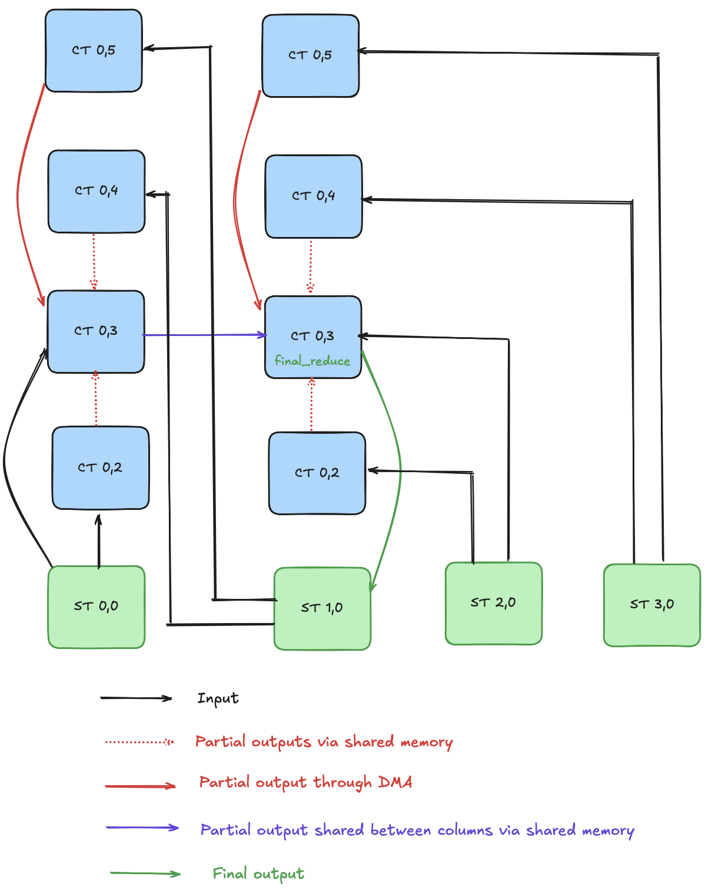

<!---//===- README.md --------------------------*- Markdown -*-===//
//
// This file is licensed under the Apache License v2.0 with LLVM Exceptions.
// See https://llvm.org/LICENSE.txt for license information.
// SPDX-License-Identifier: Apache-2.0 WITH LLVM-exception
//
// Copyright (C) 2025, Advanced Micro Devices, Inc.
// 
//===----------------------------------------------------------------------===//-->
## Multi-Column Reduction Designs

Partial reductions are performed within each row using shared memory between neighboring tiles, followed by a final reduction step across the column. The number of columns (`num_columns`) can be configured from 1 to 8 and number of shim DMAs (`num_channels`) can be configured from 1 to 2. 

Both BF16 and INT32 data types are supported, leveraging kernels from `reduce_max.cc`.

## Source Files Overview

### Design Source Files
1. `col_wise_vector_reduce_max.py`: An `@iron.jit`-decorated IRON design that limits the number of cores per column, generating a design with reduction executed horizontally across the columns.

<br>

2. `row_wise_vector_reduce_max.py`: An alternative to `col_wise_vector_reduce_max.py` using the maximum number of cores per column, generating a design with reduction executed vertically across the rows.

<br>

## Ryzen™ AI Usage

### Compilation

The two variants are selected with the `VARIANT` Makefile variable (default: `col_wise`):

```shell
make                            # builds VARIANT=col_wise
env VARIANT=row_wise make
```

To compile the C++ testbench:

```shell
make vector_reduce_max.exe
```

### C++ Testbench

To run the design:

```shell
make run                        # runs VARIANT=col_wise
env VARIANT=row_wise make run
```

### Trace

To generate a [trace file](../../../programming_guide/section-4/section-4b/README.md):

```shell
make trace                      # traces VARIANT=col_wise
env VARIANT=row_wise make trace
```