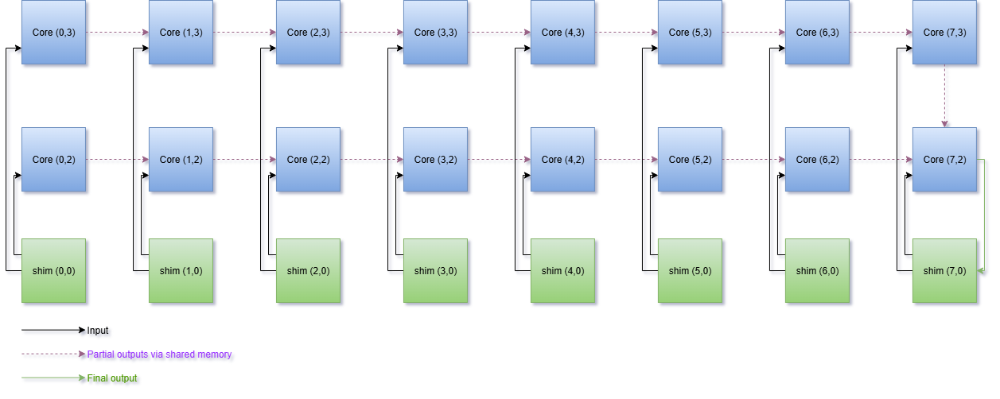

<!---//===- README.md --------------------------*- Markdown -*-===//
//
// This file is licensed under the Apache License v2.0 with LLVM Exceptions.
// See https://llvm.org/LICENSE.txt for license information.
// SPDX-License-Identifier: Apache-2.0 WITH LLVM-exception
//
// Copyright (C) 2025, Advanced Micro Devices, Inc.
// 
//===----------------------------------------------------------------------===//-->
## Multi-Column Reduction Designs

The designs in this folder are optimized to avoid the use of memory tiles and minimize data movement. Partial reductions are performed within each column using shared memory between neighboring tiles, followed by a final reduction step across the two columns. The number of cores (`n_cores`) can be configured from 1 to 8, and all shim tiles and shim DMAs are utilized. 

Both BF16 and INT32 data types are supported, leveraging kernels from `reduce_max.cc`.

## Source Files Overview

### Design Source Files
1. `vector_reduce_max.py`: A Python script that defines the AIE array structural design using MLIR-AIE operations. This generates MLIR that is then compiled using `aiecc.py` to produce design binaries (ie. XCLBIN and inst.bin for the NPU in Ryzen™ AI). 

2. `vector_reduce_max_placed.py`: An alternative version of the design in `vector_reduce_max.py`, that is expressed in a lower-level version of IRON.

<br>

## Ryzen™ AI Usage

### Compilation

To compile the design (default is the cascade design):

```shell
make
```

To compile the placed design:

```shell
env use_placed=1 make
```

To compile the C++ testbench:

```shell
make vector_reduce_max.exe
```
### C++ Testbench

To run the design:

```shell
make run
```

### Trace

To generate a [trace file](../../../programming_guide/section-4/section-4b/README.md) for the default cascade design:

```shell
make trace
```