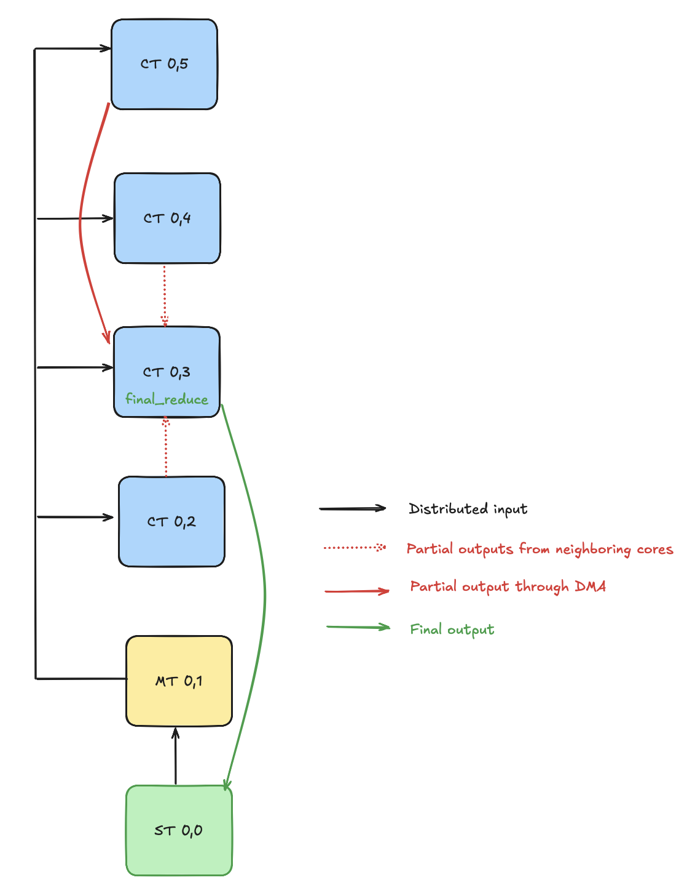
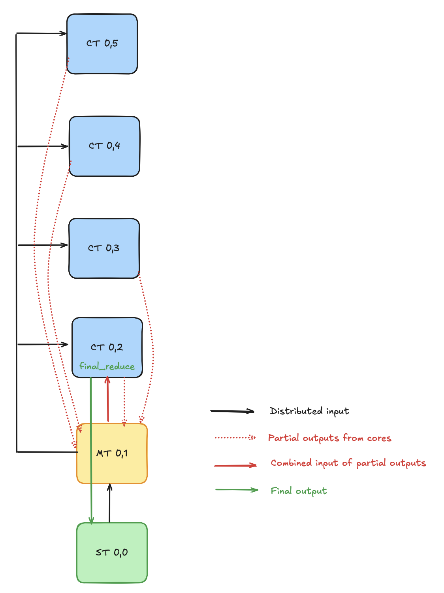

<!---//===- README.md --------------------------*- Markdown -*-===//
//
// This file is licensed under the Apache License v2.0 with LLVM Exceptions.
// See https://llvm.org/LICENSE.txt for license information.
// SPDX-License-Identifier: Apache-2.0 WITH LLVM-exception
//
// Copyright (C) 2025, Advanced Micro Devices, Inc.
// 
//===----------------------------------------------------------------------===//-->

## Column-Wide Reduction Designs

This folder presents three distinct styles of column-wide reduction designs for AIE cores:

- **Cascade Design:** Each tile computes a partial maximum and passes the result to the next tile in the column, forming a reduction cascade. 
- **Shared Memory Design:** Neighboring tiles use shared memory to exchange intermediate results, enabling a collaborative reduction.
- **Memory Tile Design:** Partial results from all tiles are aggregated in a dedicated memory tile, which then forwards the combined result to an AIE core for the final reduction. 

All designs support both BF16 and INT32 data types and utilize kernels from `reduce_max.cc`.

## Source Files Overview

### Design Source Files

1. `vector_reduce_max_cascade.py`: Implements a cascading reduction where intermediate results are passed between adjacent tiles in the column.

2. `vector_reduce_max_shared.py`: Utilizes shared memory between neighboring tiles to perform the final reduction.

3. `vector_reduce_max_memtile.py`: Leverages memory tiles to aggregate partial results from the column, which is then sent to one of the AIE cores for the final reduction step.

For each design, there are also "placed" variants (e.g., `vector_reduce_max_cascade_placed.py`) that use the low-level IRON API to explicitly control tile placement and resource allocation.

## Ryzen™ AI Usage

### Compilation

To compile the design (default is the cascade design):

```shell
make
```

To compile the shared memory-based design:

```shell
env use_shared=1 make
```

To compile the memory tile-based design:

```shell
env use_memtile=1 make
```

To compile any of the "placed" design variants, add `use_placed=1` to the corresponding command. For example, to compile the placed cascade design:

```shell
env use_placed=1 make
```

You can also combine options:

```shell
env use_memtile=1 use_placed=1 make
```
```shell
env use_shared=1 use_placed=1 make
```

To compile the C++ testbench:

```shell
make vector_reduce_max.exe
```
### C++ Testbench

To run the design:

```shell
make run
```

### Trace

To generate a [trace file](../../../programming_guide/section-4/section-4b/README.md) for the default cascade design:

```shell
make trace
```

To generate a trace file for the shared memory-based design:

```shell
env use_shared=1 make trace
```

To generate a trace file for the memory tile-based design:

```shell
env use_memtile=1 make trace
```