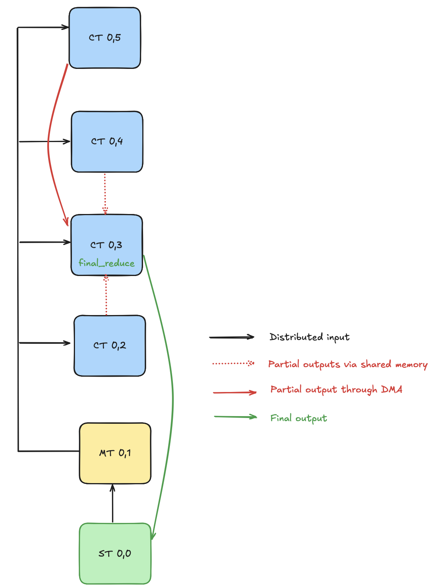
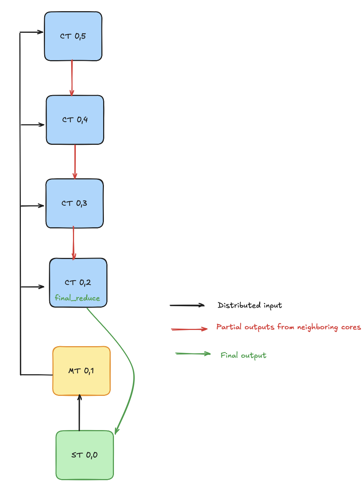
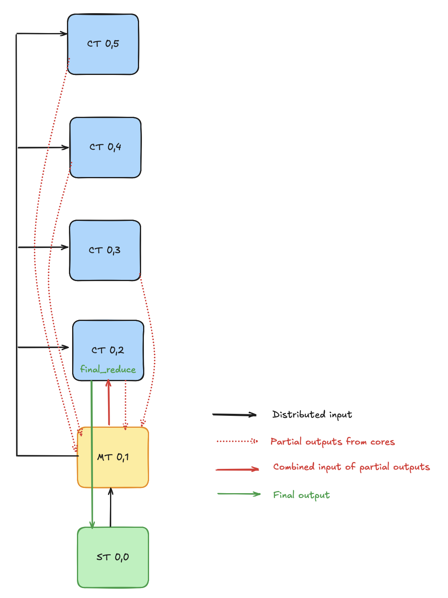

<!---//===- README.md --------------------------*- Markdown -*-===//
//
// This file is licensed under the Apache License v2.0 with LLVM Exceptions.
// See https://llvm.org/LICENSE.txt for license information.
// SPDX-License-Identifier: Apache-2.0 WITH LLVM-exception
//
// Copyright (C) 2025, Advanced Micro Devices, Inc.
// 
//===----------------------------------------------------------------------===//-->

## Column-Wide Reduction Designs

This folder presents three distinct styles of column-wide reduction designs for AIE cores. 

- **Shared Memory Design:** Neighboring tiles use shared memory to exchange intermediate results, enabling a collaborative reduction.<br>
- **Chained Design:** Each tile computes a partial maximum and passes the result to the next tile in the column, forming a reduction cascade.<br>
- **Memory Tile Based Design:** Partial results from all tiles are aggregated in a dedicated memory tile, which then forwards the combined result to an AIE core for the final reduction.<br>

Among these, the **Shared Memory Design** is the preferred approach, as it eliminates the need for DMAs to transfer data between neighboring tiles—a key feature enabled by the NPU architecture. The other two designs, **Chained Design** and **Memory Tile Based Design**, are provided as alternatives to demonstrate different data movement strategies for the reduce-max operation. 

All designs support both BF16 and INT32 data types and utilize kernels from `reduce_max.cc`.

## Source Files Overview

### Design Source Files

1. `vector_reduce_max_shared.py`: Utilizes shared memory between neighboring tiles to perform the final reduction.

2. `vector_reduce_max_chained.py`: Implements a chained reduction where intermediate results are passed between adjacent tiles in the column.

3. `vector_reduce_max_memtile.py`: Leverages memory tiles to aggregate partial results from the column, which is then sent to one of the AIE cores for the final reduction step.

## Ryzen™ AI Usage

### Compilation

The three variants are selected with the `VARIANT` Makefile variable (default: `shared`):

```shell
make                          # builds VARIANT=shared
env VARIANT=chained make
env VARIANT=memtile make
```

To compile the C++ testbench:

```shell
make vector_reduce_max.exe
```

### C++ Testbench

To run the design:

```shell
make run                      # runs VARIANT=shared
env VARIANT=chained make run
env VARIANT=memtile make run
```

### Trace

To generate a [trace file](../../../programming_guide/section-4/section-4b/README.md):

```shell
make trace                    # traces VARIANT=shared
env VARIANT=chained make trace
env VARIANT=memtile make trace
```