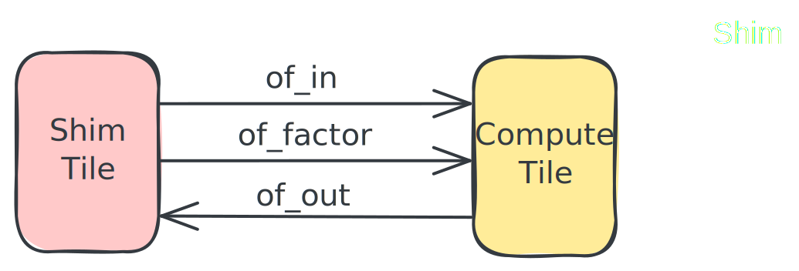

<!---//===- README.md -----------------------------------------*- Markdown -*-===//
//
// This file is licensed under the Apache License v2.0 with LLVM Exceptions.
// See https://llvm.org/LICENSE.txt for license information.
// SPDX-License-Identifier: Apache-2.0 WITH LLVM-exception
//
// Copyright (C) 2024-2026, Advanced Micro Devices, Inc.
//
//===----------------------------------------------------------------------===//-->

# Vector Scalar Multiplication:

This IRON design flow example, called "Vector Scalar Multiplication", demonstrates a simple AIE implementation for vectorized vector scalar multiply on a vector of integers. In this design, a single AIE compute tile performs the vector scalar multiply operation on a vector with a default length `4096`. The kernel is configured to work on `1024` element-sized subvectors, and is invoked multiple times to complete the full scaling. `vector_scalar_mul.py` is a single `@iron.jit`-decorated design that can either be driven standalone (compile + run + verify end-to-end via `iron.tensor`) or from the `Makefile` in compile-only mode for use with `test.cpp` / `test.py`.

## Source Files Overview

1. `vector_scalar_mul.py`: An `@iron.jit` design that declares the AIE-array dataflow and kernel binding in one place. Standalone invocation runs the full compile + execute + verify cycle; `--xclbin-path` / `--insts-path` switches it into compile-only mode for the `Makefile` flow.

1. `scale.cc`: A C++ implementation of scalar and vectorized vector scalar multiply operations for AIE cores. Found [here](../../../aie_kernels/aie2/scale.cc).

1. `test.cpp`: C++ testbench that loads the prebuilt XCLBIN/insts, configures the AIE module, supplies input data, executes on the NPU, and verifies against a CPU reference. Optionally outputs trace data.

1. `test.py`: Python equivalent of `test.cpp` for the same prebuilt-artifacts run path.

## Design Overview



This simple example uses a single compute tile in the NPU's AIE array. The design is described as shown in the figure to the right. The overall design flow is as follows:
1. An object FIFO called `of_in` connects a Shim Tile to a Compute Tile, and another called `of_out` connects the Compute Tile back to the Shim Tile.
1. The runtime data movement is expressed to read `4096` int16 (or int32) data from host memory to the compute tile and write the `4096` data back to host memory. A single int32 scale factor is also transferred from host memory to the Compute Tile via `of_factor`.
1. The compute tile acquires this input data in "object" sized (`1024`) blocks from `of_in` and stores the result to another output "object" it has acquired from `of_out`. A scalar or vectorized kernel running on the Compute Tile's AIE core multiplies the data from the input "object" by the scale factor before storing it to the output "object".
1. After the compute is performed, the Compute Tile releases the "objects", allowing the DMAs (abstracted by the object FIFO) to transfer the data back to host memory and copy additional blocks into the Compute Tile via `of_out` and `of_in` respectively.

It is important to note that the Shim Tile and Compute Tile DMAs move data concurrently, and the Compute Tile's AIE Core also processes data concurrently with the data movement. This is made possible by having an `ObjectFifo` with `depth` of `2` (the default) to denote ping-pong buffers.

## Design Component Details

### AIE Array Structural Design in `vector_scalar_mul.py`

The `@iron.jit`-decorated `vector_scalar_mul(A, F, C, ...)` function expresses the design in IRON primitives:

1. **Compile-time configuration:** `in1_size`, `int_bit_width`, `vectorized`, `trace_size`, and `use_chess` are `CompileTime[...]` parameters, so different specializations live in separate JIT artifacts.

1. **Scaling Function Declaration:** A single `ExternalFunction` references `scale.cc` and selects the `vector_scalar_mul_vector` or `vector_scalar_mul_scalar` symbol based on `vectorized`.

1. **Object Fifos:** `of_in` and `of_out` carry the data vector; `of_factor` carries the scalar factor.

1. **Core Body:** Loops through sub-vectors of the input, calls the external kernel, and emits to `of_out`. Wrapped in a `Worker` (with `trace=...` enabled when `trace_size > 0`).

1. **Runtime Sequence:** `rt.sequence(...)` declares the host-side buffer types; `rt.fill` / `rt.drain` move data; `rt.enable_trace` activates tracing when requested.

### AIE Core Kernel Code

`scale.cc` contains a C++ implementation of scalar and vectorized vector scalar multiplication operation designed for AIE cores. It consists of two main sections:

1. **Scalar Scaling:** `scale_scalar()` processes one data element at a time, using the AIE scalar datapath.

1. **Vectorized Scaling:** `scale_vectorized()` processes multiple data elements simultaneously, using the AIE vector datapath.

1. **C-style Wrapper Functions:** `vector_scalar_mul_aie_scalar()` and `vector_scalar_mul_aie()` are two C-style wrappers exposed as `vector_scalar_mul_scalar` / `vector_scalar_mul_vector`. The functions are provided for `int16_t` and `int32_t` (selected via `-DBIT_WIDTH`).

## Usage

### Standalone (no Makefile)

Compile + run + verify in one shot via the JIT pipeline:

```shell
python3 vector_scalar_mul.py
```

`-d npu2` for Strix; `-i1s` / `-bw` to override the data size / element width.

### Makefile flow (C++ testbench)

Build the xclbin/insts and host binary, then run:

```shell
make
make run
```

For NPU2 (Strix): `make devicename=npu2 && make run devicename=npu2`.

### Makefile flow (Python testbench)

```shell
make run_py
```

### Tracing

```shell
make trace
```

This generates a trace-enabled xclbin, runs it with the C++ host, and parses the resulting `trace.txt` into a summary.  Use `make trace_py` for the Python host equivalent.

### Chess

The Makefile can build kernels with `xchesscc_wrapper` instead of Peano:

```shell
env CHESS=true make
```
