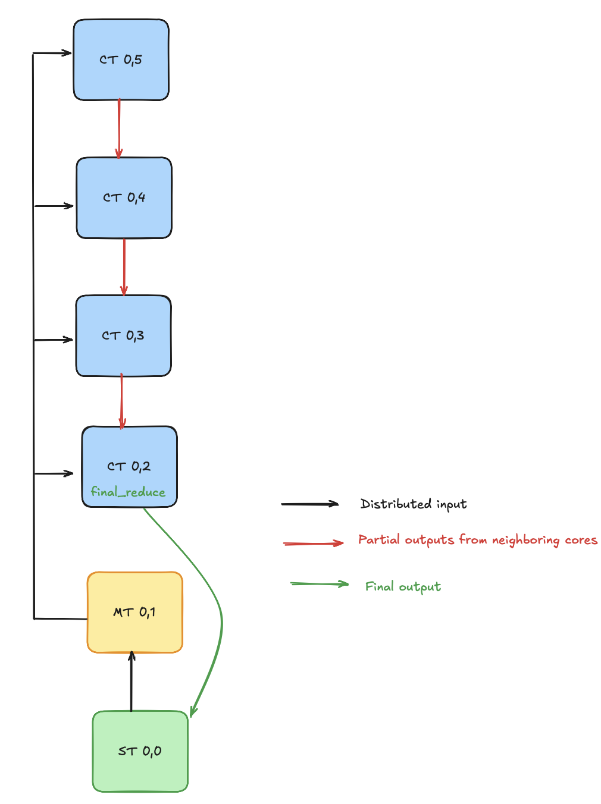

# Getting Started: Vector Reduce Max

This example demonstrates how to efficiently compute the maximum value of an input vector using a distributed, parallel approach across multiple cores in an AIE column. The input vector is partitioned into equal-sized chunks, with each core assigned a chunk to process. Each core independently calculates the local maximum for its chunk. These local maxima are then propagated along the column cascade-style reduction, where each core compares its local result with the incoming partial maxima from previous cores. The process continues until the final core produces the overall maximum value of the vector.

<br>

For more versions of the vector reduce max design, with customizable parameters, please see [here](../../basic/vector_reduce_max/).

## Overview

This design consists of the following:

* `vector_reduce_max_1col.py`: The NPU design for this application,
  which describes which cores of the NPU we will use, how to route data between
  cores, and what program to run on each core. This design leverages the IRON
  JIT decorator to compile the design into a binary to run on the NPU, as well as 
  to describe the program that runs on the CPU (host) that calculates a correct 
  reference output, verifies and times our NPU design's execution.
* `vector_reduce_max.cc`: A C++ implementation of a vectorized `max` reduction operation for AIE cores. The code uses the AIE API, which is a C++ header-only library providing types and operations that get translated into efficient low-level intrinsics, and whose documentation can be found [here](https://www.xilinx.com/htmldocs/xilinx2023_2/aiengine_api/aie_api/doc/index.html).
* `run.lit`: lit test that runs the design on different NPU devices.

## Ryzen™ AI Usage

Run and verify the design:

```shell
python3 vector_reduce_max_1col.py
```
