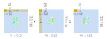
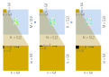

# Getting Started: Single Core Matrix Multiplication

This example multiplies two input matrices of 16-bit integers, `A` and `B`, to 
produce a 16-bit integer output matrix `C`. All matrices are of size `512x512`.
We use a single AI Engine core to compute the matrix product. Since these
matrices do not fit into a AI Engine core's memory, we split the input and
output into sub-tiles that are processed individually.


For more versions of the matrix multiplication design, with customizable parameters, please see [here](../../basic/matrix_multiplication/).

## Overview

This design consists of the following:

* `matrix_multiplication_single_core.py`: The NPU design for this application,
  which describes which cores of the NPU we will use, how to route data between
  cores, and what program to run on each core. This design leverages the IRON
  JIT decorator to compile the design into a binary to run on the NPU, as well as 
  to describe the program that runs on the CPU (host) that calculates a correct 
  reference output, verifies and times our NPU design's execution.
* `matrix_multiplication.cc`: A C++ kernel that exposes a function for 
  efficiently multiplying matrices using the 
  [AIE API](https://xilinx.github.io/aie_api/index.html).
* `run.lit`: lit test that runs the design on different NPU devices.

## Problem Size, Tile Size and Intrinsic Size

In this an other matrix multiplication examples in this repository, we refer
to the overall matrix dimensions as the "problem size", and use variables `M`,
`K` and `N` to denote them. `A` has `M` rows and `K` columns; `B` has `K` rows
and `N` columns, and `C` has `M` rows and `N` columns.

We split the matrices into tiles of sizes denoted by variables  `m`, `k`, `n`,
which are defined analogously. Each AI Engine core processes single tiles.

Lastly, we further subdivide the matrix into tiles of sizes denoted by
variables `r`, `s`, `t`. These smallest sub-tiles are small enough to fit into
a single vector register of the AI Engine. The AI Engine provides dedicated
fused multiply-add instructions, called `VMAC`, that are capable of multiplying
one of these smallest sub-tiles in each clock cycle. We call this smallest tile
size the intrinsic size, and the hardware dictates which tile sizes are
available. The availalbe sizes for different architectures are documented 
[here](https://xilinx.github.io/aie_api/group__group__mmul.html).

## Data Movement and Matrix Tiling

For brevity, the code refers to different memories as "levels"; the higher
the level, the farther away from the AI Engine compute core the memory is, i.e.
L3 is DRAM memory shared with the CPU, L2 is the memory on memory tiles and
L1 is compute core memory. The ObjectFIFOs that move data are named accordingly
by which matrix they move (`A`, `B` or `C`), followed by their source and
destination memories. For example, the ObjectFIFO `fifo_A_L3L2` moves `A` from 
DRAM into the memory tile.

### L3 &rightarrow; L2: Larger Tiles

```
a_taps = TensorTiler2D.group_tiler((M, K), (m, k), (1, K // k), pattern_repeat=(N // n))
b_tap = TensorTiler2D.group_tiler((K, N), (k, n), (K // k, N // n), tile_group_col_major=True)[0]
c_taps = TensorTiler2D.group_tiler((M, N), (m, n), (1, N // n))

rt = Runtime()
with rt.sequence(A_ty, B_ty, C_ty) as (A, B, C):
    rt.start(worker)
    for tile_row in range(M // m):
        task_group = rt.task_group()
        rt.fill(fifo_A_L3L2.prod(), A, tap=a_taps[tile_row], task_group=task_group)
        rt.fill(fifo_B_L3L2.prod(), B, tap=b_tap, task_group=task_group)
        rt.drain(fifo_C_L2L3.cons(), C, tap=c_taps[tile_row], task_group=task_group, wait=True)
        rt.finish_task_group(task_group)
```

As `A` and `B` are moved in from DRAM, our design splits these matrices up into
smaller tiles. The DMAs are programmed to iterate over tiles of `A` in
row-major order, whereas we iterate over `B` in column-major order. Streaming 
the entire first row of tiles of `A` and entire first column of tiles of `B` 
allows the cores to fully compute the first complete output tile in the
top-left of `C`:



Once an entire row of `A` and an entire column of `B` have been streamed in, 
we move onto the next column of tiles of `B`, while repeating the same row of
tiles of `A`. This allows the cores to compute the next output tile of C. In
our implementation above, we achieve the repeat of `A` using the 
`pattern_repeat` attribute, whereas the B tensor access pattern specifies to
tile the entire B matrix without repeats.  Note that the local buffer holding 
output C on the compute cores is zero-initialized in each such iteration.


After repeating the first row of tiles of `A` for each column of tiles in B
(i.e., `N / n` times), we move on to the next row of `A`. In our 
implementation, this step corresponds to moving on to the next iteration of
the `for tile_row in range(M // m)` loop in the `rt.sequence`. We use the same
tensor access pattern for `A`, except that the transfer will start from an
offset that starts at the next row of tiles of `A`. The tensor access pattern
for `B` is exactly the same, as we will once again iterate over all tiles
across columns of `B` to produce the next row of output tiles in `C`:


### L2 &rightarrow; L1: Intrinsic Tiles

```
tap_A_L2L1 = TensorTiler2D.group_tiler((m, k), (r, s), (m // r, k // s))[0]
fifo_A_L2L1 = fifo_A_L3L2.cons().forward(
    dims_to_stream=tap_A_L2L1.transformation_dims, 
    name="A_L2L1"
)
```
```
tap_B_L2L1 = TensorTiler2D.group_tiler((k, n), (s, t), (k // s, n // t))[0]
fifo_B_L2L1 = fifo_B_L3L2.cons().forward(
    dims_to_stream=tap_B_L2L1.transformation_dims, 
    name="B_L2L1"
)
```
```
tap_C_L1L2 = TensorAccessPattern(
    tensor_dims=(m, n),
    offset=0,
    sizes=[m // r, r, n // t, t],
    strides=[r * n, t, r * t, 1]
)
fifo_C_L2L3 = fifo_C_L1L2.cons().forward(
    dims_to_stream=tap_C_L1L2.transformation_dims, 
    name="C_L2L3"
)
```

The above tensor access patterns tile the input matrices into the smallest
tiles used in our design -- the intrinsic-sized tiles. The computation kernel
expects data to be tiled into these small vector-sized dimensions. The
tensor access pattern for the ouptut C then undoes this tiling to produce a 
regular row-major tile as the output moves out of the computation core.
Note that all of these tiles are arranged in row-major order.



## Ryzen™ AI Usage

Run and verify the design:

```shell
python3 matrix_multiplication_single_core.py
```
