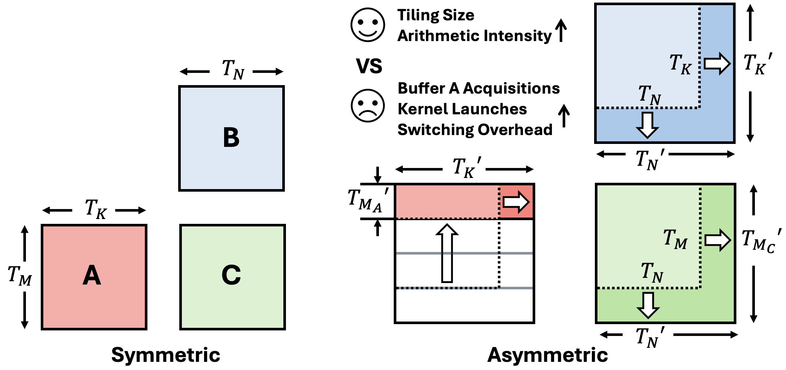
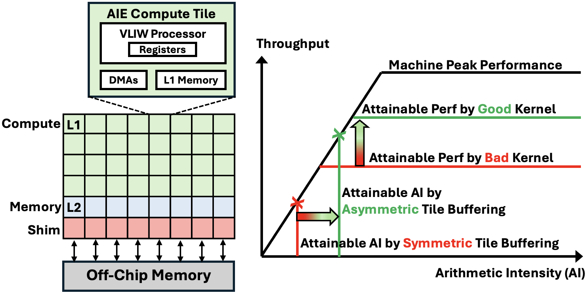

<!---//===- README.md --------------------------------------*- Markdown -*-===//
//
// This file is licensed under the Apache License v2.0 with LLVM Exceptions.
// See https://llvm.org/LICENSE.txt for license information.
// SPDX-License-Identifier: Apache-2.0 WITH LLVM-exception
//
// Copyright (C) 2026, Advanced Micro Devices, Inc.
//
//===----------------------------------------------------------------------===//-->

# GEMM with Asymmetric Tile Buffering (ATB)

These examples implement matrix multiplication on the AMD XDNA2 NPU using
**asymmetric tile buffering** at the L1 memory level. They reproduce the three
best-performing configurations from
["Can Asymmetric Tile Buffering Be Beneficial?"](https://arxiv.org/abs/2511.16041)
(Wang et al., 2025).

Slides and the most recent updates are available at the paper authors'
companion repository:
**[UCLA-VAST/AMD-NPU-GEMM-Asymmetric-Tile-Buffering](https://github.com/UCLA-VAST/AMD-NPU-GEMM-Asymmetric-Tile-Buffering)**.

If you are new to block-floating-point GEMM on AIE, start with the symmetric
example in
[`../matrix_multiplication/whole_array_mixed`](../matrix_multiplication/whole_array_mixed/)
first — these examples only describe what is *different* about ATB.

## What is Asymmetric Tile Buffering?

Conventional GEMM tiling makes the L1 input-A buffer and the L1 output-C buffer
share their `M` dimension (`T_M`). Their lifetimes are different, however: a row
of `A` is dead as soon as the corresponding row of `C` has accumulated a
single full reduction over `K`, while a row of `C` must stay live for the entire
reduction. Symmetric buffering forces both to share the same shape, paying the
peak buffer cost twice.

ATB decouples them. We let the input-A buffer have a small `T_MA` and the
output-C buffer have a larger `T_MC = ρ · T_MA`, with the asymmetry ratio
`ρ ≥ 1`. The core then accumulates `ρ` sub-rows of `A` against one row of `C`
before releasing the C buffer. L2 buffering is left symmetric.



Why this matters on XDNA2:
- Each core's L1 is 63 KB. The 128×64×128 BF16/BFP16 mixed tile that maximizes
  arithmetic intensity needs ~91 KB symmetric, so it does not fit. With `ρ=4`
  (`T_MA=32`, `T_MC=128`), it fits comfortably.
- Larger `T_MC · T_N` lifts arithmetic intensity (more work per byte fetched
  from L2/off-chip), which is the dominant gain for memory-bound shapes.

The roofline view from the paper shows how ATB lifts the attainable AI on
memory-bound regimes while preserving compute-bound peaks:



For the analytical model (arithmetic intensity, microkernel efficiency, and the
combined tradeoff) see Sections 3 – 5 of the paper.

## Examples

These designs use IRON and currently require the **chess** compiler (the per-
design Makefile already pulls in `xchesscc` via the shared `makefile_common`
since Peano's AIE2P backend can't yet legalize the bfp16 mac kernels). Build
any of them with:

```shell
cd <config_dir>
make devicename=npu2 run
```

The Makefile defaults match the paper-scale shapes listed in the table
below, which are also what the Performance section measures.

| Directory | Precision (A / B / C / accum) | L1 tile `m × k × n` | ρ | Paper shape (M × K × N) |
|---|---|---|---|---|
| [`config1`](./config1/) | bf16 / bfp16ebs8 / bf16 / bf16 | 128 × 64 × 128 | 4 | 4096 × 4096 × 2048 |
| [`config2`](./config2/) | bfp16ebs8 / bfp16ebs8 / bfp16ebs8 / bfp16ebs8 | 192 × 128 × 96 | 6 | 3072 × 4096 × 1536 |
| [`config3`](./config3/) | bfp16ebs8 / bfp16ebs8 / bfp16ebs8 / bf16 | 128 × 64 × 128 | 4 | 4096 × 4096 × 2048 |

To run a config at the paper shape, override `M K N` on the make line, for
example:

```shell
cd config1
make devicename=npu2 run M=4096 K=4096 N=2048
```

## Notes

- All three designs target NPU2 (Strix Point / Krackan Point). They use 32
  AIE compute cores (8 columns × 4 rows).
- The kernels live inside each example directory rather than under
  `aie_kernels/aie2p/`, because each config carries its own microkernel
  schedule. This folder ships its own [`makefile_common`](./makefile_common)
  (a copy of `../matrix_multiplication/makefile_common` with `kernel_dir`
  made overridable) so each per-example `Makefile` can do
  `kernel_dir := ${srcdir}` and pull the in-tree kernel.
- Host runners live in this folder rather than reusing the canonical
  `../matrix_multiplication/mixed_test.cpp` / `bfp_test.cpp`, because the ATB
  designs expect a different B (and, for the pure-bfp16 configs, A) input
  layout: column-major over L1 tiles, with each tile pre-shuffled into 1×2
  super-blocks of 8×8 column-major sub-blocks. The helpers that perform that
  pre-shuffle are in [`gemm_atb_layout.h`](./gemm_atb_layout.h); the per-config
  test wrappers are [`gemm_atb_mixed_test.cpp`](./gemm_atb_mixed_test.cpp)
  (config1, bf16/bfp16 mixed) and [`gemm_atb_bfp_test.cpp`](./gemm_atb_bfp_test.cpp)
  (configs 2 and 3, pure bfp16).
- The runtime sequence uses a 4-way ping-pong scheme, so `(M/m)·(N/n)` must
  be a multiple of 128 if you override `M K N`. Config 3's microkernel
  additionally hard-codes `K_Problemsize = 4096` for its BF16-staging flush,
  so config 3 only runs at K=4096.

## Performance

All three examples build and run end-to-end against `mlir-aie` HEAD (May 2026
wheel) with the **chess** compiler.

Peak throughput at the paper-scale shapes, using `sudo xrt-smi configure
--pmode turbo` and 20 warmup + 20 iters (min NPU time across iters):

| Config | Shape (M × K × N) | L1 tile `m × k × n` | ρ | Strix Point NPU | Krackan Point NPU |
|---|---|---|---|---|---|
| 1 | 4096 × 4096 × 2048 | 128 × 64 × 128 | 4 | 24.3 TFLOPS | 27.33 TFLOPS |
| 2 | 3072 × 4096 × 1536 | 192 × 128 × 96 | 6 | 31.3 TFLOPS | 31.58 TFLOPS |
| 3 | 4096 × 4096 × 2048 | 128 × 64 × 128 | 4 | 28.5 TFLOPS | 28.60 TFLOPS |

Strix Point column: Ryzen AI 9 HX 370. Krackan Point column: Ryzen AI 7,
ASUS Vivobook.

## Reference

Chengyue Wang, Wesley Pang, Xinrui Wu, Gregory Jun, Luis Romero, Endri Taka,
Diana Marculescu, Tony Nowatzki, Pranathi Vasireddy, Joseph Melber, Deming
Chen, and Jason Cong. *Can Asymmetric Tile Buffering Be Beneficial?*
arXiv:2511.16041, 2025. To appear in DAC'26.
<https://arxiv.org/abs/2511.16041>

```bibtex
@misc{wang2025asymmetrictilebufferingbeneficial,
      title={Can Asymmetric Tile Buffering Be Beneficial?},
      author={Chengyue Wang and Wesley Pang and Xinrui Wu and Gregory Jun and Luis Romero and Endri Taka and Diana Marculescu and Tony Nowatzki and Pranathi Vasireddy and Joseph Melber and Deming Chen and Jason Cong},
      year={2025},
      eprint={2511.16041},
      archivePrefix={arXiv},
      primaryClass={cs.DC},
      url={https://arxiv.org/abs/2511.16041},
}
```
