<!---//===- README.md --------------------------------------*- Markdown -*-===//
//
// This file is licensed under the Apache License v2.0 with LLVM Exceptions.
// See https://llvm.org/LICENSE.txt for license information.
// SPDX-License-Identifier: Apache-2.0 WITH LLVM-exception
//
// Copyright (C) 2025, Advanced Micro Devices, Inc.
// 
//===----------------------------------------------------------------------===//-->

# Block Datatypes - Matrix Multiplication

This folder cotains multiple variations of the standard matrix multiplication example. In order to understand the matrix multiplication example itself, it is recommended to check the [original one](../../matrix_multiplication/whole_array/README.md), along with its corresponding README file, since explanations related to the matrix multiplication will be found there. Here, only differences related to using blocked datatypes will be mentioned and code comments have been removed.

Blocked datatypes require additional attention when declaring the matrix shapes, since they group multiple elements. When going through these examples, notice how matrices must be reshaped to take this into account (usually with divisions such as `[matrix_dimension] // 8`).

These examples are currently only supported when using the chess compiler. Assuming your environment is properly set up, it can be used with `make run use_chess=1`.

## Block Datatypes - Main changes

### Data Movement

At the IRON level, v8bfp16ebs8 and v8bfp16ebs16 have corresponding byte sizes of 9 and 17 bytes, which make it impossible to tile the subtiles in the correct order to feed them to the cores (the second level of tiling has been removed in these examples) because of the 4 byte granularity that Data Layout Transformations use. For this reason, these subtiles must be pretiled in main memory or apply the corresponding transformations inside the core. Other alternatives may be considered, such as adding padding to the blocks so that they align with the 4 byte granularity of DMAs.

As described in the [original gemm example](../../matrix_multiplication/whole_array/README.md), there are multiple Data Layout Transformations (DLT) taking place in these implementations. Usage of blocked datatypes requires carefully managing these.

#### First DLT

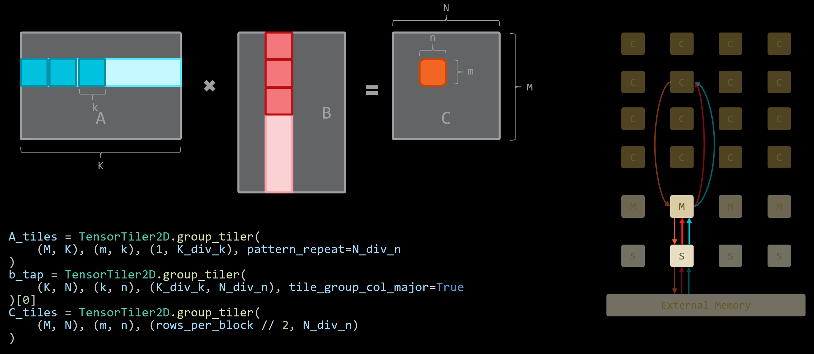

For this DLT to be possible using blocked datatypes, the innermost dimension of the DLT associated to tiling must be contiguous and a multiple of 4 bytes. This is a limitation imposed by the buffer descriptors used in these data transfers. The next step is simply to modify the columns in each matrix to so that they group the blocks accordingly (see [example](./single_core/single_core.py)).

#### Second DLT

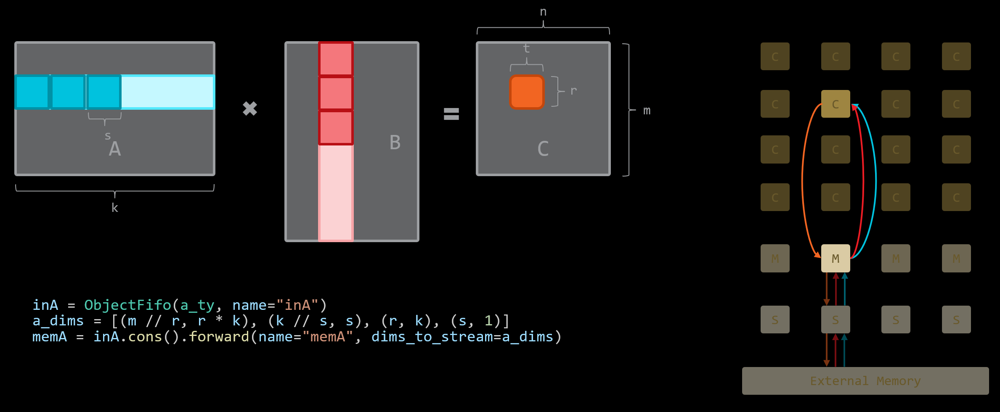

This second DLT is meant to rearrange the individual tiles to be used inside the cores. MACs need each subtile from each tile to be contiguous in memory in order to be loaded into the appropriate registers, please refer to the [programming guide](../../../../programming_guide/section-4/section-4c/README.md). These transformations are not possible when using blocked datatypes because of the bitwidth of the blocks, which are not multiples of the buffer descriptors' granularity.

Visualization of the second DLT if needed

The original transformation:

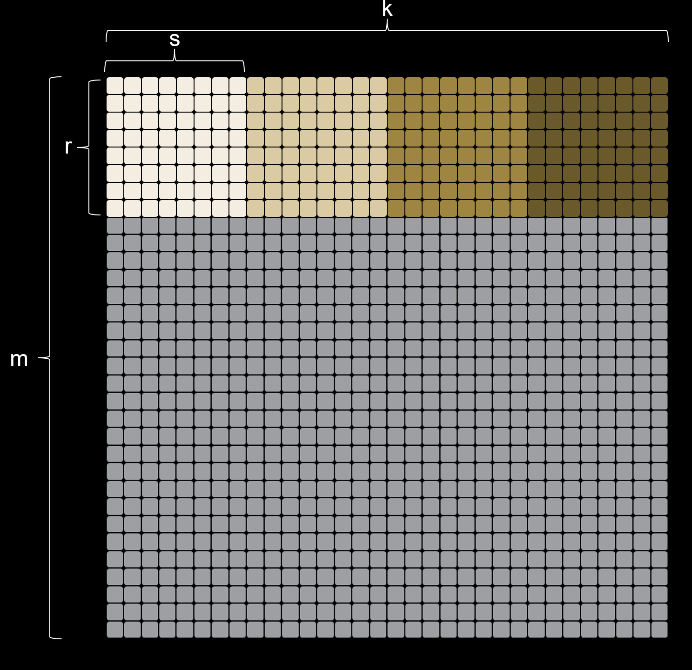
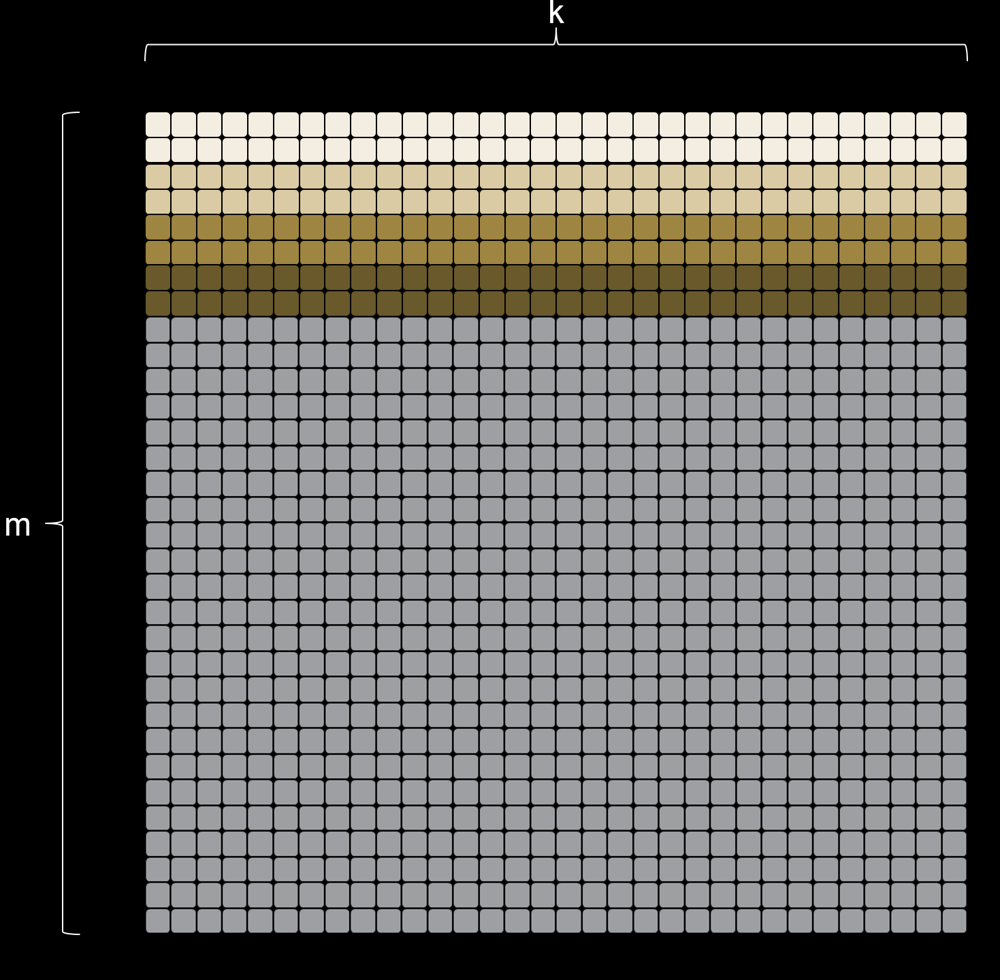

The (impossible) equivalent transformation for block datatypes:

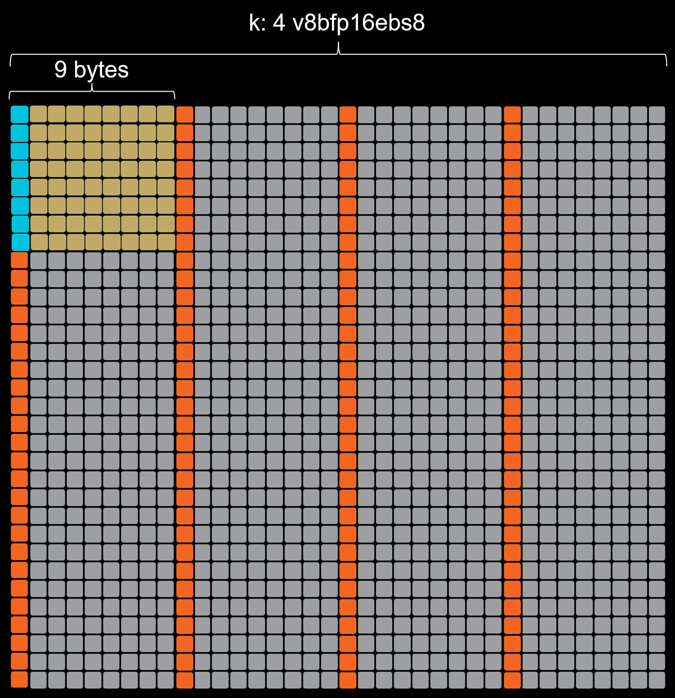
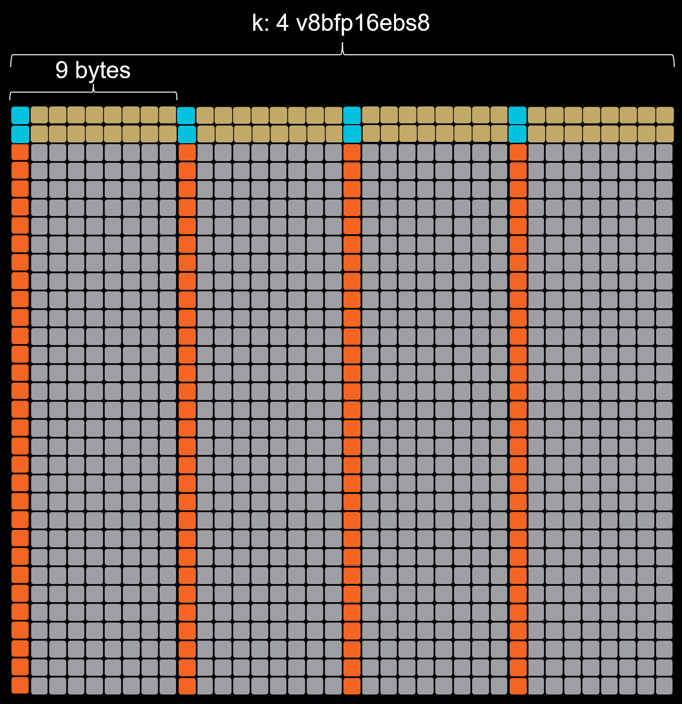

### Core Computations

Once the data has reached a compute tile, block datatypes also have additional complexities. They require additional manipulation in order to be loaded in and stored out of registers. The additional manipulations required to achieve this can be seen in [mm.cc](./mm.cc).

The main difference is due to the difficulty of loading the block_vector into the appropriate registers (illustrated below). To fully understand this problem, it is important to keep in mind how memory is accessed by the cores to load into the registers. For more information, please consult the [programming guide](../../../../programming_guide/section-4/section-4c/README.md).
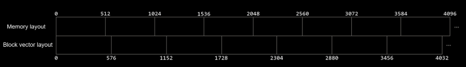

## Examples

> NOTE: These examples are meant to be orientative and do not aim at being an ideal implementation. They may be used to evaluate the cost and capabilities of different implementations and datatypes in the NPU, but could be developed further to achieve maximal performance.

- [`in_core_shuffle`](./in_core_shuffle/): Minimalist example performing the shuffling described above inside an AIE core using the scalar unit. It may be used to evaluate the efficiency of the scalar unit and the CPU for the shuffling operation.
- `single_core`: Single core implementation of a matrix multiplication
    - [`no_tiling`](./single_core_no_tiling/): This implementation uses hardcoded matrix dimensions and reduces data movement to its minimum by removing tiling completely. Only bfp16ebs8 values are used for both input, output and inside the kernel without any conversion. Use this example as a stepping stone to understand the more complex ones first. Feel free to try to modify the hardcoded values for the dimensions.
    - [`bfp_input_and_output`](./single_core/): This implementation generalizes the matrix multiplication to any shape within the limits of the hardware and the chosen algorithm. Only bfp16ebs8 values are used for both input, output and inside the kernel without any conversion. The matrix B is assumed to be already transposed and all three matrices are assumed to be shuffled in host memory.
    - [`mixed`](./single_core_mixed/): This implementation modifies the previous one by using bf16 for matrices A and C and does the appropriate conversions for them inside the core.
- `whole_array`: Whole array implementation of a matrix multiplication. These examples may be used to evaluate the performance of the cores in conjunction with the data movement inside the NPU.
    - [`bfp_input_and_output`](./whole_array/): See single core explanation above.
    - [`mixed`](./whole_array_mixed/): See single core explanation above.
    - [`shuffle`](./whole_array_shuffle/): This implementation does not assume that the A matrix has been shuffled in host memory and performs the operation inside the cores, using the scalar unit before calling the matrix multiplication on the vectors. B and C are not shuffled. Note that this example is tremendously inefficient (see below)!

## Performance

**These performance results are not representative of the maximal achievable performance in the NPU. They are meant to help newcomers to AIE programming to grasp the impact of their decisions when utilizing the NPU, primarily from the data movement perspective.**

### Main observations

| Kernel type                                | Columns used | Matrix shapes  | Tiling    | Achievable Tflops |
|--------------------------------------------|--------------|----------------|-----------|-------------------|
| bfp16ebs8 input/output                     | 8            | 7680x4096x8192 | 96x128x64 | 10.2              |
| bf16 input/output with bfp16ebs8 emulation | 8            | 8192x4224x4096 | 64x88x64  | 4.8               |
| bf16 input/output                          | 8            | 4096x4096x4096 | 64x88x64  | 1.6               |

### More detailed plots

These are some plots that may help you give some intuition about how to best program when using IRON.

  
Impact of different intrinsics

  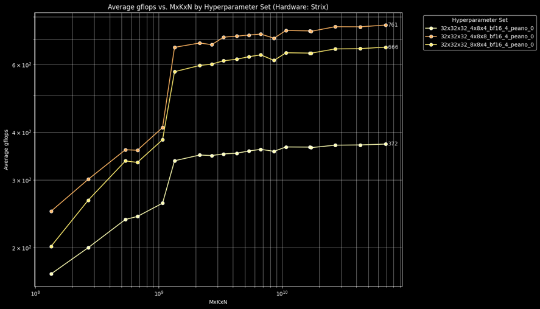

  Some intrinsics require additional data manipulation, are emulated or have less favourable memory access patterns or allocation.

  
Impact of number of columns

  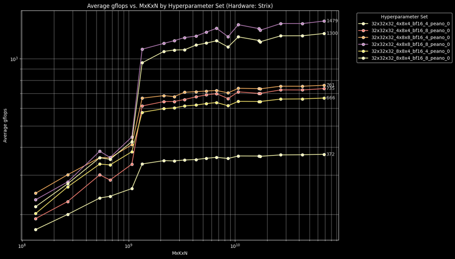

  
Impact of using bfp16ebs8 emulation

  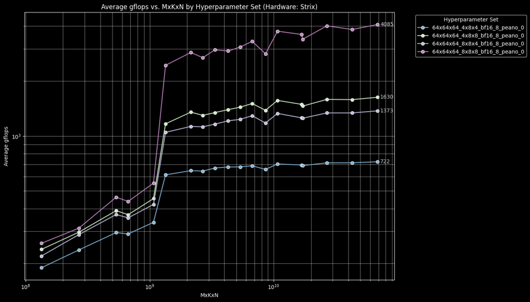

  This example shows the cost of using bf16 for data movement and bfp16 hardware for computation, with an appropriate conversion between them inside the cores. This can be enabled by passing by passing the AIE_API_EMULATE_BFLOAT16_MMUL_WITH_BFP16 flag when compiling the cores (see [makefiles](../../../basic/matrix_multiplication/makefile-common)).

  
Impact of conversion unit

  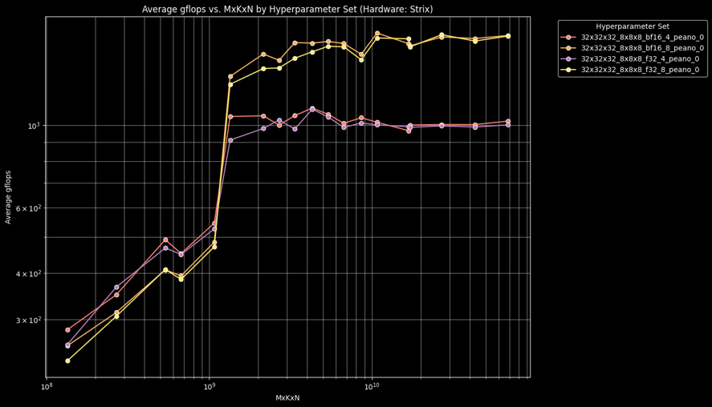

  This example uses bf16 with bfp16 emulation, but outputs either bf16 or float for the C matrix. Hardware support makes conversions from accumulator registers inexpensive from the kernel perspective, even though the data movement cost may be increased.

  
Impact of using bfp16ebs8 directly

  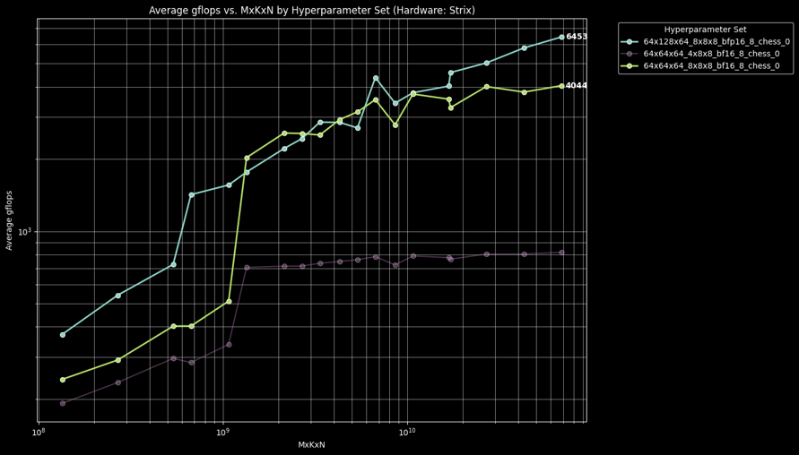

  Using bfp16 directly allows for a reduction in data movement, an increase in tile sizes and faster computation resulting in increased overall performance of the kernels.

  
Impact of matrix shapes

  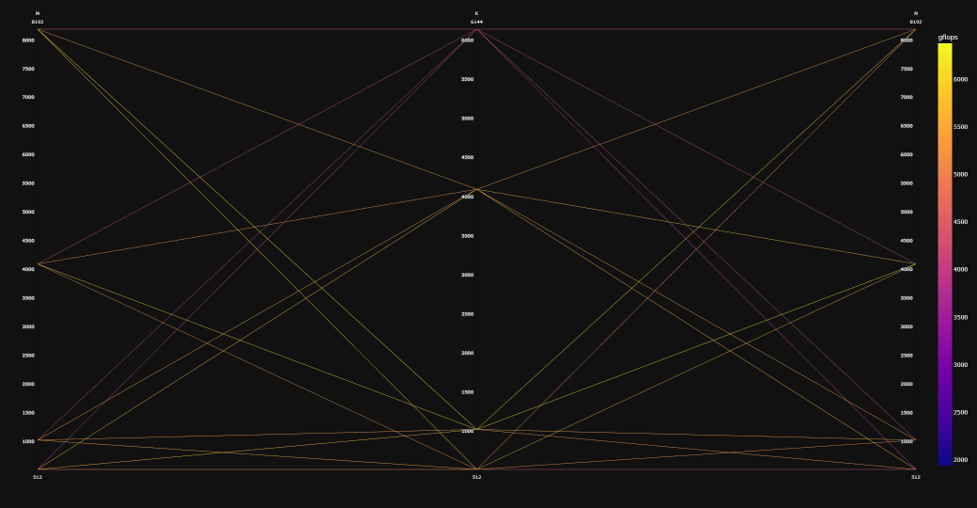
  

  These plots illustrate the impact of different matrix shapes when using bfp16 inputs and outputs. Note that increasing K requires more data movement than increasing M or N.

  
Maximal tilings

  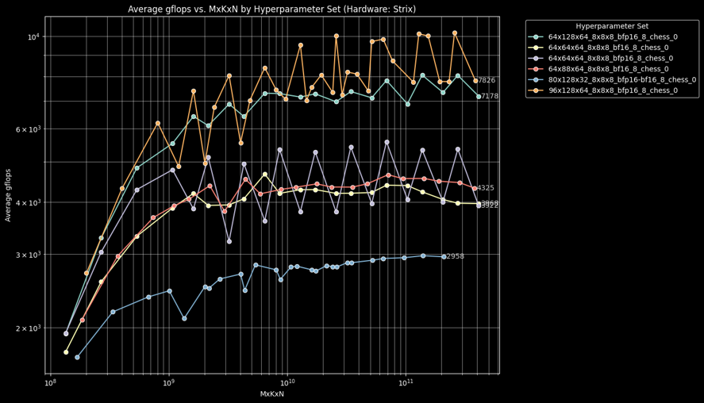

  Note that when using object fifos for data movement, buffers must be allocated twice to achieve higher performance. In order to remember what is allocated in each compute core's memory, please refer to the [programming_guide](../../../../programming_guide/section-0/README.md). The available memory per core in Strix is 64kB and the used memory in these kernels can be computed as follows:
  \[matrix_size\]x\[number_of_matrices\]x\[dtype_size\]x2 + \[stack_size\]

