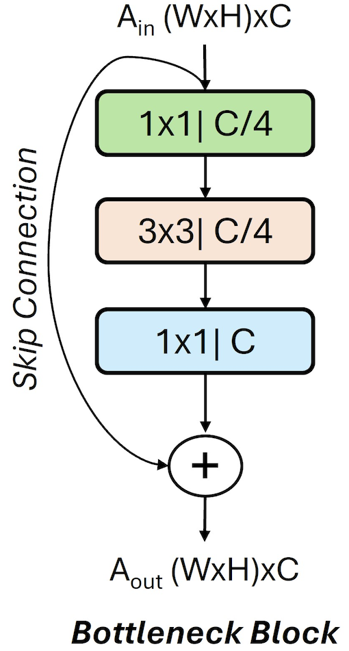

<!---//===- README.md --------------------------*- Markdown -*-===//
//
// This file is licensed under the Apache License v2.0 with LLVM Exceptions.
// See https://llvm.org/LICENSE.txt for license information.
// SPDX-License-Identifier: Apache-2.0 WITH LLVM-exception
//
// Copyright (C) 2024, Advanced Micro Devices, Inc.
// 
//===----------------------------------------------------------------------===//-->

# <ins>The Bottleneck Block</ins>
## Introduction
The bottleneck block is a key component in deep neural network architectures, such as ResNet. It is designed to help address the challenge of training very deep networks by reducing the computational cost while maintaining or improving performance. This README provides an overview of the process and considerations for accelerating a single bottleneck block.


## Bottleneck Block Overview
The components and functionality of a standard bottleneck block:

* Identity Mapping: The core idea behind bottleneck blocks is the concept of identity mapping. Traditional neural network layers aim to learn a mapping from input to output. In contrast, a bottleneck block learns a residual mapping, which is the difference between the input and the output. The original input is then added back to this residual mapping to obtain the final output. Mathematically, this can be represented as `output = input+ residual.`

* Convolutional Layers: Bottleneck blocks typically consist of one or more convolutional layers. These layers are responsible for learning features from the input data. Convolutional layers apply filters/kernels to the input feature maps to extract relevant patterns and features. The number of filters, kernel size, and other parameters can vary based on the specific architecture and requirements.

* Activation Function: After each convolutional layer, an activation function is applied to introduce non-linearity into the network. Rectified Linear Unit (ReLU) is commonly used as the activation function due to its simplicity and effectiveness.

* Batch Normalization: Batch normalization is often employed after convolutional layers to stabilize and accelerate the training process. It normalizes the activations of each layer, making optimization more robust and efficient.

* Skip Connection (Identity Shortcut): This is the hallmark of bottleneck blocks. The skip connection directly passes the input from one layer to a later layer without any modification. It provides an alternative, shorter path for gradient flow during training. If the input and output dimensions of the bottleneck block are the same, the skip connection directly adds the input to the output. If the dimensions differ, the skip connection might include a 1x1 convolutional layer to adjust the dimensions accordingly.

* Final Output: The final output of the bottleneck block is obtained by adding the input to the output of the convolutional layers (including any adjustments made to match dimensions via the skip connection).
<p align="center">
  <picture>
    <source media="(prefers-color-scheme: light)" srcset="bottleneck_block.png">
  
</picture>
  <h3 align="center">Bottleneck block has a 1x1 convolution layer for dimension reduction, a 3x3 convolution layer, and a 1x1 convolution layer for dimension restoration.
  </h3>
</p>

## Acceleration Techniques
1. Depth-First Implementation: Spatial architectures provide coarse-grained flexibility that allows for tailoring of the dataflow to optimize data movement. By tailoring the dataflow, we implement depth-first schedule for a bottleneck block  routing the output of one convolutional operation on an AIE core directly to another convolutional operation on a separate AIE core, all without the need to transfer intermediate results off-chip. This approach effectively minimizes the memory footprint associated with intermediate data, mitigating the overhead of costly off-chip accesses leading to increase in the overall performance.

2. Data Layout: Optimize activation and weight layout to enhance memory access patterns and enables effective utilization of AIE parallel processing units, ultimately improving the performance of 2D convolution operations. 

3. Kernel Optimzation: To optimize convolution operations on AIE, we vectorize the code using AIE vector intrinsics. We load 8 elements of the input channel into vector registers using vector load intrinsic. We apply the convolution operation on this loaded data, utilizing for enhanced computational efficiency. To ensure accurate convolution results, particularly at the edges of feature maps, we implement zero-padding to handle boundary conditions. This comprehensive approach optimizes convolution processing on AIE, facilitating efficient and accurate feature extraction in neural network applications. Input is 4x8 matrix corresponding to 4 element of row and 8 input channels.

4. Quantization: We use int8 precision for activationa and weights. At int8 precision, AIE offers the highest compute density with 256 MAC/cycle.  

5. Layer Fused: We perform two levels of fusion. First, we fuse ReLU in convolution using SRS capabilities of AIE. Second, we fuse BatchNorm into convolution weights. 


## Data Layout
We need to ensure that the data layout is compatible with efficient SIMD processing and rearrange the input data into a format where contiguous elements represent consecutive X-dimension values for each channel. For more efficient processing, we adopt a channels-last memory ordering, denoted as NYCXC8, to ensure that channels become the densest dimension. Operating on 8 elements simultaneously, we process 8 channels with the same width at once. Subsequently, we traverse the entire width dimension, handling the remaining channels in batches of 8. This process continues row-wise, resulting in our final data layout pattern: NYCXC8. This optimized layout enhances memory access patterns and enables effective utilization of parallel processing units, ultimately improving the performance of 2D convolution operations. This transformation ensures that data can be efficiently loaded into SIMD registers and processed in parallel. 

YCXC8 Input/Output Data Layout:

In the YCXC8 (with N=1) data layout, the data is organized in memory as follows:

* Y: Represents the output feature map dimension.
* C: Denotes the number of channels.
* X: Represents the input feature map dimension.
* C8: Indicates that 8 elements of the input channel are processed together.

OIYXI8O8 Weight Layout:

We align the weight layout as specified: O,I,Y,X,I8,O8, to match the input image processing. We first load the weight tensor, organizing it to match this layout, where dimensions represent: output channels, input channels, kernel height, kernel width, input channel groups of 8, and output channel groups of 8. By aligning the weight layout in this manner, we enable seamless integration with the input data layout, maximizing parallelism and minimizing memory access overhead. 

In the OIYXI8O8 data layout, the data is organized in memory as follows:

* O: Denotes the number of output channels.
* I: Denotes the number of input channels.
* Y: Represents the kernel height.
* X: Represents the kernel weight.
* I8: Indicates that 8 elements of the input channel are processed together.
* O8: Indicates that 8 elements of the output channel are processed together.

## Fusing Convolution and Batch Normalization

We assume the BatchNorm layer is fused into Convoluion Layer. Fusing BatchNorm into convolution involves incorporating the normalization step directly into the convolution operation. This is achieved by modifying the weights of the convolutional filters to include the scaling and shifting factors. Specifically, the weights are adjusted such that the convolution operation performs the normalization, scaling, and shifting in a single step.

## Fusing ReLU

Fusing ReLU into the convolution operation can further optimize the implementation by reducing memory bandwidth requirements and computational overhead. ReLU activation function introduces non-linearity by setting negative values to zero and leaving positive values unchanged. Utilize SIMD instructions to efficiently compute ReLU activation in parallel with convolution. After performing the convolution operation, apply ReLU activation function at vector register level. 
We use `aie::set_rounding()` and `aie::set_saturation()` to set the rounding and saturation modes for the computed results in the accumulator. Seeting round mode `postitive_inf` rounds halfway towards positive infinity while setting saturation to `aie::saturation_mode::saturate` saturation rounds an uint8 range (0, 255). 

```
::aie::set_saturation(
      aie::saturation_mode::saturate); // Needed to saturate properly to uint8
::aie::set_rounding(
      aie::rounding_mode::positive_inf); // Needed to saturate properly to uint8
```
After convolution and ReLU fusion, the output data is generate in YCXC8 layout. Ensure that the output data layout is compatible with subsequent layers or processing steps in the neural network architecture.


### Benefits of ReLU Fusion:

1. Reduced Memory Bandwidth:
By fusing ReLU into the convolution operation, unnecessary memory accesses and data transfers associated with separate ReLU computation are eliminated, leading to reduced memory bandwidth requirements.

2. Improved Performance:
Fusing ReLU reduces the number of instructions executed per element, resulting in improved computational efficiency and overall performance of the convolution operation.

3. Simplified Code Structure:
Fusing ReLU into the convolution kernel simplifies the code structure and reduces the overhead associated with separate activation function calls, leading to cleaner and more maintainable code.

4. Enhanced Resource Utilization:
By combining convolution and ReLU operations, computational resources such as CPU cores or SIMD units are utilized more efficiently, maximizing throughput and achieving better resource utilization.

## Compilation
To compile the design:
```
make
```

To run the design:
```
make run_py
```

### Prerequisites
To install the dependencies, run the following command:
```
pip install -r requirements.txt

```