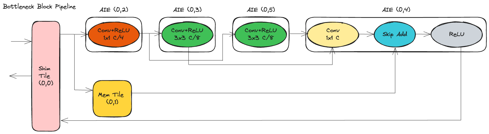

<!---//===- README.md --------------------------*- Markdown -*-===//
//
// This file is licensed under the Apache License v2.0 with LLVM Exceptions.
// See https://llvm.org/LICENSE.txt for license information.
// SPDX-License-Identifier: Apache-2.0 WITH LLVM-exception
//
// Copyright (C) 2024, Advanced Micro Devices, Inc.
// 
//===----------------------------------------------------------------------===//-->

# <ins>Bottleneck Block</ins>
## Introduction
The bottleneck block is a key component in deep neural network architectures like ResNet. It is designed to help address the challenge of training deep networks by reducing computational costs while maintaining or improving performance. This README provides an overview of the process and considerations for accelerating a single bottleneck block.


## Bottleneck Block Overview
The components and functionality of a standard bottleneck block:

* Identity Mapping: The core idea behind bottleneck blocks is the concept of identity mapping. Traditional neural network layers aim to learn how to map from input to output. In contrast, a bottleneck block learns a residual mapping, which is the difference between the input and the output. The original input is then added to this residual mapping to obtain the final output. Mathematically, this can be represented as `output = input+ residual.`

* Convolutional Layers: Bottleneck blocks typically consist of one or more convolutional layers. These layers are responsible for learning features from the input data. Convolutional layers apply filters/kernels to the input feature maps to extract relevant patterns and features. The number of filters, kernel size, and other parameters can vary based on the specific architecture and requirements.

* Activation Function: After each convolutional layer, an activation function is applied to introduce non-linearity into the network. Rectified Linear Unit (ReLU) is commonly used as the activation function due to its simplicity and effectiveness.

* Batch Normalization: Batch normalization is often employed after convolutional layers to stabilize and accelerate the training process. It normalizes the activations of each layer, making optimization more robust and efficient.

* Skip Connection (Identity Shortcut): This is the hallmark of bottleneck blocks. The skip connection directly passes the input from one layer to a later layer without modification. It provides an alternative, shorter path for gradient flow during training. If the input and output dimensions of the bottleneck block are the same, the skip connection directly adds the input to the output. If the dimensions differ, the skip connection might include a 1x1 convolutional layer to adjust the dimensions accordingly.

* Final Output: The final output of the bottleneck block is obtained by adding the input to the output of the convolutional layers (including any adjustments made to match dimensions via the skip connection).
<p align="center">
 <picture>
 <source media="(prefers-color-scheme: light)" srcset="bottleneck_block.png">
 
</picture>
 <h3 align="center">Bottleneck block has a 1x1 convolution layer for dimension reduction, a 3x3 convolution layer, and a 1x1 convolution layer for dimension restoration.
 </h3>
</p>

## NPU Implementation

In our bottleneck pipeline implementation, every adjacent ReLU operation is fused into the convolution operation using the approach described in [conv2d_fused_relu](../conv2d_fused_relu). Fusing adjacent convolution and batch norm layers is another inference-time optimization, which involves updating the weight and bias of the convolution layer. The remaining layers of the bottleneck block are mapped onto a single column of NPU with one Shim Tile (0,0) and one Mem Tile (0,1), along with four AIE computer tiles spanning from (0,2) to (0,5), as illustrated in the figure below.

<p align="center">
 <picture>
 <source media="(prefers-color-scheme: light)" srcset="bottleneck_pipeline.png">
 
</picture>
 <h3 align="center">Depth-first implementation of bottleneck block pipeline on a single column of NPU.
 </h3> 
</p>
The data movement within this pipeline is orchestrated using the ObjectFifo (OF) primitive. Initially, input activation is brought into the array via the `Shim Tile (0,0)`. We broadcast the data to both `AIE (0,2)` and `AIE (0,4)` to perform the very first convolution and skip addition operation in the bottleneck block, respectively. Since tile (0,4) must await additional data from other kernels before proceeding with its execution, buffering the data for tile (0,4) within the Mem tile is imperative to prevent any stalls in the broadcast process. Due to the data's size, direct buffering in the smaller L1 memory module of tile (0,5) is impractical. Therefore, we require two OFs: one for broadcasting to tile (0,2) and the Mem tile and another for data movement between the Mem tile and tile (0,5). These two OFs are interconnected to indicate that data from the first OF should be implicitly copied to the second OF through the Mem tile's DMA.

Starting from the tile (0,2), data is processed by each compute tile, with the intermediate activations being forwarded to the subsequent tile. AIE (0,2) handles 1x1 convolution with fused ReLU operation. Based on our hand analysis, we partition the 3x3 convolution across two cores to balance computation and accommodate weight distribution across two cores effectively. The resulting feature map from the 1x1 convolution is broadcasted to AIE (0,3) and AIE (0,5) to ensure all required input channels are available for generating output feature maps in the subsequent 3x3 convolution. We split the output feature map processing across AIE (0,3) and AIE (0,5), with each core computing half of the total channels. The outputs from AIE (0,3) and AIE (0,5) are then merged in AIE (0,4) to perform the final 1x1 convolution. This final convolution operation also integrates skip addition, utilizing the initial input and the output of the 1x1 convolution. Following this, the final ReLU activation is applied. Finally, the output is transmitted from the tile (0,4) back to the output via the Shim tile.

We use the following architectural techniques to implement our bottleneck pipeline:

1. Depth-First Implementation: Spatial architectures provide coarse-grained flexibility that allows for tailoring of the data flow to optimize data movement. By tailoring the dataflow, we implement a depth-first schedule for a bottleneck block where the output of one convolutional operation on an AIE core is sent directly to another convolutional operation on a separate AIE core, all without the need to transfer intermediate results off-chip. This approach effectively minimizes the memory footprint associated with intermediate data, mitigating the overhead of costly off-chip accesses and increasing the overall performance.

2. Data Layout: Optimize activation and weight layout to enhance memory access patterns and enable effective utilization of AIE parallel processing units, ultimately improving the performance of 2D convolution operations. 

3. Kernel Optimization: To optimize convolution operations on AIE, we vectorize the code using AIE vector intrinsics. We load 8 elements of the input channel into vector registers using vector load intrinsic. We apply the convolution operation on this loaded data, utilizing it for enhanced computational efficiency. We implement zero-padding to handle boundary conditions and ensure accurate convolution results, particularly at the edges of feature maps. This comprehensive approach optimizes convolution processing on AIE, facilitating efficient and accurate feature extraction in neural network applications. Input is a 4x8 matrix corresponding to 4 elements of a row and 8 input channels.

4. Quantization: We use int8 precision for activation and weights. At int8 precision, AIE offers the highest compute density with 256 MAC/cycle. 

5. Layer Fused: Initially, we employ AIE's SRS capabilities to fuse ReLU directly into the convolution operation. This integration optimizes performance by eliminating separate ReLU computations, streamlining the convolution process.

Another inference-time optimization is merging BatchNorm directly into the convolution weights. This strategy reduces redundant operations, ensuring more streamlined processing and improved overall performance.

## Compilation
To compile the design:
```
make
```

To run the design:
```
make run_py
```