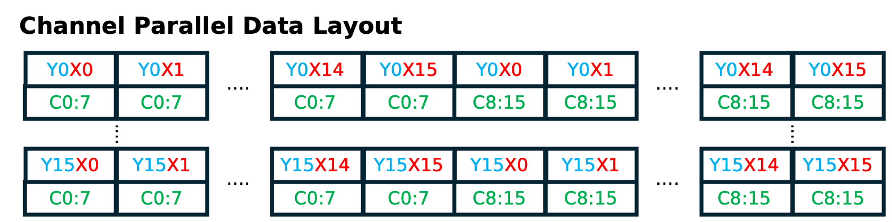

<!---//===- README.md --------------------------*- Markdown -*-===//
//
// This file is licensed under the Apache License v2.0 with LLVM Exceptions.
// See https://llvm.org/LICENSE.txt for license information.
// SPDX-License-Identifier: Apache-2.0 WITH LLVM-exception
//
// Copyright (C) 2024-2026, Advanced Micro Devices, Inc.
//
//===----------------------------------------------------------------------===//-->

# <ins>1x1 Conv2D (int8, optionally fused with ReLU)</ins>

A vectorized 1x1 `int8` Conv2D in the IRON API, with an optional fused-ReLU mode selected at compile time via the `fuse_relu` flag.

* `fuse_relu=0` (default): `kernels.conv2dk1_i8`; signed `int8` output.
* `fuse_relu=1`: `kernels.conv2dk1(act_dtype=int8)`; unsigned `uint8` output.  The unsigned saturation IS the fused ReLU.

The `scale` runtime parameter is lifted to a `CompileTime[int]` so the design skips the RTP buffer + barrier dance.

## Introduction

Convolution is a crucial part of various machine learning and computer vision tasks — image recognition, object detection, image segmentation.  At its core, convolution combines an input tensor with a filter (kernel) to produce an output tensor (a "feature map"):

* The input tensor is multi-dimensional with input width, height, and channel.
* The filter is multi-dimensional with filter height, width, input channels (same number of channels as the input), and output channels.
* The filter is applied to overlapping regions of the input — at each step the filter is element-wise multiplied by the region and the products are summed to produce a single output value.  Walking that sliding window across the whole input produces the feature map.

Implemented naïvely, convolution is seven nested loops (input H, input W, input C, output C, filter H, filter W, batch).  This design vectorizes the 1×1 case on a single AIE compute core.

## NPU implementation

1. **Kernel vectorization.**  The C++ kernel loads 8 elements of the input channel into vector registers via vector intrinsics, performs the multiply-accumulates with vector MAC/MUL, and emits 8 output elements per cycle.  Boundary conditions are handled by zero-padding.  The compute tile sees the input as a `4×8` matrix — 4 elements of a row × 8 input channels.

2. **Quantization.**  Activations and weights are `int8`; AIE2 offers the highest compute density at this precision (256 MAC/cycle).

3. **Data layout.**  Activations and weights are pre-reordered into a channels-last layout so contiguous bytes feed the vector unit cleanly.  See [§Data layout](#data-layout) below.

## Data layout

The vector unit operates on 8 elements simultaneously.  To keep the SIMD path fed cheaply, the activations are stored channels-last, with channels (in groups of 8) as the densest dimension:

```
Y { C/8 } X { C8 }
```

* `C8` — innermost group: 8 input-channel elements processed together.
* `X` — input feature-map width.
* `C/8` — remaining number of channel groups.
* `Y` — input feature-map height.

For an `8×8×16` tensor, the layout looks like this:

<p align="center">
 <picture>
 <source media="(prefers-color-scheme: light)" srcset="act_layout.png">
 
 </picture>
 <h3 align="center">Channel-parallel data layout for activations.  An AIE core processes 8 channels in parallel per vector operation.</h3>
</p>

Weights are reordered to match:

```
{O/8} {I/8} Y X {I8} {O8}
```

* `O8` — innermost group: 8 output channels.
* `I8` — next group: 8 input channels.
* `X` / `Y` — kernel width / height (both `1` for a 1×1 conv).
* `I/8` / `O/8` — remaining input / output channel groups.

Matching the two layouts lets the kernel stream a vector load + a vector MAC per cycle without scatter / gather.

## Source files

1. `conv2d.py` — IRON design with the `fuse_relu` flag.  Kernel factory, output dtype, default scale, and worker stack size all branch on this single flag.
2. `test.py` — torch-based host harness.  Pass `--fuse_relu` to match the compiled design — picks the ReLU layer and `uint8` output in the reference model.
3. `act_layout.png` — figure for the activation layout discussed above.

## Usage

```shell
make && make run_py                                            # plain Conv2d
make clean && make fuse_relu=1 && make fuse_relu=1 run_py      # fused ReLU
```

### Configuring problem shape

The data width, height, and channel counts come from variables at the top of the [`Makefile`](./Makefile) — `width`, `height`, `in_channels`, `out_channels` — and are forwarded into the design via `CompileTime[int]` params.  Override on the make command line: `make width=64 height=64 run_py`.
