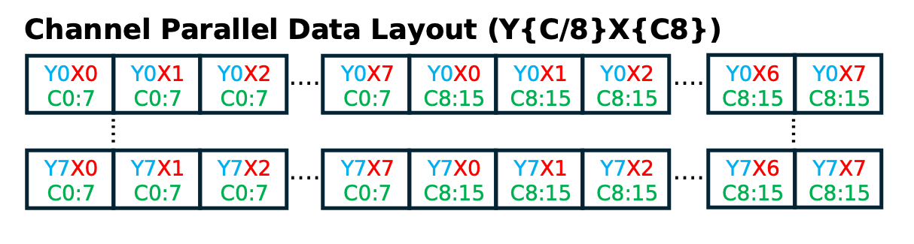

<!---//===- README.md --------------------------*- Markdown -*-===//
//
// This file is licensed under the Apache License v2.0 with LLVM Exceptions.
// See https://llvm.org/LICENSE.txt for license information.
// SPDX-License-Identifier: Apache-2.0 WITH LLVM-exception
//
// Copyright (C) 2024, Advanced Micro Devices, Inc.
// 
//===----------------------------------------------------------------------===//-->

# <ins>Convolution 2D </ins>
## Introduction
Convolution is a crucial part of various machine learning and computer vision tasks, such as image recognition, object detection, and image segmentation. This README provides instructions for implementing convolution on AI Engine with 8-bit precision. 

At its core, it is a mathematical operation that combines an input tensor and a filter to produce an output tensor. The input tensor is a multi-dimensional matrix with input weight, height, and channel. The filter is also represented as a multi-dimensional matrix with filter height, width, input, and output channels (the same number of channels as the input tensor). The filter is systematically applied to different regions of the input data. At each step, the filter is element-wise multiplied by the overlapping region of the input tensor. The element-wise products are summed up to produce a single value, representing the result of the convolution operation for that region. This process is repeated for all possible regions of the input tensor, producing an output tensor called the feature map.

The process of applying the filter to different regions of the input tensor is often visualized as a sliding window moving across the input data. The size of the sliding window corresponds to the size of the filter, and it moves with a certain stride (the number of pixels it moves at each step). The convolution operation consists of seven nested loops, iterating over the input height, input length, input channel, output channel, filter height, filter length, and batch size, each loop corresponding to a different aspect of the operation. This systematic process extracts features from the input tensor, yielding the output feature map and illustrating the computational intricacies of convolution. In this design, we vectorize a two-dimensional convolution with 1x1 filter size.


## Source Files Overview

```
.
+-- act_layout.png      # Figure describing input/output data layout.
+-- aie2.py             # A Python script that defines the AIE array structural design using MLIR-AIE operations.
+-- Makefile            # Contains instructions for building and compiling software projects.
+-- README.md           # This file.
+-- run.lit             # For LLVM Integrated Tester (LIT) of the design.
+-- test.py             # Python code testbench for the design example.
```

## NPU Implementation
1. Kernel Optimization: To optimize convolution operations on AIE, we vectorize the code using AIE vector intrinsics. We load 8 elements of the input channel into vector registers using vector load intrinsic. We perform the convolution operation using vector MAC/MUL on this loaded data. We implement zero-padding to handle boundary conditions to ensure accurate convolution results, particularly at the edges of feature maps. This comprehensive approach optimizes convolution processing on AIE, facilitating efficient and accurate feature extraction in neural network applications. Input is a 4x8 matrix corresponding to 4 elements of a row and 8 input channels.

2. Quantization: We use `int8` precision for activation and weights. At `int8` precision, AIE offers the highest compute density with 256 MAC/cycle. 

3. Data Layout: We optimize activation and weight layout to enhance memory access patterns and enable effective utilization of AIE parallel processing units, ultimately improving the performance of 2D convolution operations. 

## Data Layout
We must ensure that the data layout is compatible with efficient SIMD processing and rearrange the input data into a format where contiguous elements represent consecutive X-dimension values for each channel. We adopt a channels-last memory ordering, denoted as Y{C/8}X{C8}, to exploit output channel parallelism by ensuring channels become the densest dimension. Operating on 8 elements simultaneously, we process 8 channels simultaneously with the same width. Subsequently, we traverse the entire width dimension, handling the remaining channels in batches of 8. This process continues row-wise, resulting in our final data layout pattern: Y{C/8}X{C8}. This optimized layout enhances memory access patterns and enables effective utilization of parallel processing units, ultimately improving the performance of 2D convolution operations. This transformation ensures that data can be efficiently loaded into SIMD registers and processed in parallel. 

The below figure shows our channel parallel data layout (Y{C/8}X{C8}) for a tensor dimension 8x8x16:

<p align="center">
 <picture>
 <source media="(prefers-color-scheme: light)" srcset="act_layout.png">
 
</picture>
 <h3 align="center">Channel parallel data layout for activations. An AIE core processes 8 channels in parallel per vector operation.
 </h3>
</p>


In the Y{C/8}X{C8} (with N=1) data layout, the data is organized in memory as follows:

* C8:   Indicates that 8 elements of the input channel are processed together.
* X:    Represents the input feature map dimension.
* C/8:  Denotes the remaining number of channels.
* Y:    Represents the output feature map dimension.


{O/8}{I/8}YX{I8}{O8} Weight Layout:

We align the weight layout as specified: O/8, I/8, Y, X, I8, O8, to match the input tensor processing. We first load the weight tensor and organize it to match this layout, where dimensions represent output channels, input channels, kernel height, kernel width, input channel groups of 8, and output channel groups of 8. By aligning the weight layout in this manner, we enable seamless integration with the input data layout, maximizing parallelism and minimizing memory access overhead. 

In the {O/8}{I/8}YX{I8}{O8} data layout, the data is organized in memory as follows:

* O8:   Indicates that 8 elements of the output channel are processed together.
* I8:   Indicates that 8 elements of the input channel are processed together.
* X:    Represents the kernel weight.
* Y:    Represents the kernel height.
* I/8:  Denotes the remaining number of input channels.
* O/8:  Denotes the remaining number of output channels.


## Compilation
To compile the design:
```
make
```

To run the design:
```
make run_py
```