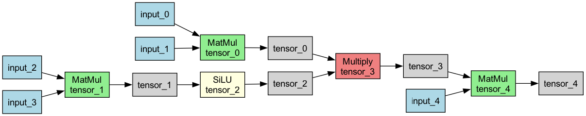

# Llama2 Graph Execution Demo

This project demonstrates graph-based execution of Llama2-style operations using PyTorch.

## Running the Demo

```bash
./llama2.py
```

## Output

The execution captured and ran 5 operations in sequence:

1. **MatMul** - Matrix multiplication between input tensors
2. **MatMul** - Another matrix multiplication operation  
3. **SiLU** - Sigmoid Linear Unit activation function
4. **Transform** - Element-wise multiplication between tensors
5. **MatMul** - Final matrix multiplication

### Execution Log

```
Executing graph with 5 operations:
  1. matmul:
     Input A: torch.Size([2, 10, 512]), first 10 values: [-1.355, -1.097, -0.992, 0.739, 0.827, 0.994, -0.572, -0.644, -0.243, -0.917]
     Input B: torch.Size([512, 2048]), first 10 values: [0.279, 0.924, 1.536, -0.105, -0.406, 2.471, -1.119, -0.008, 0.72, 1.965]
     Output tensor_0: torch.Size([2, 10, 2048]), first 10 values: [-39.848, -24.922, -43.63, 2.529, 17.12, -33.908, -22.541, -6.013, -9.654, 20.91]

  2. matmul:
     Input A: torch.Size([2, 10, 512]), first 10 values: [-0.45, 0.881, 1.107, 0.931, 0.712, -0.834, 1.326, 0.192, 0.711, 0.075]
     Input B: torch.Size([512, 2048]), first 10 values: [0.367, 0.851, 0.37, 1.481, 0.844, -1.27, -0.25, -0.601, -0.421, -0.395]
     Output tensor_1: torch.Size([2, 10, 2048]), first 10 values: [-15.411, -23.395, -3.266, -23.504, 10.329, 9.771, -2.324, 0.625, 13.826, 22.193]

  3. silu:
     Input X: torch.Size([2, 10, 2048]), first 10 values: [-15.411, -23.395, -3.266, -23.504, 10.329, 9.771, -2.324, 0.625, 13.826, 22.193]
     Output tensor_2: torch.Size([2, 10, 2048]), first 10 values: [-0.0, -0.0, -0.12, -0.0, 10.329, 9.771, -0.207, 0.407, 13.826, 22.193]

  4. transform:
     Input A: torch.Size([2, 10, 2048]), first 10 values: [-39.848, -24.922, -43.63, 2.529, 17.12, -33.908, -22.541, -6.013, -9.654, 20.91]
     Input B: torch.Size([2, 10, 2048]), first 10 values: [-0.0, -0.0, -0.12, -0.0, 10.329, 9.771, -0.207, 0.407, 13.826, 22.193]
     Operation: <lambda>
     Output tensor_3: torch.Size([2, 10, 2048]), first 10 values: [0.0, 0.0, 5.239, -0.0, 176.827, -331.307, 4.669, -2.447, -133.477, 464.063]

  5. matmul:
     Input A: torch.Size([2, 10, 2048]), first 10 values: [0.0, 0.0, 5.239, -0.0, 176.827, -331.307, 4.669, -2.447, -133.477, 464.063]
     Input B: torch.Size([2048, 512]), first 10 values: [0.045, -0.474, -2.357, -1.286, -1.632, -0.698, -0.104, 1.752, 1.322, -0.412]
     Output tensor_4: torch.Size([2, 10, 512]), first 10 values: [22564.406, -17298.057, -10180.983, -12744.041, -2693.806, 27847.891, 11819.603, 3368.201, 16146.652, -7758.121]

Final output shape: torch.Size([2, 10, 512])
```

## Graph Visualization

The execution graph is visualized in `llama2_graph.png`, showing the flow of operations and tensor dependencies.


