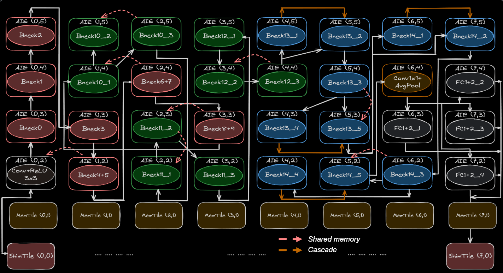

# MobileNet V3 Implementation on AI Engine

## Overview

MobileNet V3 is a highly efficient model for mobile and edge devices, designed to provide a good balance between latency and accuracy.
This project implements MobileNet V3 on AI Engine with three different mappings of bottleneck blocks:

1. **Bottleneck A**: Each bottleneck block is implemented on a single AI core.
2. **Bottleneck B**: Each bottleneck block is distributed across three AI cores.
3. **Bottleneck C**: Each bottleneck block is distributed across five AI cores.

## Contents

- `README.md`: This file, providing an overview and setup instructions.
- `bottlenec_A/`: Implementation of Bottleneck A.
- `bottlenec_B/`: Implementation of Bottleneck B.
- `bottlenec_C/`: Implementation of Bottleneck C.

## Dataflow Mapping

The below figures shows our dataflow mapping of MobileNetV3 on 4x8 AI Engine array.

 <picture>
 <source media="(prefers-color-scheme: light)" srcset="./mobilenet_dataflow.png">
 
</picture>
 <h3 align="center">Our depth-first mapping avoid unnecessary off-chip data movement.
 </h3>

### Bottleneck A

In this mapping, each bottleneck block is implemented on a single AI core. 

### Bottleneck B

In this mapping, each bottleneck block is distributed across three AI cores. This approach balances between computational load and parallelism, potentially offering better performance than Bottleneck A.

### Bottleneck C

In this mapping, each bottleneck block is distributed across five AI cores. This maximizes parallelism and is designed to achieve the best performance by fully utilizing the available AI cores.
