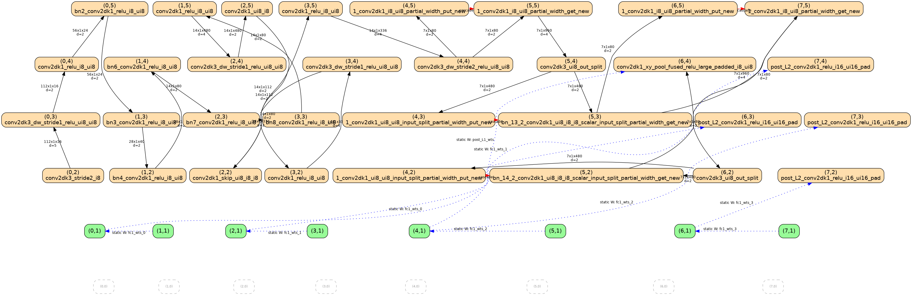

# MobileNet V3 Implementation on AI Engine

## Overview

MobileNet V3 is a highly efficient model for mobile and edge devices, designed to provide a good balance between latency and accuracy and targeting a device with 4x8 core tiles and 1 row of mem tiles (Strix).
This project implements MobileNet V3 on AI Engine with three different mappings of bottleneck blocks:

1. **Bottleneck A**: Each bottleneck block is implemented on a single AI core.
2. **Bottleneck B**: Each bottleneck block is distributed across three AI cores.
3. **Bottleneck C**: Each bottleneck block is distributed across five AI cores.


## Contents

- `README.md`: This file, providing an overview and setup instructions.
- `bottlenec_A/`: Implementation of Bottleneck A.
- `bottlenec_B/`: Implementation of Bottleneck B.
- `bottlenec_C/`: Implementation of Bottleneck C.


## Dataflow Mapping


The below figures shows our dataflow mapping of MobileNetV3 on 4x8 AI Engine array.
<p align="center">
 <picture>
 <source media="(prefers-color-scheme: light)" srcset="./mobilenet_dataflow.png">
 
</picture>
 <h3 align="center">Our depth-first mapping avoid unnecessary off-chip data movement.
 </h3>
</p>

### Bottleneck A

In this mapping, each bottleneck block is implemented on a single AI core with some layers combined to balance the pipe and leave enough tile for the fully connected layers at the end.

### Bottleneck B

In this mapping, each bottleneck block is distributed across three AI cores. This approach balances between computational load and parallelism, potentially offering better performance than Bottleneck A.

### Bottleneck C

In this mapping, each bottleneck block is distributed across five AI cores. This maximizes parallelism and is designed to achieve the best performance by fully utilizing the available AI cores.

## Setup

### Building the Project

To compile and run the chained design:
```
make run_py
```

We have separated the generation of the golden data, weights and scale factors to a separate python program `gen_golden.py`. This writes the data to the `log` folder which should match the ones stored under `data` that the test uses as input stimulus, golden reference, weights, and scale factors. In order to run `gen_golden.py`, we need additional python packages (e.g. torchvision, brevitas) as well as a set of imagenet calibration images. Those calibration images are not part of this repo (details to be shared soon) but the remaining package requirements can be satisfied via:
```
python3 -m pip install -r requirements_gen_golden.txt
```
To generate the input stimulus, golden reference, weights and scale factors:
```
python3 ./gen_golden.py
```

