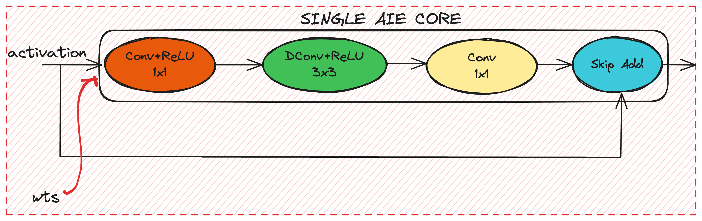

# Bottleneck A Implementation on a Single AI Engine Core

## Overview

This project implements a bottleneck block for a neural network on a single AI Engine core. The bottleneck block is a crucial component in many deep learning architectures, such as in MobileNet and ResNet models. It helps reduce computational complexity and the number of parameters while maintaining performance. The block consists of three layers: a 1x1 convolution, a depthwise 3x3 convolution, and another 1x1 convolution. A skip connection may also be included.

## Contents

- `README.md`: This file, providing an overview and setup instructions.
- `Makefile`: Makefile for building the project.


The below figures shows our implementation of the bottleneck A mapping using one AIE core.
<p align="center">
 <picture>
 <source media="(prefers-color-scheme: light)" srcset="./bottleneck_a.png">
 
</picture>
 <h3 align="center">Bottleneck A depth-first mapping on a single AIE core to avoid unnecessary off-chip data movement.
 </h3>
</p>

## Setup

### Building the Project

To compile and run the chained design:
```
cd bottleneck_A
make -f Makefile_chain
```