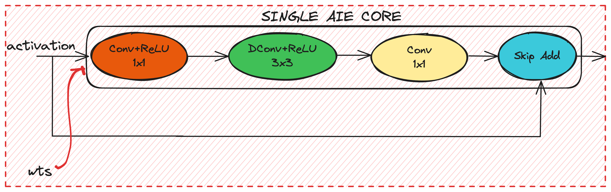

# Bottleneck A Implementation on a Single AI Engine Core

## Overview

This project implements a bottleneck block for a neural network on a single AI Engine core. The bottleneck block is a crucial component in many deep learning architectures, such as in MobileNet and ResNet models. It helps reduce computational complexity and the number of parameters while maintaining performance. The block consists of three layers: a 1x1 convolution, a depthwise 3x3 convolution, and another 1x1 convolution. A skip connection may also be included.

## Contents

- `README.md`: This file, providing an overview and setup instructions.
- `Makefile`: Makefile for building the project.
- `aie2_bottleneckA.py`: Main bottleneck A design block, repeated for most of the 9 stages in A processing section (with exception to stage 0)
- `aie2_bottleneckAStatic.py`: static weights version of the bottleneck A block
- `aie2_bottleneck0.py`: slight variation of the A block for stage 0
- `aie2_bottleneck0Stati.py`: static weights version of the A block for stage 0
- `aie2_bottleneck8And9.py` : fused block of two A blocks (used in such combinatoins as stage8+stage9 or stage4+stage5)
- `aie2_bottleneck8And9Static.py`: static weights version of fused block
- `aie2_bn_*.py`: Top level design file for single bottleneck stage used for single block testing
- `aie2_bottleneckA_chain.py`: Full chain of all bottleneck A blocks for stages 0-9 (uses static weights version of blocks). In this design, we fused stages 4+5 and stages 8+9.
- `test_bn_*.py`: Testbench host code for single bottleneck stage tests
- `test_bottleneckA.py`: Testbench host code for the complete chain for stages 0-9

The below figures shows our implementation of the bottleneck A mapping using one AIE core.
<p align="center">
 <picture>
 <source media="(prefers-color-scheme: light)" srcset="./bottleneck_a.png">
 
</picture>
 <h3 align="center">Bottleneck A depth-first mapping on a single AIE core to avoid unnecessary off-chip data movement.
 </h3>
</p>

## Setup

### Building the Project

To compile and run the full chain design:
```
cd bottleneck_A
make run_py_bn_chain
```

To run some of the single kernel design tests like stage 1:
```
make run_py_0
```
