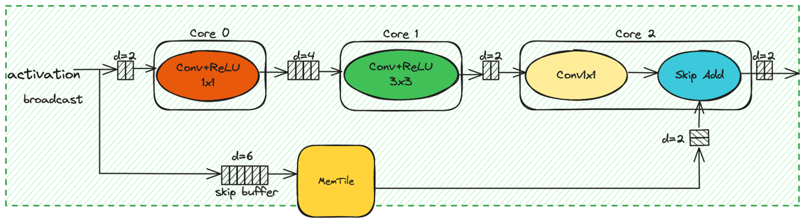

# Bottleneck B Implementation on AI Engine

## Overview

This project implements the Bottleneck B block of MobileNet V3 on AI Engine. In Bottleneck B, each bottleneck block is distributed across three AI cores, balancing computational load and parallelism to achieve efficient performance.

## Contents

- `README.md`: This file, providing an overview and setup instructions.
- `Makefile`: Makefile for building the project.

## Architecture

In Bottleneck B, each bottleneck block is divided and distributed across three AI cores. This design ensures efficient parallelism and load balancing, enhancing performance while maintaining the integrity of the MobileNet V3 architecture.

The below figures shows our implementation of the bottleneck B mapping using three AIE core.
<p align="center">
 <picture>
 <source media="(prefers-color-scheme: light)" srcset="./bottleneck_b.png">
 
</picture>
 <h3 align="center">Bottleneck B depth-first mapping on three AIE cores to avoid unnecessary off-chip data movement.
 </h3>
</p>

## Setup

### Building the Project

To compile and run the chained design:
```
cd bottleneck_B
make
```