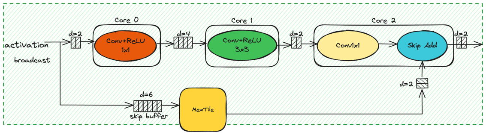

# Bottleneck B Implementation on AI Engine

## Overview

This project implements the Bottleneck B block of MobileNet V3 on AI Engine. In Bottleneck B, each bottleneck block is distributed across three AI cores, maximizing parallelism to achieve optimal performance.

## Contents

- `README.md`: This file, providing an overview and setup instructions.
- `Makefile`: Makefile for building the project.
- `aie2_bottleneckBStatic.py`: Full chain of bottleneck B
- `aie2_bn_10_11_12.py`: Top level design instantiating `aie2_bottleneckBStatic` chain
- `test_bottleneckB.py`: Testbench host code for the complete chain for stages 10, 11, and 12


## Architecture

In Bottleneck B, each bottleneck block is divided and distributed across three AI cores. This design ensures maximum parallelism and load balancing, enhancing performance while maintaining the integrity of the MobileNet V3 architecture.


The below figures shows our implementation of the bottleneck B mapping using three AIE cores.
<p align="center">
 <picture>
 <source media="(prefers-color-scheme: light)" srcset="./bottleneck_b.png">
 
</picture>
 <h3 align="center">Bottleneck B maps each stage onto three AIE cores.
 </h3>
</p>


## Setup

### Building the Project

To compile and run the chained design:
```
cd bottleneck_B
make run_py
```

To generate input stimulus, golden reference, weights, and scale factors:
```
python3 ./gen_golden.py
```
