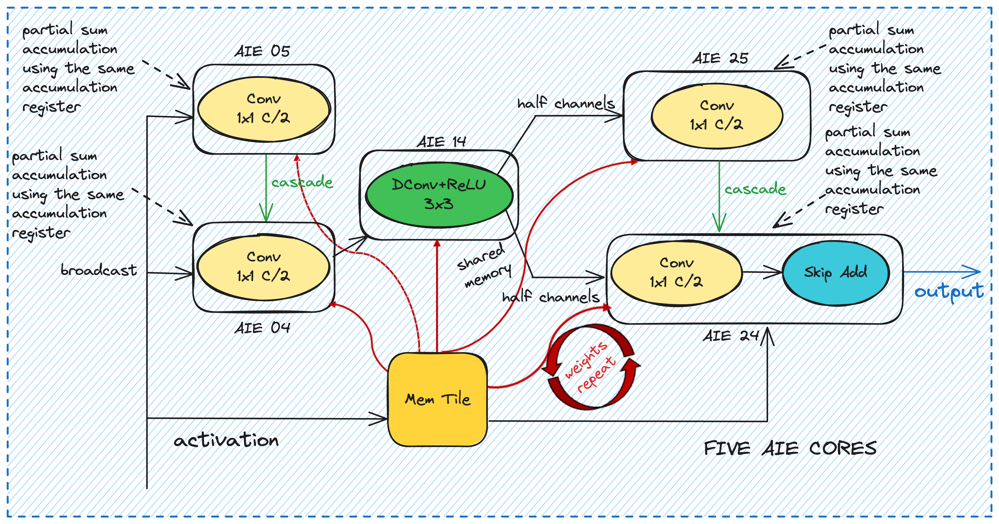

# Bottleneck C Implementation on AI Engine

## Overview

This project implements the Bottleneck C block of MobileNet V3 on AI Engine. In Bottleneck C, each bottleneck block is distributed across five AI cores, maximizing parallelism to achieve optimal performance.

## Contents

- `README.md`: This file, providing an overview and setup instructions.
- `Makefile`: Makefile for building the project.


## Architecture

In Bottleneck C, each bottleneck block is divided and distributed across five AI cores. This design ensures maximum parallelism and load balancing, enhancing performance while maintaining the integrity of the MobileNet V3 architecture.


The below figures shows our implementation of the bottleneck C mapping using five AIE core.
<p align="center">
 <picture>
 <source media="(prefers-color-scheme: light)" srcset="./bottleneck_c.png">
 
</picture>
 <h3 align="center">Bottleneck C depth-first mapping on five AIE cores to avoid unnecessary off-chip data movement.
 </h3>
</p>


## Setup

### Building the Project

To compile and run the chained design:
```
cd bottleneck_C
make 
```