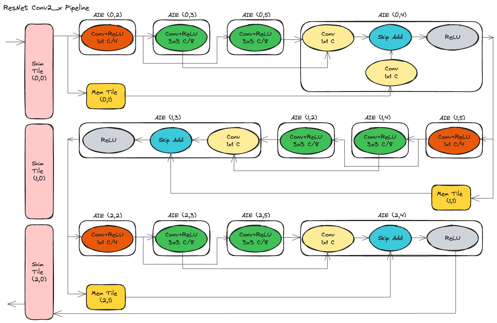

<!---//===- README.md --------------------------*- Markdown -*-===//
//
// This file is licensed under the Apache License v2.0 with LLVM Exceptions.
// See https://llvm.org/LICENSE.txt for license information.
// SPDX-License-Identifier: Apache-2.0 WITH LLVM-exception
//
// Copyright (C) 2024, Advanced Micro Devices, Inc.
// 
//===----------------------------------------------------------------------===//-->

# <ins>ResNet with Offloaded Conv2_x Layers</ins>

## Introduction
ResNet [[1]](#1) is a convolutional neural network architecture that has gained significant popularity for various computer vision tasks, including image classification, object detection, and image segmentation. It is renowned for its depth and efficiency in training very deep networks. This README focuses on our implementation of the conv2_x layers of the ResNet architecture using three columns of NPU. 

## ResNet Architecture Overview
ResNet consists of the following key components:

1. Input Layer: This layer accepts input image data with dimensions typically set to 224x224x3 (width, height, and RGB channels).
2. Convolutional Layers: The initial layers perform convolution operations to extract basic features from the input image.
3. Bottleneck Blocks:
 * ResNet is composed of multiple bottleneck blocks grouped into different stages (conv2_x, conv3_x, conv4_x, conv5_x).
 * Each bottleneck block contains convolutional layers and shortcut connections that facilitate the learning of residual mappings.
 * The conv2_x stage is particularly targeted for offloading computations in this optimization.
4. Pooling Layers: Max pooling layers reduce the spatial dimensions of the feature maps.
5. Fully Connected Layer: Produces the final output predictions, typically followed by a softmax activation for classification tasks.

## Source Files Overview

```
.
+-- layers_conv2_x                  # Implementation of ResNet conv2_x layers on NPU
|   +-- aie2.py                     # A Python script that defines the AIE array structural design using MLIR-AIE operations.
|   +-- Makefile                    # Contains instructions for building and compiling software projects.
|   +-- resnet_conv2x_pipeline.png  # Figure describing our implementation of conv2_x layers on NPU.
|   +-- run.lit                     # For LLVM Integrated Tester (LIT) of the design.
|   +-- test.py                     # Python code testbench for the design example.
+-- README.md                       # This file.

```

## NPU Implementation
The conv2_x stage of ResNet comprises a series of bottleneck blocks, each containing convolutional, batch norm, and ReLU layers responsible for learning more complex features from the input data. By offloading the computations within these blocks to AI Engine, we aim to:

* Reduce the computational burden on the main processing unit (e.g., CPU or GPU).
* Improve overall inference speed and efficiency.

The below figures shows our implementation of the conv2_x layers of the ResNet architecture using three columns of NPU.
<p align="center">
 <picture>
 <source media="(prefers-color-scheme: light)" srcset="./layers_conv2_x/resnet_conv2x_pipeline.png">
 
</picture>
 <h3 align="center">ResNet conv2_x stage's bottleneck blocks are stacked depth-first to avoid unnecessary off-chip data movement.
 </h3>
</p>

Similar to our [bottleneck design](../../bottleneck), we implement conv2_x layers depth-first. Our implementation connects the output of one bottleneck block on an NPU column to another on a separate column, all without the necessity of transferring intermediate results off-chip. Compared to [bottleneck design](../../bottleneck), the first bottleneck block in the conv2_x stage requires an additional 1x1 convolution on the `AIE (0,4)` tile to handle channel mismatch for the skip addition between the input from the skip path and the input from the non-skip path. This mismatch arises because the initial input activation transferred from the skip path possesses fewer input channels compared to the output on the non-skip path. To overcome this issue, an additional 1x1 convolution is introduced in the skip path that the increases the number of channels.

After the initial processing in the first bottleneck block, the output is sent directly to the second bottleneck block on a separate NPU column. The output activation is broadcasted to both `AIE (1,5)` and `AIE (1,3)` via `Mem Tile (1,1)`. The second bottleneck's processing proceeds as described in [bottleneck design](../../bottleneck). Similarly, the subsequent bottleneck block requires the output from the second bottleneck, avoiding any need to send intermediate activations off-chip. Upon processing in the third bottleneck block, the final output is transmitted from tile `AIE (2,4)` back to the output via `Shim tile (2,0)`, completing the seamless flow of computation within the NPU architecture. Thus, our depth-first implementation avoids any unnecessary off-chip data movement for intermediate tensors.


## Compilation
To compile the design:
```
make
```

To run the design:
```
make run_py
```

## References
<a id="1">[1]</a> 
He, K., Zhang, X., Ren, S., & Sun, J. (2016). Deep residual learning for image recognition. In Proceedings of the IEEE conference on computer vision and pattern recognition (pp. 770-778).

