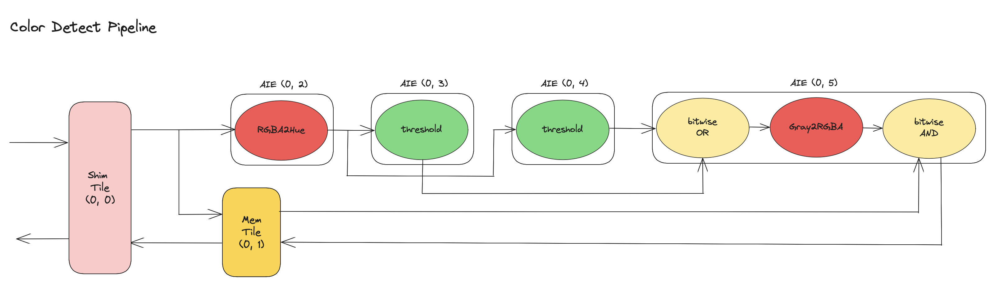

<!---//===- README.md --------------------------*- Markdown -*-===//
//
// This file is licensed under the Apache License v2.0 with LLVM Exceptions.
// See https://llvm.org/LICENSE.txt for license information.
// SPDX-License-Identifier: Apache-2.0 WITH LLVM-exception
//
// Copyright (C) 2023, Advanced Micro Devices, Inc.
// 
//===----------------------------------------------------------------------===//-->

# <ins>Color Detect</ins>

The Color Detect pipeline design consists of the following blocks arranged in a pipeline fashion for the detecting of 2 colors in a sequence of images : `rgba2hue`, `threshold`, `threshold`, `bitwiseOR`, `gray2rgba`, `bitwiseAND`.

The pipeline is mapped onto a single column of the npu device, with one Shim tile (0, 0), one Mem tile (0, 1) and four AIE compute tiles (0, 2) through (0, 5). As shown in the image below, the `rgba2hue`, and the two `threshold` kernels are each mapped onto one compute tile, while `bitwiseOR`, `gray2rgba` and `bitwiseAND` are mapped together on AIE tile (0, 5). 

<p align="center">
  
</p>

The data movement of this pipeline is described using the ObjectFifo (OF) primitive. Input data is brought into the array via the Shim tile. The data then needs to be broadcasted both to AIE tile (0, 2) and AIE tile (0, 5). However, tile (0, 5) has to wait for additional data from the other kernels before it can proceed with its execution, so in order to avoid any stalls in the broadcast, data for tile (0, 5) is instead buffered in the Mem tile. Because of the size of the data, the buffering couldn't directly be done in the smaller L1 memory module of tile (0, 5). This is described using two OFs, one for the broadcast to tile (0, 2) and the Mem tile, and one for the data movement between the Mem tile and tile (0, 5). The two OFs are linked to express that data from the first OF should be copied to the second OF implicitly through the Mem tile's DMA.

Starting from tile (0, 2) data is processed by each compute tile and the result is sent to the next tile. This is described by a series of one-to-one OFs. An OF also describes the broadcast from tile (0, 2) to tiles (0, 3) and (0, 4). As the three kernels `bitwiseOR`, `gray2rgba` and `bitwiseAND` are mapped together on AIE tile (0, 5), two OFs are also created with tile (0, 5) being both their source and destination to describe the data movement between the three kernels. 

Finally, the output is sent from tile (0, 5) to the Mem tile and then back to the output through the Shim tile.

To compile desing in Windows:
```
make
make colorDetect.exe
```

To run the design:
```
make run
```
