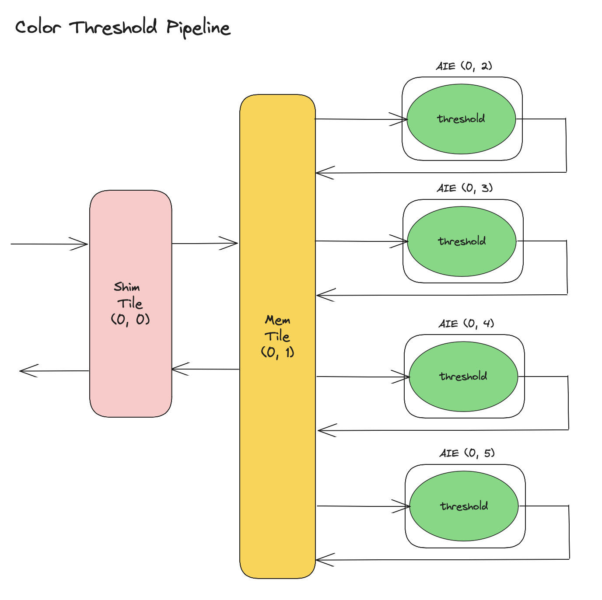

<!---//===- README.md --------------------------*- Markdown -*-===//
//
// This file is licensed under the Apache License v2.0 with LLVM Exceptions.
// See https://llvm.org/LICENSE.txt for license information.
// SPDX-License-Identifier: Apache-2.0 WITH LLVM-exception
//
// Copyright (C) 2022, Advanced Micro Devices, Inc.
// 
//===----------------------------------------------------------------------===//-->

# <ins>Color Threshold</ins>

The Color Threshold pipeline design consists of 4 threshold blocks in separate AIE tiles that process a different region of an input image, as shown in the image below.

The pipeline is mapped onto a single column of the npu device, with one Shim tile (0, 0), one Mem tile (0, 1) and four AIE compute tiles (0, 2) through (0, 5). 

<p align="center">
  
</p>

The data movement of this pipeline is described using the OrderedObjectBuffer (OOB) primitive. The input image is brought into the array via Shim tile (0, 0) and first sent to Mem tile (0, 1). There it is split into smaller blocks of data and each block is distributed to one of the 4 AIE tiles (0, 2) to (0, 5). One OOB is used to express data movement from the Shim tile to the Mem tile. Four different OOBs express the one-to-one data movements between the Mem tile and each of the compute tiles. The input OOB is linked to the other four OOBs to express that data from the input OOB should be copied implicitly to the other OOBs via the DMA. Currently, the ordering of the four OOBs in the Link operation expresses what piece of input data should go to each compute tile.

Each AIE tile applies a threshold kernel on its data and sends its result back to the Mem tile, this is represented by one OOB for each compute tile. The results are then joined back together in the Mem tile and sent back to the output through the Shim tile. This is again described using a Link operation in which the ordering of the input OOBs expresses how the different results should be joined together before being sent to the output OOB, to the Shim tile.

To compile desing in Windows:
```
make
make colorThreshold.exe
```

To run the design:
```
make run
```
