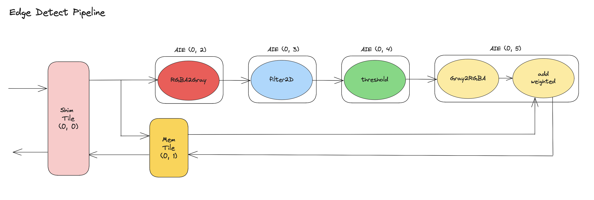

<!---//===- README.md --------------------------*- Markdown -*-===//
//
// This file is licensed under the Apache License v2.0 with LLVM Exceptions.
// See https://llvm.org/LICENSE.txt for license information.
// SPDX-License-Identifier: Apache-2.0 WITH LLVM-exception
//
// Copyright (C) 2022-2026, Advanced Micro Devices, Inc.
//
//===----------------------------------------------------------------------===//-->

# <ins>Edge Detect</ins>

The Edge Detect pipeline detects edges in a sequence of images via five line-based kernels arranged in a pipeline: `rgba2gray`, `filter2D`, `threshold`, `gray2rgba`, `addWeighted`. All five kernels are pulled from `aie.iron.kernels.vision`; the design body wires them up with `ObjectFifo` and four `Worker` stages.

The pipeline is mapped onto a single column of the NPU: one Shim tile (0, 0), one Mem tile (0, 1), and four compute tiles (0, 2)–(0, 5). `SequentialPlacer()` (the IRON default) assigns these for us. `rgba2gray`, `filter2D`, and `threshold` each get their own compute tile; `gray2rgba` + `addWeighted` share tile (0, 5).

<p align="center">
  
</p>

Input data enters via the Shim tile and is broadcast both to tile (0, 2) and tile (0, 5). Tile (0, 5) waits for the post-threshold edge map before combining with the original RGBA via `addWeighted`, so its copy of the input is buffered in the Mem tile to avoid stalling the broadcast. The two ObjectFifos (`inOF_L3L2` and `inOF_L2L1` via `cons(7).forward(...)`) describe this: the first carries the broadcast to tile (0, 2) and the Mem tile, the second carries the staged data from the Mem tile to tile (0, 5).

Compute results flow through one-to-one ObjectFifos between consecutive stages. The shared-tile `gray2rgba` + `addWeighted` worker uses an extra `of_local` ObjectFifo internally (source = destination = tile (0, 5)) to hand data between the two kernels. The final RGBA edge-overlaid output goes back through the Mem tile and out the Shim tile.

## Usage

### Standalone (no Makefile, no OpenCV)

```shell
python3 edge_detect.py
```

`-d npu2` for Strix; `-W` / `-H` override the image dimensions. This mode JIT-compiles + runs on random data without verifying pixels — use the C++/OpenCV host below for pixel-level checks.

### Makefile + C++ testbench (OpenCV required)

```shell
make
make run
```

For NPU2 (Strix): `make devicename=npu2 && make run devicename=npu2`.
