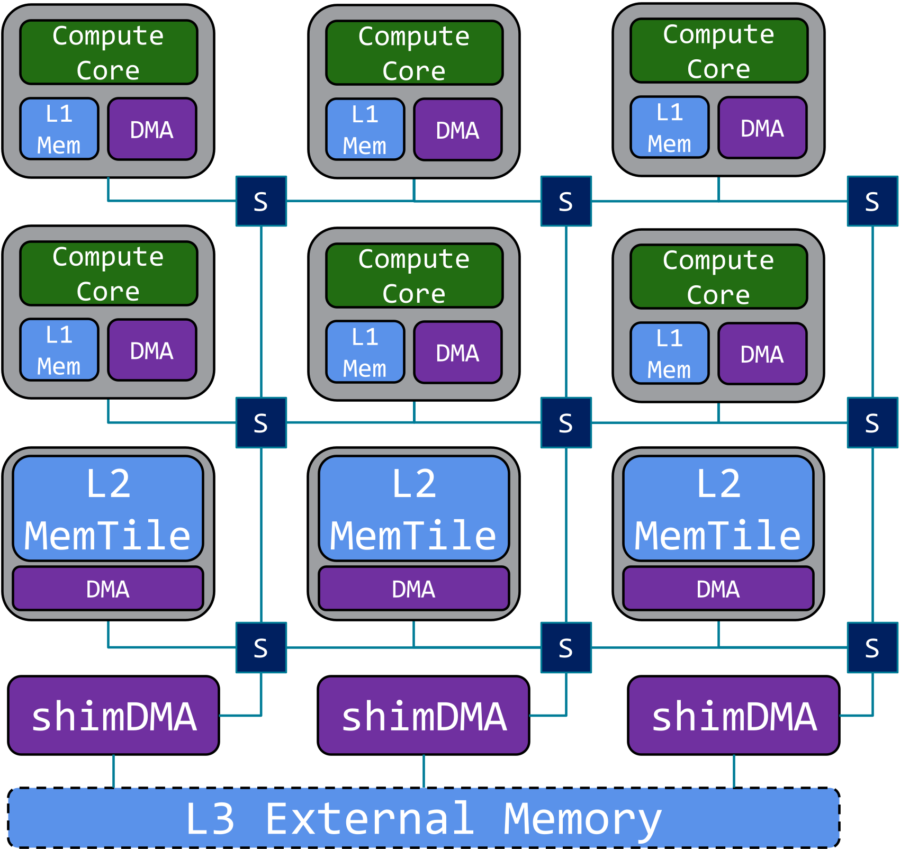

<!---//===- README.md --------------------------*- Markdown -*-===//
//
// This file is licensed under the Apache License v2.0 with LLVM Exceptions.
// See https://llvm.org/LICENSE.txt for license information.
// SPDX-License-Identifier: Apache-2.0 WITH LLVM-exception
//
// Copyright (C) 2022, Advanced Micro Devices, Inc.
// 
//===----------------------------------------------------------------------===//-->

# <ins>IRON AIE Programming Guide</ins>

 

The AI Engine (AIE) array is a spatial compute architecture: a modular and scalable system with spatially distributed compute and memories. Its compute dense vector processing runs independently and concurrently to explicitly scheduled data movement. Since the vector compute core (green) of each AIE can only operate on data in its L1 scratchpad memory (light blue), data movement accelerators (purple) bi-directionally transport this data over a switched (dark blue) interconnect network, from any level in the memory hierarchy.

Programming the AIE-array configures all its spatial building blocks: the compute cores' program memory, the data movers' buffer descriptors, interconnect with switches, etc. This guide introduces our Interface Representation for hands-ON (IRON) close-to-metal programming of the AIE-array. IRON is an open access toolkit enabling performance engineers to build fast and efficient, often specialized designs through a set of Python language bindings around mlir-aie, our MLIR-based representation of the AIE-array. MLIR-AIE provides the foundation from which complex and performant AI Engine designs can be defined and is supported by simulation and hardware implementation infrastructure. 

> **NOTE:**  For those interested in better understanding how AI Engine designs are defined at the MLIR level, take a look through the [MLIR tutorial](../tutorials/) material. mlir-aie also serves as a lower layer for other higher-level abstraction MLIR layers such as [MLIR-AIR](https://github.com/Xilinx/mlir-air).

This IRON AIE programming guide first introduces the language bindings for AIE-array's structural elements (section 1). After explaining how to set up explicit data movement (section 2) to transport the necessary data, you can run your first program on the AIE compute core (section 3). Section 4 adds tracing for performance analysis and explains how to exploit the compute dense vector operations. More vector design examples, basic and larger (ML or computer vision) are given in sections 5 and 6. Finally, the quick reference summarizes the most important API elements.

## Outline

<a href="./section-0">Section 0 - Getting Set Up for IRON</a>

* Introduce recommended hardware to target with IRON
* Simple instructions to set up your hardware, tools and environment

<a href="./section-1">Section 1 - Basic AI Engine building blocks</a>

* Introduce the AI Engine building blocks for expressing an application design
* Give example of python bindings for MLIR source that definre AIE tiles

<a href="./section-2">Section 2 - Data Movement (Object FIFOs)</a>

* Introduce topic of objectfifos and how they abstract connections between tiles and data in the AIE array memories
* Explain key objectfifo data movement patterns
* Introduce more complex objectfifo connection patterns (link/ broadcast, join/ distribute)
* Demonstrate objectfifos with practical examples
* Explain runtime data movement between the host and AIE array

<a href="./section-3">Section 3 - My First Program</a>

* Introduce example of first simple program (Vector Scalar Multiplication)
* Illustrate how to run designs on Ryzen™ AI enabled hardware

<a href="./section-4">Section 4 - Vector programming & Peformance Measurement</a>

* Discuss topic of vector programming at the kernel level
* Introduce performance measurement (trace) and how we measure cycle count and efficiency
* Performant Vector Scalar Multiplication design example

<a href="./section-5">Section 5 - Example Vector Designs</a>

* Introduce additional vector design examples with exercises to measure performance on each
    * Passthrough
    * Vector $e^x$
    * Vector Scalar Addition
    * GEMM
    * CONV2D
    * ...

<a href="./section-6">Section 6 - Larger Example Designs</a>

* Introduce larger design examples with performance measured over multiple cores
    * Edge Detect
    * Resnet
    * ...

### [Quick Reference](./quick_reference.md)

