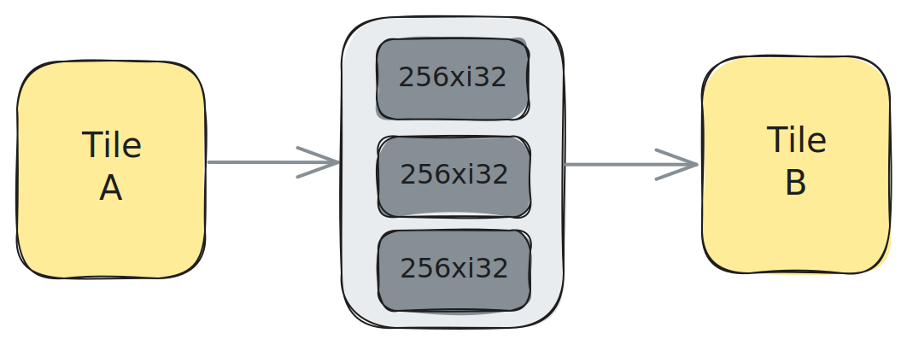
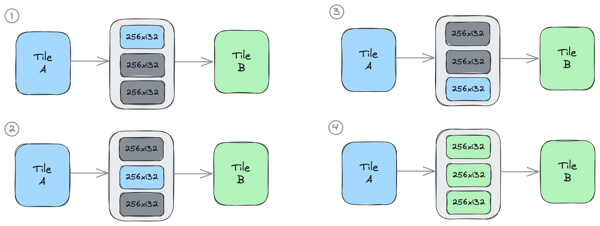

<!---//===- README.md ---------------------------------------*- Markdown -*-===//
//
// This file is licensed under the Apache License v2.0 with LLVM Exceptions.
// See https://llvm.org/LICENSE.txt for license information.
// SPDX-License-Identifier: Apache-2.0 WITH LLVM-exception
//
// Copyright (C) 2024, Advanced Micro Devices, Inc.
// 
//===----------------------------------------------------------------------===//-->

# <ins>Section 2a - Introduction</ins>

### Initializing an Object FIFO

An Object FIFO represents the data movement connection between a point A and a point B. In the AIE array, these points are AIE tiles (see [Section 1 - Basic AI Engine building blocks](../../section-1/)). Under the hood, the data movement configuration for different types of tiles (Shim tiles, Mem tiles, and compute tile) is different, but there is no difference between them when using an Object FIFO. 

To initialize an Object FIFO, users can use the `object_fifo` class constructor (defined in [aie.py](../../../python/dialects/aie.py)):
```python
class object_fifo:
    def __init__(
        self,
        name,
        producerTile,
        consumerTiles,
        depth,
        datatype,
        dimensionsToStream=None,
        dimensionsFromStreamPerConsumer=None,
    )
```
We will now go over each of the inputs, what they represents and why they are required by the abstraction. We will first focus on the mandatory inputs and in a later section of the guide on the default valued ones (see Data Layout Transformations in [section-2c](../section-2c/README.md#data-layout-transformations)).

First of all, an Object FIFO has a unique `name` which is required for the lowering steps. It functions as an ordered buffer that has `depth`-many objects of specified `datatype`. Currently, all objects in an Object FIFO have to be of the same datatype. The `datatype` is a tensor-like attribute where the size of the tensor and the type of the individual elements are specified at the same time (i.e. `<16xi32>`). The `depth` can be either an integer or an array of integers. The latter is used to support a specific dependency that can arise when working with multiple Object FIFOs and it is further explained in the Key Object FIFO Patterns [section](../section-2b/02_Broadcast/README.md#object-fifo-broadcast-pattern).

An Object FIFO is created between a producer, or source tile, and a consumer, or destination tile. The tiles are where producer and consumer processes accessing the Object FIFO will be executed. Below, you can see an example of an Object FIFO created between producer tile A and consumer tile B:
```python
A = tile(1, 3)
B = tile(2, 4)
of0 = object_fifo("objfifo0", A, B, 3, T.memref(256, T.i32()))
```
The created Object FIFO is stored in the `of0` variable and is named `objfifo0`. It has a depth of `3` objects of datatype `<256xi32>`. The figure below represents a logical view of `of0` where no assumptions are made about where the tiles and the Object FIFO resources are placed:



As you will see in the Key Object FIFO Patterns [section](../section-2b/README.md#key-object-fifo-patterns), an Object FIFO can have multiple consumer tiles, which describes a broadcast connection from the source tile to all of the consumer tiles. As such, the `consumerTiles` input can be either a single tile or an array of tiles. This is not the case for the `producerTile` input as currently the Object FIFO does not support multiple producers.

### Accessing the objects of an Object FIFO

An Object FIFO can be accessed by the processes running on the producer and consumer tiles registered to it. Before a process can have access to the objects it has to acquire them from the Object FIFO. This is because the Object FIFO is a synchronized communication primitive that leverages the synchronization mechanism available in the target hardware architecture to ensure that two processes can't access the same object at the same time. Once a process has finished working with an object and has no further use for it, it should release it so that another process will be able to acquire and access it. The patterns in which a producer or a consumer process acquires and releases objects from an Object FIFO are called `access patterns`. We can specifically refer to the acquire and release patterns as well.

To acquire one or multiple objects users should use the acquire function of the `object_fifo` class:
```python
def acquire(self, port, num_elem)
```
Based on the `num_elem` input representing the number of acquired elements, the acquire function will either directly return an object, or an array of objects that can be accessed in an array-like fashion. 

The Object FIFO is an ordered primitive and the API keeps track for each process which object is the next one that they will have access to when acquiring, based on how many they have already acquired and released. Specifically, the first time a process acquires an object it will have access to the first object of the Object FIFO, and after releasing it and acquiring a new one, it'll have access to the second object, and so on until the last object, after which the order starts from the first one again. When acquiring multiple objects and accessing them in the returned array, the object at index 0 will always be the <u>oldest</u> object that that process has access to, which may not be the first object in the pool of that Object FIFO.

To release one or multiple objects users should use the release function of the `object_fifo` class:
```python
def release(self, port, num_elem)
```
A process may release one, some or all of the objects it has acquired. The release function will release objects from oldest to youngest in acquired order. If a process does not release all of the objects it has acquired, then the next time it acquires objects the oldest objects will be those that were not released. This functionality is intended to achieve the behaviour of a sliding window through the Object FIFO primitive. This is described further in the Key Object FIFO Patterns [section](../section-2b/01_Reuse/README.md#object-fifo-reuse-pattern). 

When acquiring the objects of an Object FIFO using the acquire function it is important to note that any <u>unreleased objects from a previous acquire</u> will also be returned by the <u>most recent</u> acquire call. Unreleased objects will not be reacquired in the sense that the synchronization mechanism used under the hood has already been set in place such that the process already has the sole access rights to the unreleased objects from the previous acquire. As such, two acquire calls back-to-back without a release call in-between will result in the same objects being returned by both acquire calls. This decision was made to facilitate the understanding of releasing objects between calls to the acquire function as well as to ensure a proper lowering through the Object FIFO primitive. A code example of this behaviour is available in the Key Object FIFO Patterns [section](../section-2b/01_Reuse/README.md#object-fifo-reuse-pattern).

The `port` input of both the acquire and the release functions represents whether that process is a producer or a consumer process and it is an important hint for the Object FIFO lowering to properly leverage the underlying synchronization mechanism. Its value may be either `ObjectFifoPort.Produce` or `ObjectFifoPort.Consume`. However, an important thing to note is that the terms producer and consumers are used mainly as a means to provide a logical reference for a human user to keep track of what process is at what end of the data movement, but it <u>does not restrict the behaviour of that process</u>, i.e., a producer process may simply access an object to read it and does not require to modify it.

Below you can see an example of two processes that are <u>iterating over the objects of the Object FIFO</u> `of0` that we initialized in the previous section, one running on the producer tile and the other on the consumer tile. To do this, the producer process runs a loop of three iterations, equal to the depth of `of0`, and during each iteration it acquires one object from `of0`, calls a `test_func` function on the acquired object, and releases the object. The consumer process only runs once and acquires all three objects from `of0` at once and stores them in the `elems` array, from which it can <u>access each object individually in any order</u>. It then calls a `test_func2` function three times and in each call it gives as input one of the objects it acquired, before releasing all three objects at the end.
```python
A = tile(1, 3)
B = tile(2, 4)
of0 = object_fifo("objfifo0", A, B, 3, T.memref(256, T.i32()))

@core(A)
def core_body():
    for _ in range_(3):
        elem0 = of0.acquire(ObjectFifoPort.Produce, 1)
        call(test_func, [elem0])
        of0.release(ObjectFifoPort.Produce, 1)
        yield_([])

@core(B)
def core_body():
    elems = of0.acquire(ObjectFifoPort.Consume, 3)
    call(test_func2, [elems[0]])
    call(test_func2, [elems[1]])
    call(test_func2, [elems[2]])
    of0.release(ObjectFifoPort.Consume, 3)
```

The code above can be viewed as in the figure below where each of the 4 drawings can be seen as the state of the system during an iteration of execution. In the first three iterations, the producer process, drawn in blue, on tile A progressively acquires the elements of `of0` one by one. Once the third element has been released in the forth iteration the consumer process, drawn in green, on tile B is able to acquire all three objects at once.



Examples of designs that use these features are available in Section 2e: [01_single_double_buffer](../section-2e/01_single_double_buffer/) and [02_external_mem_to_core](../section-2e/02_external_mem_to_core/).

### Object FIFOs with same producer / consumer

An Object FIFO can be created with the same tile as both its producer and consumer tile. This is mostly done in order to ensure proper synchronization within the process itself, as opposed to synchronization across multiple processes running on different tiles, as we've seen in examples up until this point. Composing two kernels with access to a shared buffer is an application that leverages this property of the Object FIFO, as showcased in the code snippet below, where `test_func` and  `test_func2` are composed using `of0`:
```python
A = tile(1, 3)
of0 = object_fifo("objfifo0", A, A, 3, T.memref(256, T.i32()))

@core(A)
def core_body():
    for _ in range_(3):
        elem0 = of0.acquire(ObjectFifoPort.Produce, 1)
        call(test_func, [elem0])
        of0.release(ObjectFifoPort.Produce, 1)

        elem1 = of0.acquire(ObjectFifoPort.Consume, 1)
        call(test_func2, [elem1])
        of0.release(ObjectFifoPort.Consume, 1)
        yield_([])
```

-----
[[Top](..)] [[Next - Section 2b](../section-2b/)]
