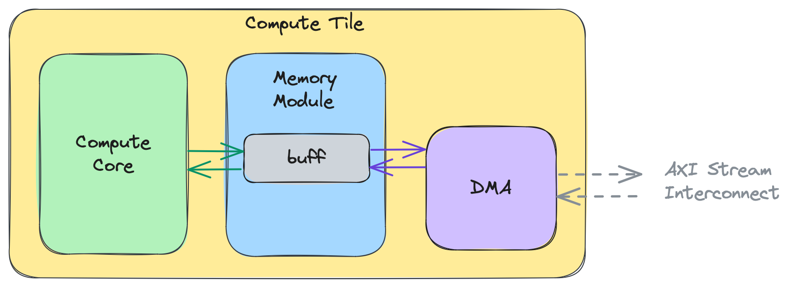
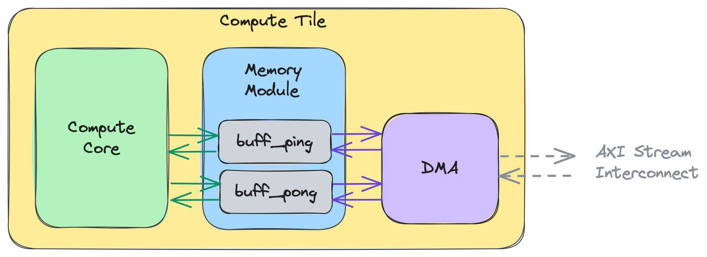

<!---//===- README.md ---------------------------------------*- Markdown -*-===//
//
// This file is licensed under the Apache License v2.0 with LLVM Exceptions.
// See https://llvm.org/LICENSE.txt for license information.
// SPDX-License-Identifier: Apache-2.0 WITH LLVM-exception
//
// Copyright (C) 2024, Advanced Micro Devices, Inc.
// 
//===----------------------------------------------------------------------===//-->

# <ins>Section 2a - Introduction</ins>

* [Section 2 - Data Movement (Object FIFOs)](../../section-2/)
    * Section 2a - Introduction
    * [Section 2b - Key Object FIFO Patterns](../section-2b/)
    * [Section 2c - Data Layout Transformations](../section-2c/)
    * [Section 2d - Runtime Data Movement](../section-2d/)
    * [Section 2e - Programming for multiple cores](../section-2e/)
    * [Section 2f - Practical Examples](../section-2f/)
    * [Section 2g - Data Movement Without Object FIFOs](../section-2g/)

-----

### Initializing an Object FIFO

An Object FIFO represents the data movement connection between a source and one or multiple destinations. The endpoints of the Object FIFO are inferred based on its usage in the rest of the program. With IRON, the Object FIFO can be initialized using the `ObjectFifo` class constructor (defined in [objectfifo.py](../../../python/iron/dataflow/objectfifo.py)):
```python
class ObjectFifo(Resolvable):
    def __init__(
        self,
        obj_type: type[np.ndarray],
        depth: int | None = 2,
        name: str | None = None,
        dims_to_stream: list[Sequence[int]] | None = None,
        dims_from_stream_per_cons: list[Sequence[int]] | None = None,
        plio: bool = False,
    )
```
The Object FIFO functions as an ordered buffer that has a count of `depth` objects; by default it is set to `2` which represents double or ping-pong buffering. All objects in an Object FIFO have to be of the same `obj_type` datatype. The datatype is a tensor-like attribute where the size of the tensor and the type of the individual elements are specified at the same time (i.e. `np.ndarray[(16,), np.dtype[np.int32]]`). The `name` input must be unique and can either be given by the user or left empty for the compiler to complete. It is required for subsequent lowering steps in the compiler flow.

As it traverses the AIE array, data can be restructured using the capabilities of Direct Memory Access channels (DMAs). These components are explained in more detail [here](./README.md#advanced-topic-data-movement-accelerators), however as a quick introduction, DMAs exist at every tile in the array and they are responsible for taking data arriving on the AXI stream interconnect and writing it into the tile's local memory, and inversely. DMAs can be given access patterns to express the order in which data should be sent onto the AXI stream by the Object FIFO's producer (using the `dims_to_stream` input) or read from it by each consumer (using the `dims_from_stream_per_cons` input). These inputs have their own dedicated section (see Data Layout Transformations in [section-2c](../section-2c/README.md#data-layout-transformations)). The `plio` input can be used when one of the Object FIFO's endpoints is a Shim tile to indicate to the compiler that the communication should be wired through a dedicated `plio` port.

Below is an example of how to initialize an Object FIFO named `in` of datatype `<256xi32>` with depth `3`:
```python
# Define tensor types
line_size = 256
line_type = np.ndarray[(line_size,), np.dtype[np.int32]]

# Dataflow with ObjectFifos
of_in = ObjectFifo(line_type, name="in", depth=3)
```

Object FIFO endpoints are separated into producers and consumers, where an Object FIFO may only have one producer and one or multiple consumers. These endpoints are also refered to as the "actors" of the Object FIFO, based on dataflow theory terminology. At this level of abstraction the endpoints are typically Workers that have access to `ObjectFifoHandle`s, with one other use case being when an Object FIFO is filled from or drained to external memory at runtime (as explained in the Runtime Data Movement [section](../section-2d/README.md)). 

The code snippet below shows two Workers running processes defined by `core_fn` and `core_fn2` which take as input a producer or a consumer handle for `of_in` respectively:
```python
# Dataflow with ObjectFifos
of_in = ObjectFifo(line_type, name="in", depth=3)

# External, binary kernel definition
test_fn = Kernel(
    "test_func",
    "test_func.cc.o",
    [line_type, np.int32],
)

test_fn2 = Kernel(
    "test_func2",
    "test_func2.cc.o",
    [line_type, np.int32],
)

# Tasks for the cores to perform
def core_fn(of_in, test_func):
    # ...

def core_fn2(of_in, test_func2):
    # ...

# Create workers to perform the tasks
my_worker = Worker(core_fn, [of_in.prod(), test_fn])
my_worker = Worker(core_fn2, [of_in.cons(), test_fn2])
```
As the Object FIFO may only have one producer process, each call to `prod()` will return a reference to the same `ObjectFifoHandle`, whereas each call of `cons()` will return a reference to a new `ObjectFifoHandle` for that consumer process.

At the beginning of this section it was mentioned that the compiler can infer the endpoints of an Object FIFO based on its usage. This specifically refers to the usage of the `ObjectFifoHandle`s which can be used to collect the producer and consumers of an Object FIFO. One can thus observe different data movement patterns which are the subject of the next [section](../section-2b/README.md#key-object-fifo-patterns).

During the next steps of the compiler flow, the Object FIFO producer and consumer Worker processes are mapped to explicit AIE tiles (see [Section 1 - Basic AI Engine building blocks](../../section-1/)) using a [Placer](../../../python/iron/placers.py). Under the hood, the data movement configuration for different types of tiles (Shim tiles, Memory tiles, and Compute tiles) is different, but there is no difference between them when using an Object FIFO. 

To initialize an Object FIFO using the closer-to-metal IRON API, users can use the `object_fifo` class constructor (defined in [aie.py](../../../python/dialects/aie.py)):
```python
class object_fifo:
    def __init__(
        self,
        name,
        producerTile,
        consumerTiles,
        depth,
        datatype: MemRefType | type[np.ndarray],
        dimensionsToStream=None,
        dimensionsFromStreamPerConsumer=None,
        initValues=None,
        via_DMA=None,
        plio=None,
        disable_synchronization=None,
    )
```
Some of the inputs are the same as they were at the higher level, while the other inputs differ slightly. We will now go over each of the inputs, what they represent and why they are required by the abstraction. We will first focus on the mandatory inputs then go over the default-valued inputs later in this section. The `dimensionsToStream` and `dimensionsFromStreamPerConsumer` inputs have their own dedicated section (see Data Layout Transformations in [section-2c](../section-2c/README.md#data-layout-transformations)).

Just like at the highest level of abstraction, the Object FIFO functions as an ordered buffer that has a count of `depth` objects of specified `datatype`. Currently, all objects in an Object FIFO have to be of the same datatype. The `datatype` is a tensor-like attribute where the size of the tensor and the type of the individual elements are specified at the same time (i.e. `<16xi32>`). Unlike before, the `depth` can be defined as either an integer or an array of integers. The latter is explained further down in this section.

An Object FIFO is created between a producer, or source tile, and a consumer, or destination tile. The tiles are where producer and consumer processes accessing the Object FIFO will be executed. These processes are also refered to as the "actors" of the Object FIFO, based on dataflow theory terminology. Below, you can see an example where `of_in` is created between producer tile A and consumer tile B with depth `3`:
```python
A = tile(1, 3)
B = tile(2, 4)
of_in = object_fifo("in", A, B, 3, np.ndarray[(256,), np.dtype[np.int32]])
```
The figure below represents a logical view of `of_in` where no assumptions are made about where the tiles and the Object FIFO resources are placed:


As you will see in the ["Key Object FIFO Patterns" section](../section-2b/README.md#key-object-fifo-patterns), an Object FIFO can have multiple consumer tiles, which describes a broadcast connection from the source tile to all of the consumer tiles. As such, the `consumerTiles` input can be either a single tile or an array of tiles. This is not the case for the `producerTile` input, as currently the Object FIFO does not support multiple producers.

### Accessing the objects of an Object FIFO

An Object FIFO can be accessed by the producer and consumer processes registered to it. Before a process can have access to the objects, it has to acquire them from the Object FIFO. This is because the Object FIFO is a synchronized communication primitive that leverages the synchronization mechanism available in the target hardware architecture to ensure that two processes cannot access the same object at the same time. Once a process has finished working with an object and has no further use for it, it must release it so that another process will be able to acquire and access it. The patterns in which a producer or a consumer process acquires and releases objects from an Object FIFO are called "access patterns". We can specifically refer to the acquire and release patterns as well.

The `_acquire()` function is used to acquire one or multiple objects from an Object FIFO:
```python
def _acquire(
        self,
        port: ObjectFifoPort,
        num_elem: int,
    )
```
Based on the `num_elem` input representing the number of acquired elements, the function will either directly return an object, or an array of objects. The `port` input is explained further in this section.

The Object FIFO is an ordered primitive and the API keeps track for each process which object is the next one that they will have access to when acquiring, based on how many they have already acquired and released. Specifically, the first time a process acquires an object it will have access to the first object of the Object FIFO, and after releasing it and acquiring a new one, it'll have access to the second object, and so on until the last object, after which the order starts from the first one again. When acquiring multiple objects and accessing them in the returned array, the object at index 0 will always be the <u>oldest</u> object that process has access to, which may not be the first object in the pool of that Object FIFO.

The `_release()` function is used to release one or multiple objects:
```python
def _release(
        self,
        port: ObjectFifoPort,
        num_elem: int,
    )
```
A process may release one, some or all of the objects it has acquired. The release function will release objects from oldest to youngest in acquired order. If a process does not release all of the objects it has acquired, then the next time it acquires objects the oldest objects will be those that were not released. This functionality is intended to achieve the behaviour of a sliding window through the Object FIFO primitive. This is described further in the ["Key Object FIFO Patterns" section](../section-2b/01_Reuse/README.md#object-fifo-reuse-pattern). 

When acquiring the objects of an Object FIFO it is important to note that any <u>unreleased objects from a previous acquire</u> will also be returned by the <u>most recent</u> acquire call. Unreleased objects will not be reacquired in the sense that the synchronization mechanism used under the hood has already been set in place such that the process already has the sole access rights to the unreleased objects from the previous acquire. As such, two acquire calls back-to-back without a release call in-between will result in the same objects being returned by both acquire calls. This decision was made to facilitate the understanding of releasing objects between calls to the acquire function as well as to ensure a proper lowering through the Object FIFO primitive. A code example of this behaviour is available in the ["Key Object FIFO Patterns" section](../section-2b/01_Reuse/README.md#object-fifo-reuse-pattern).

The `port` input of both the acquire and the release functions represents whether that process is a producer or a consumer process at the lower level of ObjectFIFO abstraction and it is an important indication for the Object FIFO lowering to properly leverage the underlying synchronization mechanism. Its value may be either `ObjectFifoPort.Produce` or `ObjectFifoPort.Consume`. However, an important thing to note is that the terms producer and consumers are used mainly as a means to provide a logical reference for a human user to keep track of what process is at what end of the data movement, but it <u>does not restrict the behaviour of that process</u>, i.e., a producer process may simply access an object to read it and is not required to modify it.

Below you can see an example of two processes that are <u>iterating over the objects of the Object FIFO</u> `of_in` that we initialized in the previous section, one accessing its producer handle and the other accessing the consumer handle. To do this, the producer process runs a loop of three iterations, equal to the depth of `of_in`, and during each iteration it acquires one object from `of_in`, calls a `test_func` function on the acquired object, and releases the object. The consumer process only runs once and acquires all three objects from `of_in` at once and stores them in the `elems` array, from which it can <u>access each object individually in any order</u>. It then calls a `test_func2` function three times and in each call it gives as input one of the objects it acquired, before releasing all three objects at the end.
```python
# Dataflow with ObjectFifos
of_in = ObjectFifo(line_type, name="in", depth=3)

# External, binary kernel definition
# ...

# Tasks for the cores to perform
def core_fn(of_in, test_func):
    for _ in range_(3):
        elemIn = of_in.acquire(1)
        test_func(elemIn, line_size)
        of_in.release(1)

def core_fn2(of_in, test_func2):
    elems = of_in.acquire(3)
    test_func2(elems[0], line_size)
    test_func2(elems[1], line_size)
    test_func2(elems[2], line_size)
    of_in.release(3)

# Create workers to perform the tasks
my_worker = Worker(core_fn, [of_in.prod(), test_fn])
my_worker = Worker(core_fn2, [of_in.cons(), test_fn2])
```

The closer-to-metal API variants of the `acquire()` and `release()` functions of the `object_fifo` class are shown below:
```python
def acquire(self, port, num_elem)
def release(self, port, num_elem)
```
The following code snippet shows how the same example as above is written at a lower level of abstraction with explicitly placed endpoints.
```python
A = tile(1, 3)
B = tile(2, 4)
of_in = object_fifo("in", A, B, 3, np.ndarray[(256,), np.dtype[np.int32]])

@core(A)
def core_body():
    for _ in range_(3):
        elem0 = of_in.acquire(ObjectFifoPort.Produce, 1)
        test_func(elem0)
        of_in.release(ObjectFifoPort.Produce, 1)

@core(B)
def core_body():
    elems = of_in.acquire(ObjectFifoPort.Consume, 3)
    test_func2(elems[0])
    test_func2(elems[1])
    test_func2(elems[2])
    of_in.release(ObjectFifoPort.Consume, 3)
```

The figure below illustrates this code: Each of the 4 drawings represents the state of the system during one iteration of execution. In the first three iterations, the producer process on tile A, drawn in blue, progressively acquires and releases the elements of `of0` one by one. Once the third element has been released in the fourth iteration, the consumer process on tile B, drawn in green, is able to acquire all three objects at once.


Examples of designs that use these features are available in Section 2f: [01_single_double_buffer](../section-2f/01_single_double_buffer/) and [02_external_mem_to_core](../section-2f/02_external_mem_to_core/).

### Object FIFOs with the same producer / consumer

An Object FIFO can be created with the same tile as both its producer and consumer tile. This is mostly done to ensure proper synchronization within the process itself, as opposed to synchronization across multiple processes running on different tiles, as we have seen in examples up until this point. Composing two kernels with access to a shared buffer is an application that leverages this property of the Object FIFO, as showcased in the code snippet below, where `test_func` and `test_func2` are composed using `of0`:
```python
# Dataflow with ObjectFifos
of0 = ObjectFifo(line_type, name="objfifo0", depth=3)

# External, binary kernel definition
# ...

# Tasks for the cores to perform
def core_fn(of_in, of_out, test_func, test_func2):
    for _ in range_(3):
        elemIn = of_in.acquire(1)
        test_func(elemIn, line_size)
        of_in.release(1)

        elemOut = of_out.acquire(1)
        test_func2(elemIn, line_size)
        of_out.release(1)

# Create workers to perform the tasks
my_worker = Worker(core_fn, [of0.prod(), of0.cons(), test_fn, test_fn2])
```
The following code snippet shows how the same example as above is written at a lower level of abstraction with explicitly placed endpoints:
```python
A = tile(1, 3)
of0 = object_fifo("objfifo0", A, A, 3, np.ndarray[(256,), np.dtype[np.int32]])

@core(A)
def core_body():
    for _ in range_(3):
        elem0 = of0.acquire(ObjectFifoPort.Produce, 1)
        test_func(elem0)
        of0.release(ObjectFifoPort.Produce, 1)

        elem1 = of0.acquire(ObjectFifoPort.Consume, 1)
        test_func2(elem1)
        of0.release(ObjectFifoPort.Consume, 1)
```

### Specifying the Object FIFO Depth as an Array

The AIE architecture is a spatial architecture that requires explicit data movement. As such, while the Object FIFO's conceptual design is that of an ordered buffer between two or more AIE tiles, in reality its conceptual depth is spread out over multiple resource pools that may be located at different levels of the memory hierarchy and on different tiles.

A more in-depth, yet still abstract, view of the Object FIFO's depth is that the producer and each consumer have their own working resource pool available in their local memory modules which they can use to send and receive data in relation to the data movement described by the Object FIFO. The Object FIFO primitive and its lowering typically allocate the depth of each of these pools such that the resulting behaviour matches that of the conceptual depth.

The user does however have the possibility to manually choose the depth of these pools. This feature is available because, while the Object FIFO primitive tries to offer a unified representation of the data movement across the AIE array, it also aims to provide performance programmers with the tools to control it more finely. <u>This feature is available at the explicitly placed level of Object FIFO abstraction.</u>

For example, in the code snippet below `of0` describes the data movement between producer A and consumer B:
```python
A = tile(1, 3)
B = tile(2, 4)
of0 = object_fifo("objfifo0", A, B, 3, np.ndarray[(256,), np.dtype[np.int32]])
```
The conceptual depth of the Object FIFO is `3`. The reasoning behind this choice of depth can be understood by looking at the acquire and release patterns of the two actors:
```python
@core(A)
def core_body():
    for _ in range_(9):
        elem0 = of0.acquire(ObjectFifoPort.Produce, 1)
        produce_func(elem0)
        of0.release(ObjectFifoPort.Produce, 1)

@core(B)
def core_body():
    for _ in range_(9):
        elems = of0.acquire(ObjectFifoPort.Consume, 2)
        consume_func(elems[0], elems[1])
        of0.release(ObjectFifoPort.Consume, 2)
```
Each iteration:
* producer A acquires one object to produce into, calls the kernel function `produce_func` to store new data in it for B to consume, and releases the object,
* consumer B acquires two objects to consume, reads the data and applies kernel function `consume_func`, then releases both objects.

A conceptual depth of `2` would have sufficed for this system to function without deadlocking. However, with a depth of `3`, A and B can execute concurrently, i.e., while B consumes two objects and applies the kernel function, A has one object available into which it can produce at the same time.

The equivalent of this conceptual depth of `3` using an array of depths would be:
```python
of0 = object_fifo("objfifo0", A, B, [2, 3], np.ndarray[(256,), np.dtype[np.int32]])
```
where `2` is the number of resources available locally to producer A and `3` is the number available to consumer B.

> **NOTE:**  For a correct lowering, this feature should be used in situations where the producers and consumers of the Object FIFO are running on different tiles.

The feature of specifying the depths of the resource pools for different actors of the Object FIFO is used to support a specific dependency that can arise when working with multiple Object FIFOs and it is further explained in the ["Key Object FIFO Patterns" section](../section-2b/02_Broadcast/README.md#broadcast-with-skip-connection).

### Additional Inputs of the Object FIFO

So far, this section has introduced the mandatory inputs of the Object FIFO. This part of the guide will focus on the remaining inputs and explain what part they play in guiding the Object FIFO lowering.
```python
class object_fifo:
    def __init__(
        ...
        initValues=None,
        via_DMA=None,
        plio=None,
        disable_synchronization=None,
    )
```
As a reminder, the `dimensionsToStream` and `dimensionsFromStreamPerConsumer` inputs have their own dedicated section (see Data Layout Transformations in [section-2c](../section-2c/README.md#data-layout-transformations)).

Upon instantiation of an Object FIFO it is possible to initialize its objects by providing an array of initial values to the `initValues` input. This is shown in the code snippet below where the two objects of `of0` are respectively initialized with the arrays `[0, 1, 2, 3]` and `[4, 5, 6, 7]`:
```python
A = tile(1, 3)
B = tile(2, 4)
of0 = object_fifo(
    "of0",
    A,
    B,
    2,
    np.ndarray[(2, 2), np.dtype[np.int32]],
    initValues=[
        np.arange(4, dtype=np.int32),
        np.arange(4, 8, dtype=np.int32)
    ],
)
```
It is important to note that the initial values must match the `datatype` of the Object FIFO. To help with this process, the Object FIFO API will try to reshape the given initial values. In the example above the initial values will be reshaped as `[[0, 1], [2, 3]]` and `[[4, 5], [6, 7]]` to match the `<2x2xi32>` datatype.

When an Object FIFO is initialized upon creation, the underlying synchronization mechanism is set in such a way that the producer of the Object FIFO cannot immediately acquire new objects to ensure that the initial values are not overwritten by new data before the consumers have had time to read it.

**The remaining inputs of the Object FIFO are considered an advanced topic and are not required to understand the rest of this guide.**

The `via_DMA` input of the Object FIFO is used mostly for debug or benchmarking purposes. It can be set to true to enforce that the lowered data movement configuration use the Direct Memory Access channels (or "DMAs") of the tiles. The DMAs are described further in the Advanced Topic section below. For further information about the Object FIFO lowering and how the `via_DMA` attribute influences it please see the sections of the MLIR-AIE [tutorials](../../../mlir_tutorials/) on communication using local memory or DMAs.

The `plio` input is used to provide information about the data movement configuration to the Object FIFO lowering. When the Object FIFO is lowered the communication flows which are established between its tiles will be wired through a dedicated `plio` port.

The Object FIFO is a synchronized data movement primitive that couples dedicated synchronization resources to its objects to ensure that only one actor at a time can access them, thus preventing data corruption. These synchronization resources cost additional cycles at runtime and it may be desirable to remove them when they aren't required. One example of such a situation is when using Object FIFOs with same producer / consumer as the accesses within a core will execute sequentially. The `disable_synchronization` input of the Object FIFO serves that exact purpose and when it is set to true there will be no synchronization resources coupled to the objects.

### Object FIFO Compiler Flags

The Object FIFO lowering pass presents two compiler flags which are made available through the `aiecc.py` compiler pipeline. These flags enable the user to drive some of the lowering decisions which affect the complexity of the Worker code generated for object accesses, as well as what hardware capabilities will be leveraged for the data movement represented by the Object FIFOs.

These flags are:
- `dynamic-objFifos`: when enabled, the compiler will generated MLIR `scf.index_switch` operations to keep track of the number of acquired objects versus released ones during the execution of a Worker. This feature is particularly useful when these numbers differ between iterations of a Worker's execution, as it enables dynamic runtime resolution of the number of accessed objects.
- `packet-sw-objFifos`: when enabled, the compiler will configure the AXI stream data movement using packet switched flows (instead of the default circuit switched flows). This feature is in the early stages of development and currently only supports Object FIFOs between Workers, and between Workers and external memory.

These flags can be combined with calls to `aiecc.py`, or directly to the Object FIFO lowering pass, as follows:
```
aiecc.py --packet-sw-objFifos <path to MLIR design file>
aie-opt --aie-objectFifo-stateful-transform="packet-sw-objFifos" <path to MLIR design file>
```

### Advanced Topic: Directed Allocation of Objects

The Object FIFO lowering makes decisions about where memory elements should be allocated in the memories of the AIE array. In some cases, it may be desirable to target specific AIE tiles to be used for these allocations. For these cases, the `allocate()` function can be used as follows:

```python
A = tile(1, 2)
B = tile(1, 3)
of_in = object_fifo("in", A, B, 3, np.ndarray[(256,), np.dtype[np.int32]])
of_in.allocate(B)
```

> **NOTE:**  Currently, both producer and consumer of the Object FIFO must have direct shared memory access to the targeted AIE tile.

### Advanced Topic: Direct Memory Access Channels

**The following topic is not required to understand the rest of this guide.**

This part of the guide introduces a few lower level concepts in the AIE hardware and takes a closer look at the individual resource pools on each tile and the reasoning behind their depths.

Every tile in the AIE array has its own dedicated Direct Memory Access (or "DMA"). The DMAs are responsible for moving data from the tile's memory module to the AXI stream interconnect, or from the stream to the memory module. In the case of compute tiles, both the compute core and the tile's DMA are able to access the tile's memory module. Because of this, there is a need for a **synchronization mechanism** that will allow the compute core and the DMA to signal to each other when data is available for the other party to read or write in order to avoid data corruption. This is very similar to the concept of the Object FIFO where producers and consumers must first acquire objects before they can access them, and release them when they are done so they may be acquired by the other party.

The figure below showcases a high-level view of a compute tile, where the compute core and the DMA are both reading and writing data to a location `buff` in the local memory module:



The intent of this high-level view showcases that the DMA is able to interact with memory buffers while the compute core is simultaneously accessing them. The DMA can send data from a buffer onto the AXI stream, and receive data from the stream to write into a buffer which the core is processing. Because this concurrency can lead to data races, a ping-pong buffer (also called double buffer) is often used instead of a single buffer. This is showcased in the figure below where the `buff` has been extended to a `buff_ping` and `buff_pong`:



> **NOTE:**  It is possible to directly configure the DMAs without the use of the Object FIFO primitive to setup data movement between tiles. This is described in [Section 2g](../section-2g/README.md).

## <u>Exercises</u>
1. In the previous [subsection](./README.md/#specifying-the-object-fifo-depth-as-an-array) it was explained that the conceptual depth of `3` for `of0` could be represented as an array of depths `[2, 3]`. With the advanced knowledge on the topic of DMAs, do you think those are the minimal depths required for the design to execute without deadlocking? 

2. Do you think the depths `[2, 3]` are sufficient for both compute cores on A and B to execute concurrently with their DMAs? 

-----
[[Up](..)] [[Next - Section 2b](../section-2b/)]
