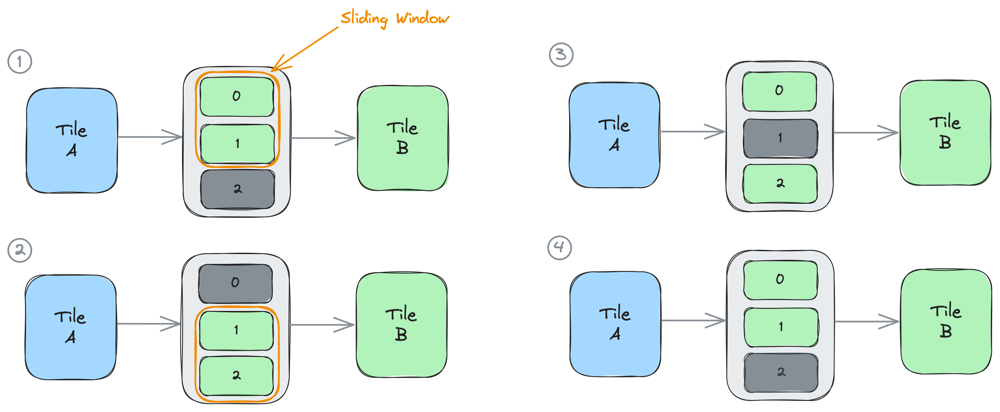

<!---//===- README.md ---------------------------------------*- Markdown -*-===//
//
// This file is licensed under the Apache License v2.0 with LLVM Exceptions.
// See https://llvm.org/LICENSE.txt for license information.
// SPDX-License-Identifier: Apache-2.0 WITH LLVM-exception
//
// Copyright (C) 2024, Advanced Micro Devices, Inc.
// 
//===----------------------------------------------------------------------===//-->

# <ins>Object FIFO Reuse Pattern</ins>

During the previous [section](../../section-2a/README.md#accessing-the-objects-of-an-object-fifo) it was mentioned that the Object FIFO acquire and release functions can be paired together to achieve the behaviour of a sliding window with data reuse. Specifically, this communication pattern occurs when a producer or a consumer of an Object FIFO releases less objects than it had previously acquired. As acquiring from an Object FIFO does not destroy the data, unreleased objects can be reused without requiring new copies of the data.

It is important to note that each new acquire function will return a new object or array of objects that a process can access, which <u>includes unreleased objects from previous acquires</u>. The process should always use the result of the <u>most recent</u> acquire call to access unreleased objects to ensure a proper lowering through the Object FIFO primitive.

In the example below `of0` is created between producer A and consumer B with a depth of 3 objects: object0, object1, and object2. The process running on the core of tile B is showcased in the next figure and explained in-depth below. 
```python
A = tile(1, 3)
B = tile(2, 4)
of0 = object_fifo("objfifo0", A, B, 3, T.memref(256, T.i32())) # 3 objects: object0, object1, object2

@core(B)
def core_body():
    ### Situation 1
    for _ in range_(3):
    elems = of0.acquire(ObjectFifoPort.Consume, 2) # acquires object0 and object1
    call(test_func2, [elems[0], elems[1]])
    of0.release(ObjectFifoPort.Consume, 1) # releases object0

    ### Situation 2
    elems_2 = of0.acquire(ObjectFifoPort.Consume, 2) # acquires object2; object1 was previously acquired
    call(test_func2, [elems_2[0], elems_2[1]])
    of0.release(ObjectFifoPort.Consume, 1) # releases object1

    ### Situation 3
    elems_3 = of0.acquire(ObjectFifoPort.Consume, 2) # acquires object0; object2 was previously acquired
    call(test_func2, [elems_3[0], elems_3[1]])
    of0.release(ObjectFifoPort.Consume, 1) # releases object2

    ### Situation 4
    elems_4 = of0.acquire(ObjectFifoPort.Consume, 2) # acquires object1; object0 was previously acquired
```

The figure below represents the status of the system in each of the marked situations 1 through 4:    
1. Consumer B first acquires 2 elements from `of0` in the variable `elems`. As this is the first time that B acquires, it will have access to object0 and object1. B then applies `test_func2` on the two acquired elements. Finally, B releases a single object, the oldest acquired one, and keeps object1.
2. B acquires 2 elements in variable `elems_2`. It already has access to object1 which remains unreleased from 1, but also to the newly acquired object2. B again applies the function after which it only releases a single object and keeps object2.
3. B acquires 2 objects in `elems_3` and has access to object2 and object0. B releases a single object and keeps object0.
4. B acquires 2 objects in `elems_4` and has access to object0 and object1 thus returning to the situation at the beginning of 1.



The situations above can be fused into a for loop with 4 iterations. By continuously releasing one less element than it acquired every iteration, the consumer process running on tile B is implementing the behaviour of a sliding window with 2 objects that slides down by 1 each new iteration. 
```python
A = tile(1, 3)
B = tile(2, 4)
of0 = object_fifo("objfifo0", A, B, 3, T.memref(256, T.i32())) # 3 objects: object0, object1, object2

@core(B)
def core_body():
    for _ in range_(4):
        elems = of0.acquire(ObjectFifoPort.Consume, 2)
        call(test_func2, [elems[0], elems[1]])
        of0.release(ObjectFifoPort.Consume, 1)
```

-----
[[Up](..)] [[Next](../02_Broadcast/)]
