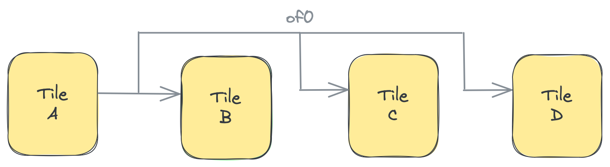
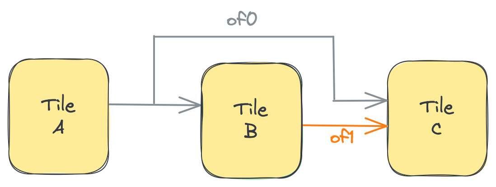
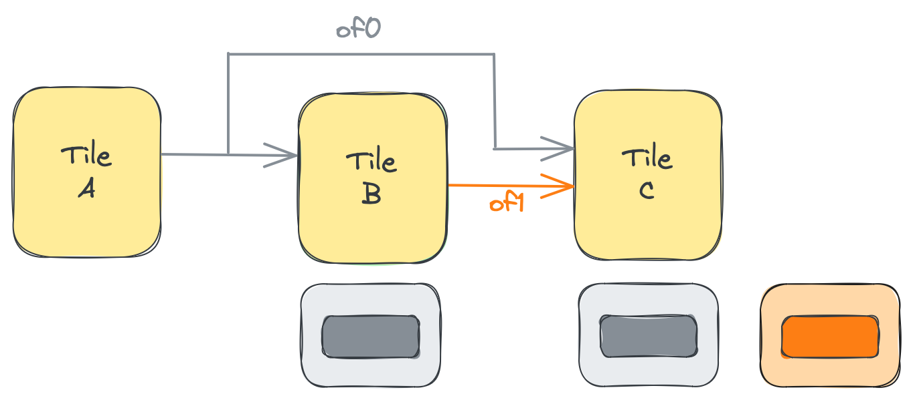
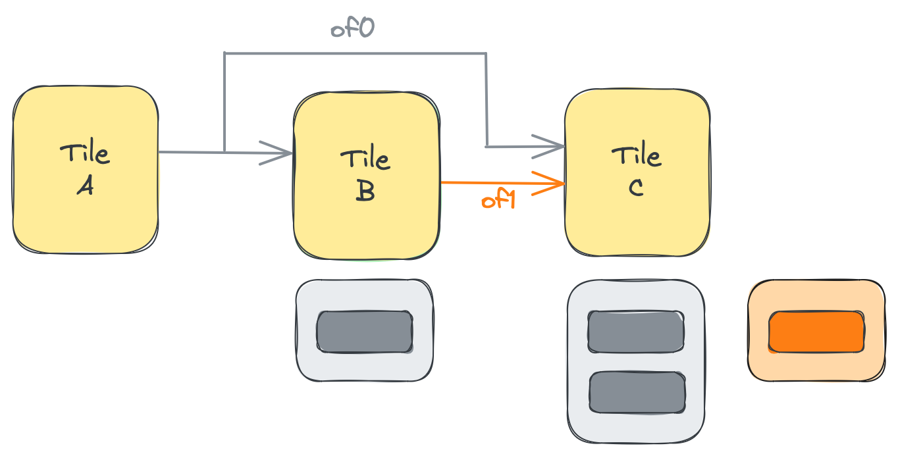

<!---//===- README.md ---------------------------------------*- Markdown -*-===//
//
// This file is licensed under the Apache License v2.0 with LLVM Exceptions.
// See https://llvm.org/LICENSE.txt for license information.
// SPDX-License-Identifier: Apache-2.0 WITH LLVM-exception
//
// Copyright (C) 2024, Advanced Micro Devices, Inc.
// 
//===----------------------------------------------------------------------===//-->

# <ins>Object FIFO Broadcast Pattern</ins>

As was explained in the Introduction [section](../../section-2a/README.md#initializing-an-object-fifo), the `consumerTiles` input can be either a single tile or an array of tiles. When the input is specified as an array of tiles, this creates a broadcast communication from a single producer tile to multiple consumer tiles. The data from the producer tile's memory module is sent to each of the consumer tiles' memory modules via the AXI stream interconnect, which handles the back-pressure from consumers with different execution times. The AXI stream is also where the low-level copy of the data is made before being sent to each of the consumers. To achieve the broadcast, the lowering will use one output port of the producer tile to establish a connection to all consumer tiles, as shown in the figure below:



For more low-level details regarding how the objects in the Object FIFO are transferred via the AXI stream through the DMAs of the producer and consumer tiles please see the mlir-aie [tutorials](/mlir-aie/tutorials/tutorial-7/). They are, however, not required to understand or use the Object FIFO API.

Below is an example of the Object FIFO `of0` shown in the previous figure. It has a depth of `3` with one producer tile A and three consumer tiles B, C and D:
```python
A = tile(1, 1)
B = tile(1, 3)
C = tile(2, 3)
D = tile(3, 3)
of0 = object_fifo("objfifo0", A, [B, C, D], 3, T.memref(256, T.i32()))
```

The `depth` input of an Object FIFO can also be specified as an array of integers, which describe the number of objects that are available to each tile (the producer tile plus each consumer tile) when accessing the Object FIFO. For the previous example, each of the four tiles has a resource pool of 3 objects available to perform the data movement of `of_0`.

> **NOTE:**  This functionality of the Object FIFO primitive exposes what is actually going on at the hardware level when the data movement is established for a broadcast. The object pool of the Object FIFO is not a single structure but rather composed of several pools of objects that are allocated in the memory module of each tile involved in the data movement. Specifying the `depth` as an array of integers allows the user full control to set the sizes of the pools on each individual tile.

The main advantage of this feature comes to light during a situation like the one showcased in the example below, which we refer to as a broadcast with a <u>skip-connection</u>. In the example below two Object FIFOs are created: `of0` is a broadcast from producer tile A to consumer tiles B and C, while `of1` is a 1-to-1 data movement from producer tile B to consumer tile C. We refer to `of1` as a skip-connection because it is a dependency between the two consumer tiles of the same broadcast connection.
```python
A = tile(1, 3)
B = tile(2, 3)
C = tile(2, 4)
of0 = object_fifo("objfifo0", A, [B, C], 1, T.memref(256, T.i32()))
of1 = object_fifo("objfifo1", B, C, 1, T.memref(256, T.i32()))
```

The situation can be viewed as in the figure below:



Now assume that the processes running on the two consumers of `of0` are as in the code snippet below.
```python
@core(B)
def core_body():
    elem0 = of0.acquire(ObjectFifoPort.Consume, 1)
    elem1 = of1.acquire(ObjectFifoPort.Produce, 1)
    call(test_func2, [elem0, elem1])
    of0.release(ObjectFifoPort.Consume, 1)
    of1.release(ObjectFifoPort.Produce, 1)

@core(C)
def core_body():
    elem0 = of0.acquire(ObjectFifoPort.Consume, 1)
    elem1 = of1.acquire(ObjectFifoPort.Consume, 1)
    call(test_func2, [elem0, elem1])
    of0.release(ObjectFifoPort.Consume, 1)
    of1.release(ObjectFifoPort.Consume, 1)
```
We can see that C requires one object from both `of0` and `of1` before it can proceed with its execution. However, B also requires an object from `of0` before it can produce the data for `of1`. Because C is waiting on B, the two tiles do not have the same rate of consumption from the broadcast connection and this results in the production rate of A being impacted. 

To further represent this we can take the slightly lower lever view that the consumer tiles each have a pool of objects allocated for their Object FIFOs. To simplify things, only the pools used by the consumers are shown (for example, for `of1` only the pool on the side of consumer tile C is visible). Currently, all the pools have a depth of `1`.


To avoid having the production of A impacted by the skip-connection, an additional object is required by C for `of0`. It can be used as buffering space for data coming from `of0` while waiting for the data from B via `of1`. To achieve this `of0` is created with an array of integers for its `depth`:
```python
of0 = object_fifo("objfifo0", A, [B, C], [1, 1, 2], T.memref(256, T.i32()))
```
where tiles A and B retain the original depth of 1 while C now has a depth of 2 objects. This change can be visualized as in the figure below where the pool of objects of `of0` in tile C has increased:


