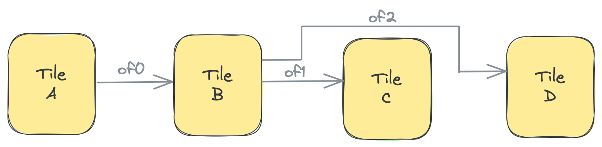
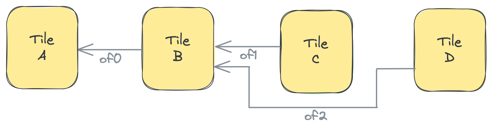

<!---//===- README.md ---------------------------------------*- Markdown -*-===//
//
// This file is licensed under the Apache License v2.0 with LLVM Exceptions.
// See https://llvm.org/LICENSE.txt for license information.
// SPDX-License-Identifier: Apache-2.0 WITH LLVM-exception
//
// Copyright (C) 2024, Advanced Micro Devices, Inc.
// 
//===----------------------------------------------------------------------===//-->

# <ins>Object FIFO Distribute & Join Patterns with Object FIFO Link</ins>

### Object FIFO Link

By design an Object FIFO handles both the configuration of the data movement between the producer and consumer tiles as well as the allocation of objects over the memory modules of the tiles. In order to put data consumed from one Object FIFO into another Object FIFO the user could explicitly do this in the core code of a shared tile between the two FIFOs. However, if the goal is to simply copy data from one Object FIFO to the other without modifying it, doing it in the manner described above results in allocating more objects than necessary, i.e., the data being copied to the second Object FIFO is already available in the first one. Additionally, Shim tiles and Mem tiles do not have a core on which the copy can be done explicitly.

Instead of an explicit copy, the Object FIFO API provides an implicit copy via an `object_fifo_link`, which can be initialized using its class constructor (defined in [aie.py](../../../../python/dialects/aie.py)):
```python
class object_fifo_link(ObjectFifoLinkOp):
    def __init__(
        self,
        fifoIns,
        fifoOuts,
    )
```
A link allows the user to specify a set of input Object FIFOs via the `fifoIns` input and a set of output ones via the `fifoOuts` input. Each Object FIFO may be specified either using its `name` or its variable. Both inputs can be either a single Object FIFO or an array of them. It is required that there exists at least one shared tile between the consumer tiles of `fifoIns` and the producer tiles of `fifoOuts` for a link to be valid. This is because the implicit copy of data will be done using the Data Movement Accelerators (DMAs) of that tile.

Below is an example of a link created between two FIFOs `of0` and `of1`, where tile B is the shared tile between them:
```python
A = tile(1, 0)
B = tile(1, 1)
C = tile(1, 3)
of0 = object_fifo("objfifo0", A, B, 2, T.memref(256, T.i32()))
of1 = object_fifo("objfifo1", B, C, 2, T.memref(256, T.i32()))
object_fifo_link(of0, of1)
```

Depending on how many Object FIFOs are specified in `fifoIns` and `fifoOuts`, two different data patterns can be achieved: a Distribute or a Join. They are described in the two next subsections. Currently, it is not possible to do both patterns at once, i.e., if `fifoIns` is an array then `fifoOuts` can only be a single Object FIFO, and the other way around.

A full design example that uses this features is available in Section 2e: [03_external_mem_to_core_L2](../../section-2e/03_external_mem_to_core_L2/).

### Link & Distribute

By using the link with one input Object FIFO and multiple output Object FIFOs a user can describe a distribute pattern where parts of data in every object from the producer tile are distributed to each output FIFO. The `datatype` of the output FIFOs should be of a smaller size than the input one, and the sum of the sizes of the output FIFOs should equal to the size of the `datatype` of the input FIFO.

Currently, the Object FIFO lowering uses the order in which the output FIFOs are specified in the `fifoOuts` to know which part of the input object should go to each output FIFO. To achieve the distribute, the lowering will use one output port of the shared tile to establish a connection per output FIFO, as in the figure below:



The following code snippet describes the figure above. There are three Object FIFOs: `of0` has a producer tile A and a consumer tile B, while `of1` and `of2` have B as their producer tile and C and D respectively as their consumer tiles. The link specifies that data from `of0` is distributed to `of1` and `of2`. In this link, B is the shared tile where the implicit data copy will take place via B's DMAs. We can also note how `of1` and `of2`'s datatypes are half of `of0`'s, which means that the first half of objects in `of0` will go to `of1` and the second half to `of2`, based on their order in the link.
```python
A = tile(1, 0)
B = tile(1, 1)
C = tile(1, 3)
D = tile(2, 3)
of0 = object_fifo("objfifo0", A, B, 2, T.memref(256, T.i32()))
of1 = object_fifo("objfifo1", B, C, 2, T.memref(128, T.i32()))
of2 = object_fifo("objfifo2", B, D, 2, T.memref(128, T.i32()))
object_fifo_link(of0, [of1, of2])
```

A full design example that uses this features is available in Section 2e: [04_distribute_L2](../../section-2e/04_distribute_L2/).

### Link & Join

The join pattern is the opposite of the distribute pattern in that the link will have multiple input Object FIFOs and a single output Object FIFO. With this pattern the user can combine the smaller inputs from multiple sources into a single bigger output data movement. The `datatype` of the input FIFOs should be of a smaller size than the output one, and the sum of the sizes of the input FIFOs should equal to the size of the `datatype` of the output FIFO.

Similarly, the order in `fifoIns` specifies which input object will make up which part of the larger objects of the output Object FIFO. To achieve the join, the lowering will use one input port of the shared tile to establish a connection per input FIFO, as in the figure below:



The following code snippet describes the figure above. There are three Object FIFOs: `of2` has a producer tile B and a consumer tile A, while `of0` and `of1` have C and D respectively as their producer tiles and B as their consumer tile. The link specifies that data from `of0` and `of1` is joined into `of2`. In this link, B is the shared tile where the implicit data copy will take place via B's DMAs. We can also note how `of0` and `of1`'s datatypes are half of `of2`'s, which means that objects from `of0` will become the first half of objects in `of2` while objects in `of1` will become the second half, based on their order in the link.
```python
A = tile(1, 0)
B = tile(1, 1)
C = tile(1, 3)
D = tile(2, 3)
of0 = object_fifo("objfifo0", B, A, 2, T.memref(256, T.i32()))
of1 = object_fifo("objfifo1", C, B, 2, T.memref(128, T.i32()))
of2 = object_fifo("objfifo2", D, B, 2, T.memref(128, T.i32()))
object_fifo_link([of1, of2], of0)
```

A full design example that uses this features is available in Section 2e: [05_join_L2](../../section-2e/05_join_L2/).

-----
[[Top](..)]
